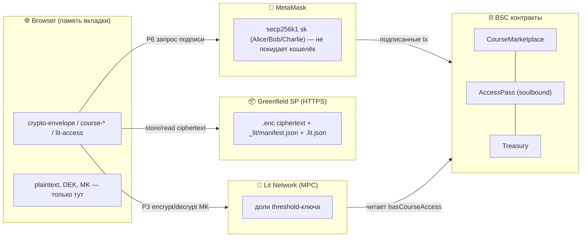
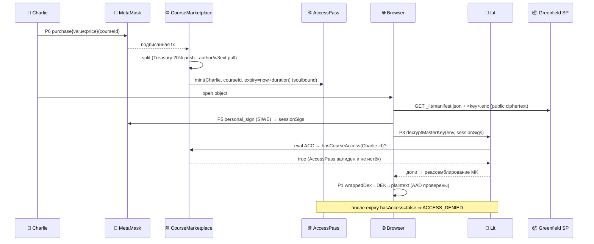

# crypto.md — Криптография системы (полная карта)

Все криптографические протоколы, процедуры encrypt/decrypt в каждом из
них, и кто что делает: **Alice** (владелец протокола), **Bob** (владелец
курса / издатель), **Charlie** (клиент). Источник истины — код в
`smartcontracts/buckets/*` и `smartcontracts/contracts/*`. Где привязка к
внешним SDK не верифицируется юнит-тестами — отмечено `⚠︎ integration`.

---

## Легенда

| Символ | Значение |
|--------|----------|
| 👩 **Alice** | Владелец протокола / governance. Ключ ECDSA в MetaMask. Owner `CourseMarketplace`/`Treasury`/`AccessPass` (Ownable2Step). Контент не шифрует — управляет параметрами. |
| 👨 **Bob** | Владелец курса / издатель. Ключ ECDSA в MetaMask. Генерирует AES-ключи, шифрует контент, публикует. Имеет **бесплатный** доступ к своему контенту. |
| 🧑 **Charlie** | Клиент. Ключ ECDSA в MetaMask. Покупает доступ on-chain, расшифровывает контент в браузере. |
| 🦊 **MetaMask** | Хранит приватные ключи secp256k1. Подписывает: EVM-tx, EIP-712 (`eth_signTypedData_v4`), `personal_sign` (SIWE). Приватник **никогда** не покидает кошелёк. |
| 🌐 **Browser** | Исполняет WebCrypto (AES/PBKDF2/SHA-256). Plaintext и DEK существуют только здесь, в памяти вкладки. |
| 📦 **Greenfield SP** | HTTPS-эндпоинт хранилища. Хранит **только ciphertext** + публичный манифест/сайдкары. Bucket = `public-read`. |
| ⛓ **Контракты (BSC)** | `CourseMarketplace` / `AccessPass` (soulbound) / `Treasury`. Крипты не делают; хранят состояние прав, читаемое Lit. |
| 🔑 **Lit Network** | Децентрализованный MPC/threshold-KMS. Хранит долю ключа; реассемблирует ключ расшифровки только при выполнении ACC. |
| `DEK` | Data Encryption Key — случайный 256-бит ключ **на объект**. |
| `MK` | Bucket **Master Key** — один 256-бит ключ на бакет; оборачивает все DEK. |
| `KEK` | Key Encryption Key — производный из пароля (PBKDF2) ключ-обёртка `MK`. |
| `ACC` | Lit Access Control Conditions — on-chain предикат, кого пускать. |
| `AAD` | AEAD additionalData — аутентифицируемые, но не шифруемые данные. |

---

## Инвентарь протоколов

| # | Протокол | Где (модуль) | Назначение |
|---|----------|--------------|------------|
| P1 | **AES-256-GCM** (AEAD) | `crypto-envelope.js` | Объёмное шифрование контента + key-wrap DEK под MK |
| P2 | **PBKDF2-SHA-256** (210k) | `crypto-envelope.js` | Опц. парольная обёртка MK (портативный бэкап, без Lit) |
| P3 | **Lit threshold encryption** (BLS12-381, MPC) | `lit-access.js` + `lit-sdk.js` ⚠︎ | Обёртка `MK` под `ACC`; реассемблирование при доступе |
| P4 | **Lit off-chain auth** (Ed25519/EDDSA) | `lit-sdk.js` ⚠︎ | Сессионная пара ключей SP-аутентификации Greenfield |
| P5 | **SIWE / sessionSigs** (EIP-4361 + ECDSA) | `lit-sdk.js::makeLitAuth` ⚠︎ | Авторизация Charlie перед Lit-узлами |
| P6 | **EVM подпись** (ECDSA secp256k1) | MetaMask + `greenfield-sdk-tx.js`, контракты | EIP-712 `eth_signTypedData_v4` (Greenfield tx), tx BSC (`purchase`) |
| P7 | **Хеши**: keccak256 / SHA-256 | контракты / `course-template.js` | `contentHash` on-chain; `dataToEncryptHash` сайдкара |
| P8 | **TLS** | транспорт к Greenfield SP / RPC / Lit | Конфиденциальность канала (CSP allowlist) |

---

## Иерархия ключей

```mermaid
graph TD
  PT["plaintext-объект (browser)"] -->|P1 AES-256-GCM, IV, AAD=schema·alg·meta| CT["ciphertext (.enc) → Greenfield"]
  DEK["DEK (256-bit, на объект)"] -->|шифрует| PT
  MK["MK — bucket master (256-bit)"] -->|P1 key-wrap, AAD=schema·originalKey| WDEK["wrappedDek (в .enc)"]
  DEK --> WDEK
  MK -->|P3 Lit encrypt под ACC| LITENV["manifest.lit (ciphertext+hash)"]
  MK -.опц.-> |P2 PBKDF2 KEK| WRAP["wrapped MK (парольный бэкап)"]
  ACC["ACC = anyOf(Bob, AccessPass-условие)"] --> LITENV
```

**Принцип:** дорогая криптозащита применяется только к 32-байтному `MK`
(Lit/PBKDF2); объём — быстрым симметричным AEAD. Ротация/уничтожение `MK`
крипто-шреддит весь бакет за O(1).

---

## Сущности и владение ключами



---

## P1 — AES-256-GCM (envelope)

`crypto-envelope.js`. Всё в браузере (WebCrypto, инъектируемый).

**Encrypt объекта** (`encryptObject(MK, data, meta)`):
1. `DEK ← random(32)`; `iv ← random(12)`; `dekIv ← random(12)`.
2. `ct = AES-GCM(key=DEK, iv, data, aad = JSON{schema,alg,contentType,originalKey,encoding})`.
3. `wrappedDek = AES-GCM(key=MK, dekIv, DEK, aad = JSON{schema,originalKey})`.
4. Конверт: `{schema, alg, iv, ciphertext, dekIv, wrappedDek, meta}` (base64).

**Decrypt** (`decryptObject(MK, env)`): пересобрать те же AAD из
`env` → `DEK = AES-GCM⁻¹(MK, dekIv, wrappedDek, aad)` →
`plaintext = AES-GCM⁻¹(DEK, iv, ciphertext, aad)`. Любая правка
`meta`/`schema` или перенос `wrappedDek` на другой объект ⇒ провал тега
GCM ⇒ `DECRYPT_FAILED` (AEAD-binding, аудит B2).

## P2 — PBKDF2-SHA-256 (опц. парольная обёртка MK)

`wrapMasterWithPassphrase`: `salt←random(16)`, `KEK = PBKDF2(pass,
salt, 210000, SHA-256)`, `wrapped = AES-GCM(KEK, iv, MK)`. Обратное —
`unwrapMasterWithPassphrase`. Неверный пароль ⇒ `DECRYPT_FAILED`.
Назначение: портативный бэкап `MK` без Lit.

## P3 — Lit threshold encryption (обёртка MK)

`lit-access.js` (чистое ядро, тестируется с фейком) +
`lit-sdk.js` (реальный `@lit-protocol`, CDN, ⚠︎ integration).

**Encrypt** (`encryptMasterKey(MK, ACC)`): `encryptString({ACC,
dataToEncrypt=MK})` → клиент-сайд шифрование к публичному ключу сети
Lit; `{ciphertext, dataToEncryptHash}` + `ACC` кладутся в
`manifest.lit`. Сам `MK` сеть Lit не видит — она хранит лишь долю
своего корневого ключа.
**Decrypt** (`decryptMasterKey(env, authContext)`): узлы Lit проверяют
`ACC` (P5 sessionSigs) и возвращают доли расшифровки; при пороге `t`
из `n` `MK` восстанавливается на клиенте. Неавторизован ⇒
`ACCESS_DENIED`. ACC строит `lit-acc.js`: `anyOf(addressAllowlistAcc(Bob),
<условие покупателя>)` — **Bob всегда внутри ⇒ бесплатный доступ**.

## P4/P5 — Lit off-chain auth + sessionSigs

`makeLitAuth` ⚠︎: `genOffChainAuthKeyPairAndUpload` создаёт сессионную
**Ed25519** пару (seed получается из `personal_sign` кошелька) для
SP-аутентификации Greenfield. Далее `getSessionSigs` с
`authNeededCallback`, подписывающим **SIWE/EIP-4361** сообщение через
`personal_sign` (P6/ECDSA). Полученные `sessionSigs` — это то, чем
Charlie доказывает Lit-узлам право на P3-decrypt.

## P6 — EVM подписи (MetaMask, secp256k1)

- Greenfield on-chain tx (`createBucket`): SDK формирует EIP-712,
  браузер подписывает `eth_signTypedData_v4` через
  `makeSignTypedDataCallback(provider)` (`greenfield-wallet-backend.js`,
  тестируется) → `tx.broadcast({signTypedDataCallback})`
  (`greenfield-sdk-tx.js`).
- BSC `CourseMarketplace.purchase{value}` — обычная подписанная tx.
- Приватник остаётся в MetaMask; код видит только подписи.

## P7/P8 — хеши и канал

`contentHash = keccak256(...)` хранится в `Course` (целостность,
on-chain). `dataToEncryptHash = SHA-256(ciphertext)` в `.lit.json`
сайдкаре (индексатор/проверка). Транспорт — TLS; CSP ограничивает
`connect-src` доверенными доменами (Greenfield/Lit/esm.sh).

---

## 👩 Alice — владелец протокола (governance)

Контент не шифрует. Через MetaMask (P6) деплоит/настраивает контракты:
`Ownable2Step` (`transferOwnership`/`acceptOwnership`), `setParams`
(bounded bps treasury/w3ext), `Treasury.withdraw` (governance-only,
pull, без циклов). Криптороль: владение secp256k1-ключом governance;
компрометация ⇒ смена параметров, **не** утечка контента (контент под
`MK`/Lit, к которым у Alice доступа нет).

## 👨 Bob — издатель курса (publish)

```mermaid
sequenceDiagram
  participant Bob as 👨 Bob
  participant Br as 🌐 Browser
  participant MM as 🦊 MetaMask
  participant Lit as 🔑 Lit
  participant GF as 📦 Greenfield SP
  participant CM as ⛓ CourseMarketplace

  Bob->>Br: publish course (spec)
  Br->>Br: P1 MK←rand; на каждый объект DEK←rand, AES-GCM(+AAD)
  Br->>Lit: P3 encryptMasterKey(MK, ACC=anyOf(Bob, buyer))
  Lit-->>Br: {ciphertext, dataToEncryptHash}  (MK скрыт)
  Br->>MM: P6 eth_signTypedData_v4 (Greenfield createBucket EIP-712)
  MM-->>Br: подпись
  Br->>GF: PUT .enc + .lit.json + _lit/manifest.json (public-read)
  Bob->>MM: P6 tx registerCourse(price, contentHash, bucket, duration)
  MM-->>CM: подписанная tx
  Note over Br,Lit: Bob ∈ ACC ⇒ далее decrypt без оплаты (free access)
```

Decrypt своего контента: тот же путь, что у Charlie (ниже), но ACC
выполняется по `addressAllowlistAcc(Bob)` / `hasCourseAccess(author)=true`
— **без покупки**.

## 🧑 Charlie — клиент (purchase + read)



Если не куплено / истёк срок (`AccessPass` expiry) / подделан конверт —
получает `ACCESS_DENIED` или `DECRYPT_FAILED`; ciphertext без `MK`
бесполезен.

---

## Границы и допущения (честно)

- **Доверие к Lit**: безопасность P3/P5 опирается на честное
  большинство узлов Lit (порог `t` из `n`). Кастомной пороговой крипты
  мы не пишем — используется аудированный `@lit-protocol`.
- **⚠︎ integration**: точные вызовы `@lit-protocol`/`@bnb-chain` SDK
  (`lit-sdk.js`, `greenfield-wallet-sdk.js`, `sdk-backend.mjs`) и CDN-
  импорт верифицируются только в Docker/Foundry-флоу, не hermetic-юнитами
  (см. `GREENFIELD.md` → verification status).
- **Метаданные публичны**: имена объектов/размер/`contentType` в
  манифесте не шифруются (P1 AAD их лишь аутентифицирует). Секреты — не
  в именах.
- **Контракты крипты не выполняют**: только хранят состояние прав;
  вся конфиденциальность — P1+P3. ECDSA-подписи — в MetaMask.
- **Session-sig theft**: кража `sessionSigs` (XSS) = доступ к контенту →
  митигируется CSP (аудит 4.2/5.3), `connect-src`-allowlist, отсутствием
  inline-скриптов.
