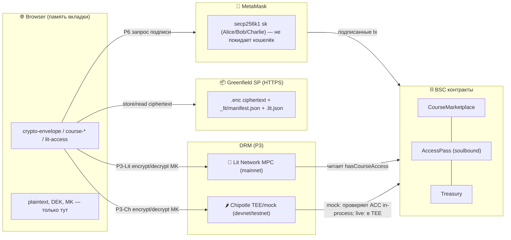
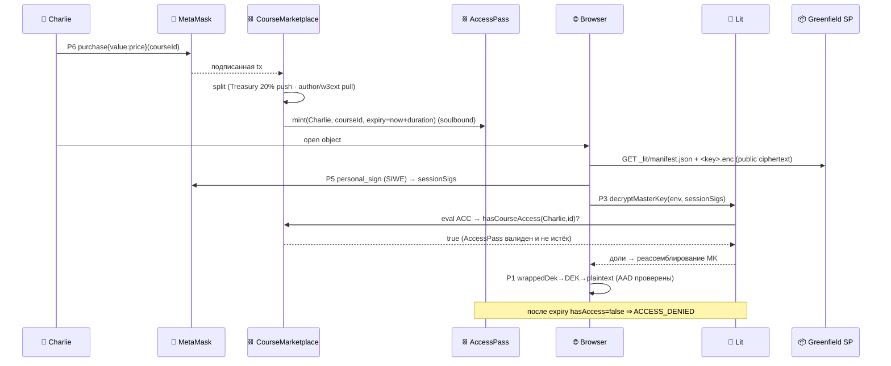
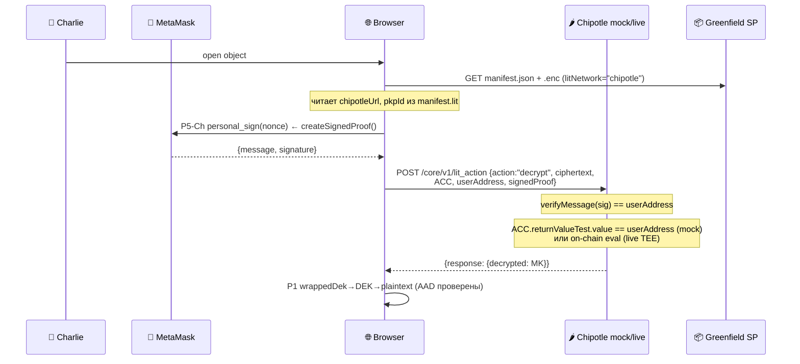

# crypto.md — Криптография системы (полная карта)

Все криптографические протоколы, процедуры encrypt/decrypt в каждом из
них, и кто что делает: **Alice** (владелец протокола), **Bob** (владелец
курса / издатель), **Charlie** (клиент). Источник истины — код в
`smartcontracts/buckets/*` и `smartcontracts/contracts/*`. Где привязка к
внешним SDK не верифицируется юнит-тестами — отмечено `⚠︎ integration`.

---

## Легенда

| Символ | Значение |
|--------|----------|
| 👩 **Alice** | Владелец протокола / governance. Ключ ECDSA в MetaMask. Owner `CourseMarketplace`/`Treasury`/`AccessPass` (Ownable2Step). Контент не шифрует — управляет параметрами. |
| 👨 **Bob** | Владелец курса / издатель. Ключ ECDSA в MetaMask. Генерирует AES-ключи, шифрует контент, публикует. Имеет **бесплатный** доступ к своему контенту. |
| 🧑 **Charlie** | Клиент. Ключ ECDSA в MetaMask. Покупает доступ on-chain, расшифровывает контент в браузере. |
| 🦊 **MetaMask** | Хранит приватные ключи secp256k1. Подписывает: EVM-tx, EIP-712 (`eth_signTypedData_v4`), `personal_sign` (SIWE). Приватник **никогда** не покидает кошелёк. |
| 🌐 **Browser** | Исполняет WebCrypto (AES/PBKDF2/SHA-256). Plaintext и DEK существуют только здесь, в памяти вкладки. |
| 📦 **Greenfield SP** | HTTPS-эндпоинт хранилища. Хранит **только ciphertext** + публичный манифест/сайдкары. Bucket = `public-read`. |
| ⛓ **Контракты (BSC)** | `CourseMarketplace` / `AccessPass` (soulbound) / `Treasury`. Крипты не делают; хранят состояние прав, читаемое Lit. |
| 🔑 **Lit Network** | Децентрализованный MPC/threshold-KMS. Хранит долю ключа; реассемблирует ключ расшифровки только при выполнении ACC. Используется только в mainnet (Flow E). |
| 🌶 **Chipotle** | REST-замена Lit Network для Flows B–D. Запускает JS-действие в TEE (production) или in-process mock (devnet). Одна AES-256-GCM мастер-пара — производится из `CHIPOTLE_PKP_KEY`. |
| `DEK` | Data Encryption Key — случайный 256-бит ключ **на объект**. |
| `MK` | Bucket **Master Key** — один 256-бит ключ на бакет; оборачивает все DEK. |
| `KEK` | Key Encryption Key — производный из пароля (PBKDF2) ключ-обёртка `MK`. |
| `ACC` | Lit Access Control Conditions — on-chain предикат, кого пускать. |
| `AAD` | AEAD additionalData — аутентифицируемые, но не шифруемые данные. |

---

## Инвентарь протоколов

| # | Протокол | Где (модуль) | Назначение |
|---|----------|--------------|------------|
| P1 | **AES-256-GCM** (AEAD) | `crypto-envelope.js` | Объёмное шифрование контента + key-wrap DEK под MK |
| P2 | **PBKDF2-SHA-256** (210k) | `crypto-envelope.js` | Опц. парольная обёртка MK (портативный бэкап, без Lit) |
| P3-Lit | **Lit threshold encryption** (BLS12-381, MPC) | `lit-access.js` + `lit-sdk.js` ⚠︎ | Обёртка `MK` под `ACC`; mainnet (Flow E) |
| P3-Ch | **Chipotle AES-256-GCM** (TEE / mock) | `lit-access.js` + `lit-sdk-chipotle.js` | Обёртка `MK` под `ACC`; Flows B–D. Единый AES-ключ, производный от PKP |
| P4 | **Lit off-chain auth** (Ed25519/EDDSA) | `lit-sdk.js` ⚠︎ | Сессионная Ed25519-пара (SP-auth Greenfield). Только mainnet. |
| P5-Lit | **SIWE / sessionSigs** (EIP-4361 + ECDSA) | `lit-sdk.js::makeLitAuth` ⚠︎ | Авторизация Charlie перед Lit-узлами. Только mainnet. |
| P5-Ch | **personal\_sign proof** (ECDSA) | `lit-sdk-chipotle.js::createSignedProof` | Charlie подписывает nonce; Chipotle сервер проверяет ECDSA + ACC. Flows B–D. |
| P6 | **EVM подпись** (ECDSA secp256k1) | MetaMask + `greenfield-sdk-tx.js`, контракты | EIP-712 `eth_signTypedData_v4` (Greenfield tx), tx BSC (`purchase`) |
| P7 | **Хеши**: keccak256 / SHA-256 | контракты / `course-template.js` | `contentHash` on-chain; `dataToEncryptHash` сайдкара |
| P8 | **TLS** | транспорт к Greenfield SP / RPC / Lit | Конфиденциальность канала (CSP allowlist) |

---

## Окружения: devnet / testnet / mainnet

Три тира. Криптографическая схема P1/P2/P6/P7/P8 **не меняется** ни в одном из них.
Меняется только DRM-бэкенд (P3) и путь авторизации (P4/P5).

| Тир | Flow | DRM (P3) | Greenfield | EVM-цепь | Авторизация (P5) |
|-----|------|----------|-----------|----------|-----------------|
| **devnet** | B, C | 🌶 Chipotle **mock** `localhost:8000` | local 9000 или testnet 5600 | Anvil / BSC testnet | `personal_sign` → `signedProof` |
| **testnet** | D | 🌶 Chipotle **live** `api.chipotle.litprotocol.com` | testnet 5600 | BSC testnet | `personal_sign` → `signedProof` |
| **mainnet** | E | 🔑 **Lit** `datil` | mainnet | BSC mainnet | SIWE sessionSigs (Ed25519) |

### Что меняется по протоколам

#### P3: Lit → Chipotle (devnet и testnet)

| Параметр | Lit (mainnet) | Chipotle mock (devnet) | Chipotle live (testnet) |
|----------|--------------|----------------------|------------------------|
| Транспорт | P2P, порт 7470 | HTTP `localhost:8000` | HTTPS REST |
| Хранение `MK` | BLS-долю в каждом узле сети | AES-GCM env, только в памяти | AES-GCM в TEE |
| Проверка ACC | Узлы Lit читают on-chain-состояние BSC | In-process: `returnValueTest.value === userAddress` | В TEE: JS-код Chipotle |
| Ключевая пара PKP | Threshold BLS — нет единой точки отказа | `CHIPOTLE_PKP_KEY` из env → **не подходит для production** | `CHIPOTLE_PKP_KEY` в TEE |
| `litNetwork` в манифесте | `"datil"` | `"chipotle"` | `"chipotle"` |
| Дополнительные поля манифеста | — | `chipotleUrl`, `pkpId` | `chipotleUrl`, `pkpId` |

Одинаково: `LitClient`-интерфейс (`encrypt` / `decrypt`) и формат `manifest.lit` (schema `daskibo.lit.acc/1`) — единые для всех тиров. Переключение — замена адаптера в одной строке:

```js
// devnet / testnet (Flows B–D)
import { createChipotleClient } from './smartcontracts/buckets/lit-sdk-chipotle.js';
const litClient = createChipotleClient({ chipotleUrl: 'http://localhost:8000' }); // devnet
// chipotleUrl: 'https://api.chipotle.litprotocol.com'                            // testnet

// mainnet (Flow E)
import { createLitClient } from './smartcontracts/buckets/lit-sdk.js';
const litClient = await createLitClient({ litNetwork: 'datil' });

// Далее одинаково:
import { createLitAccess } from './smartcontracts/buckets/lit-access.js';
const { encryptMasterKey, decryptMasterKey } = createLitAccess({ litClient });
```

#### P5: sessionSigs → signedProof (devnet и testnet)

Lit требует полный SIWE/EIP-4361 флоу с Ed25519 сессионными ключами (`sessionSigs`).
Chipotle заменяет его на простую `personal_sign`-подпись одноразового нонса:

```
Charlie → MetaMask.personal_sign(nonce) → { message, signature }
          → POST /core/v1/lit_action { action:"decrypt", userAddress, signedProof }
Chipotle → verifyMessage(message, signature) == userAddress → проверить ACC → вернуть MK
```

`signedProof` не является полноценной SIWE-сессией: нет истечения по времени на уровне
ключа, нет скоупинга ресурсов. Для production Lit (Flow E) — только `sessionSigs`.

#### ACC на devnet vs mainnet

На devnet Chipotle mock проверяет ACC упрощённо:
```js
// chipotle-mock.mjs — проверка ACC
const allowed = conditions.some(
  c => c.returnValueTest?.value?.toLowerCase() === userAddress.toLowerCase(),
);
```
Это означает: на devnet ACC пропускает только адреса, **явно перечисленные** в `returnValueTest.value`.
Логика NFT/ERC-721/balanceOf **не исполняется** — на devnet она всегда ложная.

На mainnet узлы Lit читают реальное on-chain-состояние BSC — NFT balanceOf, AccessPass expiry.

### Чеклист перехода testnet → mainnet

- [ ] Заменить адаптер: `createChipotleClient` → `createLitClient({ litNetwork: 'datil' })`
- [ ] Убрать `chipotleUrl` / `pkpId` из конфига и сборки
- [ ] Задеплоить `CourseMarketplace` / `AccessPass` / `Treasury` на BSC mainnet
- [ ] Прописать реальные адреса контрактов в ACC (`accessControlConditions`)
- [ ] Пополнить Lit Capacity Credits (без них `datil` ограничивает RPS)
- [ ] Перевести Greenfield bucket на mainnet SP (`gnfd-mainnet-sp1.bnbchain.org`)
- [ ] Убедиться, что `litNetwork: "datil"` в каждом манифесте (старые maniest'ы с `"chipotle"` на mainnet не расшифруются через Lit)
- [ ] CSP: убрать `localhost:8000` из `connect-src`, добавить `api.chipotle.litprotocol.com` (testnet) или Lit-узлы (mainnet)
- [ ] `CHIPOTLE_PKP_KEY` — не передавать в production; Lit PKP — threshold, без единой точки

### Что тестируется на каждом тире

| Тест | devnet | testnet | mainnet |
|------|--------|---------|---------|
| `tests/chipotle-drm.test.js` | ✅ in-process mock | — | — |
| `tests/lit-access.test.js` | ✅ fake LitClient | ✅ same | ✅ same |
| `tests/crypto-envelope.test.js` | ✅ WebCrypto | ✅ same | ✅ same |
| `greenfield-testnet.live.test.js` (chipotle-writer) | — | ✅ реальный testnet 5600 | — |
| `greenfield-testnet.live.test.js` (testnet-writer) | — | ✅ | — |
| Браузерный reader (manual) | ✅ localhost:8099 | ✅ testnet bucket | ✅ mainnet |

---

## Иерархия ключей

```mermaid
graph TD
  PT["plaintext-объект (browser)"] -->|P1 AES-256-GCM, IV, AAD=schema·alg·meta| CT["ciphertext (.enc) → Greenfield"]
  DEK["DEK (256-bit, на объект)"] -->|шифрует| PT
  MK["MK — bucket master (256-bit)"] -->|P1 key-wrap, AAD=schema·originalKey| WDEK["wrappedDek (в .enc)"]
  DEK --> WDEK
  MK -->|P3 Lit encrypt под ACC| LITENV["manifest.lit (ciphertext+hash)"]
  MK -.опц.-> |P2 PBKDF2 KEK| WRAP["wrapped MK (парольный бэкап)"]
  ACC["ACC = anyOf(Bob, AccessPass-условие)"] --> LITENV
```

**Принцип:** дорогая криптозащита применяется только к 32-байтному `MK`
(Lit/PBKDF2); объём — быстрым симметричным AEAD. Ротация/уничтожение `MK`
крипто-шреддит весь бакет за O(1).

---

## Сущности и владение ключами



> **Devnet/testnet**: блок Lit Network не задействован; все P3-операции идут через Chipotle.
> **Mainnet**: блок Chipotle не задействован; Lit читает BSC on-chain.

---

## P1 — AES-256-GCM (envelope)

`crypto-envelope.js`. Всё в браузере (WebCrypto, инъектируемый).

**Encrypt объекта** (`encryptObject(MK, data, meta)`):
1. `DEK ← random(32)`; `iv ← random(12)`; `dekIv ← random(12)`.
2. `ct = AES-GCM(key=DEK, iv, data, aad = JSON{schema,alg,contentType,originalKey,encoding})`.
3. `wrappedDek = AES-GCM(key=MK, dekIv, DEK, aad = JSON{schema,originalKey})`.
4. Конверт: `{schema, alg, iv, ciphertext, dekIv, wrappedDek, meta}` (base64).

**Decrypt** (`decryptObject(MK, env)`): пересобрать те же AAD из
`env` → `DEK = AES-GCM⁻¹(MK, dekIv, wrappedDek, aad)` →
`plaintext = AES-GCM⁻¹(DEK, iv, ciphertext, aad)`. Любая правка
`meta`/`schema` или перенос `wrappedDek` на другой объект ⇒ провал тега
GCM ⇒ `DECRYPT_FAILED` (AEAD-binding, аудит B2).

## P2 — PBKDF2-SHA-256 (опц. парольная обёртка MK)

`wrapMasterWithPassphrase`: `salt←random(16)`, `KEK = PBKDF2(pass,
salt, 210000, SHA-256)`, `wrapped = AES-GCM(KEK, iv, MK)`. Обратное —
`unwrapMasterWithPassphrase`. Неверный пароль ⇒ `DECRYPT_FAILED`.
Назначение: портативный бэкап `MK` без Lit.

## P3 — обёртка MK (Lit или Chipotle)

Ядро: `lit-access.js` (чистое, тестируется с фейком). Адаптер зависит от тира:

**P3-Lit** — `lit-sdk.js` (CDN, ⚠︎ integration). Только mainnet (Flow E).
`encryptString({ACC, dataToEncrypt=MK})` → шифрование к публичному threshold-ключу
сети Lit; `{ciphertext, dataToEncryptHash}` кладутся в `manifest.lit`.
Decrypt: узлы Lit проверяют ACC (P5-sessionSigs), возвращают t-из-n долей → `MK` на клиенте.

**P3-Chipotle** — `lit-sdk-chipotle.js`. Flows B–D.
`POST /core/v1/lit_action { action:"encrypt", masterKey, ACC }` → Chipotle
шифрует `MK` своим AES-GCM ключом (из `CHIPOTLE_PKP_KEY`); возвращает
`{ciphertext:"ivB64:ctB64", dataToEncryptHash, pkpId}`.
Decrypt: Chipotle проверяет `signedProof` (P5-Ch) + ACC → возвращает `MK`.
`manifest.lit` дополняется полями `litNetwork:"chipotle"`, `chipotleUrl`, `pkpId`.

В обоих случаях: ошибка авторизации ⇒ `classify()` в `lit-access.js` →
`ACCESS_DENIED`. ACC содержит `anyOf(addressAllowlistAcc(Bob), <условие покупателя>)`
— **Bob всегда внутри ⇒ бесплатный доступ** без покупки.

## P4/P5 — авторизация (зависит от тира)

**Mainnet (P4 + P5-Lit):** `makeLitAuth` ⚠︎ создаёт сессионную **Ed25519** пару
(seed из `personal_sign` кошелька) для SP-аутентификации Greenfield. Затем
`getSessionSigs` + `authNeededCallback` (SIWE/EIP-4361 через `personal_sign`).
`sessionSigs` — доказательство права на P3-Lit-decrypt.

**Devnet/testnet (P5-Ch):** упрощённый путь — только `personal_sign(nonce)`:
`createSignedProof(userAddress, provider)` в `lit-sdk-chipotle.js`. Возвращает
`{ message, signature }` → `signedProof` в теле запроса к Chipotle.
Chipotle верифицирует подпись (`verifyMessage`), проверяет ACC, возвращает `MK`.
Ed25519 сессионные ключи **не нужны** — Chipotle не требует P4.

## P6 — EVM подписи (MetaMask, secp256k1)

- Greenfield on-chain tx (`createBucket`): SDK формирует EIP-712,
  браузер подписывает `eth_signTypedData_v4` через
  `makeSignTypedDataCallback(provider)` (`greenfield-wallet-backend.js`,
  тестируется) → `tx.broadcast({signTypedDataCallback})`
  (`greenfield-sdk-tx.js`).
- BSC `CourseMarketplace.purchase{value}` — обычная подписанная tx.
- Приватник остаётся в MetaMask; код видит только подписи.

## P7/P8 — хеши и канал

`contentHash = keccak256(...)` хранится в `Course` (целостность,
on-chain). `dataToEncryptHash = SHA-256(ciphertext)` в `.lit.json`
сайдкаре (индексатор/проверка). Транспорт — TLS; CSP ограничивает
`connect-src` доверенными доменами (Greenfield/Lit/esm.sh).

---

## 👩 Alice — владелец протокола (governance)

Контент не шифрует. Через MetaMask (P6) деплоит/настраивает контракты:
`Ownable2Step` (`transferOwnership`/`acceptOwnership`), `setParams`
(bounded bps treasury/w3ext), `Treasury.withdraw` (governance-only,
pull, без циклов). Криптороль: владение secp256k1-ключом governance;
компрометация ⇒ смена параметров, **не** утечка контента (контент под
`MK`/Lit, к которым у Alice доступа нет).

## 👨 Bob — издатель курса (publish)

```mermaid
sequenceDiagram
  participant Bob as 👨 Bob
  participant Br as 🌐 Browser
  participant MM as 🦊 MetaMask
  participant Lit as 🔑 Lit
  participant GF as 📦 Greenfield SP
  participant CM as ⛓ CourseMarketplace

  Bob->>Br: publish course (spec)
  Br->>Br: P1 MK←rand; на каждый объект DEK←rand, AES-GCM(+AAD)
  Br->>Lit: P3 encryptMasterKey(MK, ACC=anyOf(Bob, buyer))
  Lit-->>Br: {ciphertext, dataToEncryptHash}  (MK скрыт)
  Br->>MM: P6 eth_signTypedData_v4 (Greenfield createBucket EIP-712)
  MM-->>Br: подпись
  Br->>GF: PUT .enc + .lit.json + _lit/manifest.json (public-read)
  Bob->>MM: P6 tx registerCourse(price, contentHash, bucket, duration)
  MM-->>CM: подписанная tx
  Note over Br,Lit: Bob ∈ ACC ⇒ далее decrypt без оплаты (free access)
```

Decrypt своего контента: тот же путь, что у Charlie (ниже), но ACC
выполняется по `addressAllowlistAcc(Bob)` / `hasCourseAccess(author)=true`
— **без покупки**.

## 🧑 Charlie — клиент (purchase + read)



Если не куплено / истёк срок (`AccessPass` expiry) / подделан конверт —
получает `ACCESS_DENIED` или `DECRYPT_FAILED`; ciphertext без `MK`
бесполезен.

### Charlie (devnet/testnet) — Chipotle path



**Devnet отличия:** нет покупки NFT/AccessPass (контракт не деплоен на Anvil);
ACC — простой адресный allowlist (`returnValueTest.value = ALLOWED_ADDRESS`).
На testnet — реальный BSC testnet, но ACC всё ещё проверяется в TEE Chipotle, не Lit-узлами.

---

## Границы и допущения (честно)

- **Доверие к Lit** (mainnet): безопасность P3-Lit/P5-Lit опирается на честное
  большинство узлов Lit (порог `t` из `n`). Кастомной пороговой крипты
  мы не пишем — используется аудированный `@lit-protocol`.
- **Доверие к Chipotle** (devnet/testnet): P3-Ch — единственная точка отказа.
  Mock (`localhost:8000`): `CHIPOTLE_PKP_KEY` в переменных среды — **не для production**.
  Live Chipotle: TEE-изоляция снижает риск, но это централизованный сервис.
  Переход на mainnet = переход на Lit (threshold MPC).
- **ACC на devnet — упрощённые**: mock проверяет только `returnValueTest.value === userAddress`.
  NFT/ERC-721 balanceOf, `AccessPass.expiry` — **не исполняются** на devnet.
  Тестировать ACC-логику на BSC testnet (Flow D) с реальным Chipotle live.
- **signedProof vs sessionSigs**: `personal_sign(nonce)` (P5-Ch) не имеет
  scoping ресурсов и TTL ключа. Для production требуется полный SIWE-флоу (P5-Lit).
- **⚠︎ integration**: точные вызовы `@lit-protocol`/`@bnb-chain` SDK
  (`lit-sdk.js`, `greenfield-wallet-sdk.js`, `sdk-backend.mjs`) и CDN-
  импорт верифицируются только в Docker/Foundry-флоу, не hermetic-юнитами
  (см. `GREENFIELD.md` → verification status).
- **Метаданные публичны**: имена объектов/размер/`contentType` в
  манифесте не шифруются (P1 AAD их лишь аутентифицирует). Секреты — не
  в именах.
- **Контракты крипты не выполняют**: только хранят состояние прав;
  вся конфиденциальность — P1+P3. ECDSA-подписи — в MetaMask.
- **signedProof theft / sessionSig theft** (XSS): кража любого из них = доступ
  к контенту → митигируется CSP (`connect-src`-allowlist, нет inline-скриптов).
  `signedProof` на devnet не истекает по времени — дополнительная причина
  не использовать Chipotle mock за пределами dev-окружения.
