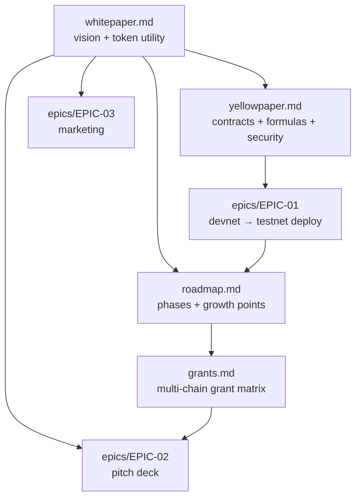

# Antigravity Protocol — Documentation

Founding documents for evolving the Antigravity Laboratory into the **Proof‑of‑Skill
Protocol**: verifiable, on‑chain credentials and a learn‑to‑earn token (AGT) for the
agentic‑coding era.

## Map

## Contents

| Doc | What it is |
| --- | --- |
| [whitepaper.md](./whitepaper.md) | Vision, problem, Proof‑of‑Skill solution, AGT token, governance |
| [yellowpaper.md](./yellowpaper.md) | Contracts, data structures, reward formula, security model |
| [roadmap.md](./roadmap.md) | Phased delivery (devnet→DAO) + growth points, with Gantt |
| [grants.md](./grants.md) | Grant programs across Arbitrum, Optimism, Base, BNB, Polygon, Scroll, zkSync, Linea, Celo, Avalanche, Gitcoin/Octant |
| [epics/EPIC-01-devnet-testnet-deployment.md](./epics/EPIC-01-devnet-testnet-deployment.md) | Deployment tasks + growth‑point tasks + impl notes |
| [epics/EPIC-02-pitch-deck.md](./epics/EPIC-02-pitch-deck.md) | Pitch deck & data‑room epic |
| [epics/EPIC-03-marketing.md](./epics/EPIC-03-marketing.md) | Go‑to‑market & community epic |

## Status

Draft / pre‑testnet. Token mechanics and timelines are illustrative and subject to legal +
governance review (see the whitepaper disclaimer). These are planning documents; no production
smart contracts are deployed yet — EPIC‑01 specifies that work.
