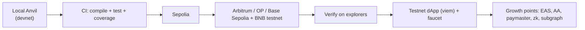

# EPIC‑01 — Devnet & Testnet Deployment

**Goal:** ship the Antigravity Proof‑of‑Skill contracts from local devnet to a verified,
multi‑chain public testnet with a working dApp, and lay the tracks for the growth points in
the [Roadmap](../roadmap.md).

**Spec:** [Yellowpaper](../yellowpaper.md) · **Vision:** [Whitepaper](../whitepaper.md)

**Definition of done:** a public tester can earn a soulbound Skill Credential and claim
testnet AGT on ≥2 chains; all contracts verified on explorers; CI runs compile + tests +
coverage on every PR.

---

## Deploy pipeline

## Task format

Each task: **Why · Implementation notes · Acceptance criteria · [Growth point]** flag where
applicable.

---

### T1 — Reuse the existing `smartcontracts/contracts/` Foundry project
- **Why:** ~~the repo has JS tooling but no Solidity project~~ **(actualized):** a Foundry
  project **already exists** at `smartcontracts/contracts/` (Foundry + OpenZeppelin v5.6.1,
  `solc 0.8.28`, `evm_version = cancun`, 6 contracts, 86 tests at 100% coverage). The
  protocol contracts should live here (or a sibling package) rather than a from‑scratch
  scaffold. Hardhat is **not** currently used — add it only if TS deploy via `viem` is
  preferred over `forge script` (the repo currently uses `forge script`).
- **Implementation:** add the protocol contracts under `smartcontracts/contracts/src/` next to
  the DRM platform; reuse its `foundry.toml`, remappings, and CI. Pin `pragma`.
- **Acceptance:** `forge build` passes with the new contracts; existing 86 tests stay green.

### T2 — Implement `AGT` (ERC‑20 + Votes)
- **Why:** learn‑to‑earn + governance asset.
- **Implementation:** OpenZeppelin `ERC20` + `ERC20Votes`; 18 decimals; mint role held only by
  `RewardDistributor`/`SkillRegistry`. Mirror the sandbox token semantics
  (`academy/courses/web3-genesis/assets/sandbox.js`), including infinite‑allowance behavior.
- **Acceptance:** parity test passes against sandbox reference; ERC‑20 completeness covered.

### T3 — Implement `SkillCredential` (soulbound ERC‑721 / ERC‑5192)
- **Why:** the non‑transferable credential primitive.
- **Implementation:** override transfer hooks to revert on holder‑to‑holder transfers; emit
  `Locked` on mint; `locked(tokenId)==true`; only `SkillRegistry` may mint; support revoke.
  **(actualized):** start from the in‑repo `SoulboundAccessNft` base
  (`smartcontracts/contracts/src/SoulboundAccessNft.sol`) — it already implements the OZ‑v5
  `_update` soulbound revert + `approve`/`setApprovalForAll` reverts and an EIP‑712 signed‑mint
  surface (see [`../../sc.md`](../../sc.md) §4). Add the ERC‑5192 `locked`/`Locked` interface
  and the registry‑only mint role + revoke flag on top.
- **Acceptance:** any transfer attempt reverts; ERC‑5192 interface detected; revoke flips flag
  without burning by default.

### T4 — Implement `SkillRegistry` + `Attestor` (EIP‑712)
- **Why:** source of truth + attestation verification (Yellowpaper §2–4).
- **Implementation:** role‑based access; EIP‑712 domain with `chainId`; `Skill`/`Credential`
  structs; `claimCredential(attestation, sig)` checks signer ∈ attestor set, deadline, nonce,
  skill active, no duplicate; accrues epoch weight. Use **custom errors** + **CEI** per
  `labs/30`.
- **Acceptance:** valid attestation mints; expired/replayed/forged attestations revert with the
  right custom errors.

### T5 — Implement `RewardDistributor` (merkle)
- **Why:** scalable per‑epoch AGT claims (Yellowpaper §5).
- **Implementation:** cumulative merkle distributor (sorted‑pair hashing, index leaves),
  `nonReentrant`, AGT transfer as final interaction; publish root per epoch.
- **Acceptance:** correct claim against a fixture root; double‑claim and over‑claim revert;
  missed epochs claimable cumulatively.

### T6 — Sandbox parity + Foundry test suite
- **Why:** keep the academy's taught behavior truthful and prove correctness.
- **Implementation:** port `tests/web3-sandbox*.test.js` expectations into Foundry unit tests;
  add invariants (no transferable SBT; minted == `CredentialMinted` count; claims ≤ epoch
  pool); fuzz attestation replay/expiry/double‑mint.
- **Acceptance:** `forge test` green incl. invariants; existing `npm test` still passes.

### T7 — Local devnet deploy + seed scripts
- **Why:** reproducible end‑to‑end demo.
- **Implementation:** Anvil/Hardhat node script that deploys all five contracts, registers a
  few skills, signs a fixture attestation, mints a credential, publishes an epoch root, and
  claims AGT — all via `viem`.
- **Acceptance:** one command runs the full learn→attest→mint→earn loop locally.

### T8 — Multi‑testnet deploy + verification
- **Why:** unlock per‑chain grant eligibility ([Grants](../grants.md)).
- **Implementation:** parameterized deploy to Sepolia, Arbitrum Sepolia, Optimism Sepolia, Base
  Sepolia, BNB testnet; record addresses in `deployments/`; verify on each explorer.
- **Acceptance:** verified contracts on ≥2 chains with published addresses.

### T9 — Extend the contracts CI gate
- **Why:** ~~the existing `static.yml` only deploys Pages~~ **(actualized):** a contracts gate
  **already exists** — `.github/workflows/test.yml` runs `forge install` (forge‑std +
  OpenZeppelin v5.6.1), `forge build`, `forge test`, and `forge snapshot --check` on PRs.
- **Implementation:** extend that `forge-test` job to also cover the protocol contracts + a
  coverage threshold; keep the gas snapshot (compare to sandbox constants in Yellowpaper §6).
  Add `hardhat compile` only if Hardhat is introduced in T1.
- **Acceptance:** CI required check passes/fails correctly on PRs, protocol contracts included.

### T10 — Testnet dApp wiring (viem)
- **Why:** a usable demo for testers and grant reviewers.
- **Implementation:** extend the academy web3 assets to connect a wallet, read the registry,
  claim a credential, and claim AGT against the deployed testnet contracts.
- **Acceptance:** a tester completes the loop in‑browser on testnet.

### T11 — Faucet & onboarding flow
- **Why:** testers need gas + a starting path.
- **Implementation:** link chain faucets; in‑app guide; pre‑sign a demo attestation path.
- **Acceptance:** a new tester goes zero→credential without external help.

---

## Growth‑point tasks (mirror Roadmap G1–G8)

| Task | Growth point | Implementation sketch | Done when |
| --- | --- | --- | --- |
| T12 | **G1 EAS attestations** | Register an EAS schema; write attestations on mint; verifier reads EAS | Credentials independently verifiable via EAS |
| T13 | **G2 Account abstraction** | ERC‑4337 smart‑wallet onboarding for new learners | New users mint without a seed phrase |
| T14 | **G3 Gasless mint+claim** | Paymaster sponsors mint/claim gas on testnet | Tester pays no gas |
| T15 | **G4 zk proof of completion** | Circuit proving assessment passage; verifier replaces trusted Attestor | Mint possible with zk proof, no signer trust |
| T16 | **G5 Subgraph** | Index `CredentialMinted`/`Claimed` events | dApp profile loads from subgraph |
| T17 | **G6 Multi‑chain SBT sync** | Read credentials cross‑chain (Superchain interop/messaging) | Credential visible on a second chain |
| T18 | **G7 Mobile wallet flow** | Mobile‑first credential wallet view | Loop works on mobile |
| T19 | **G8 DAO treasury & skill bounties** | Sponsor escrows AGT for a skill track; payout on completion | A funded bounty pays out on verified completion |

## Dependencies & order

T1 → (T2, T3) → T4 → T5 → T6 → T7 → T8 → (T9, T10, T11). Growth points T12–T19 follow once the
testnet loop (T8–T11) is live; sequence them by the grant programs being targeted.

## Risks

- Attestor key compromise → mitigate with staking/slashing and the G1/G4 trust‑minimization path.
- Gas regressions vs. taught sandbox values → guard with the T9 gas snapshot.
- Curriculum version drift → `curriculumVer` is snapshotted at mint (Yellowpaper §2).

---

*See also:* [Roadmap](../roadmap.md) · [Yellowpaper](../yellowpaper.md) ·
[EPIC‑02 Pitch deck](./EPIC-02-pitch-deck.md) · [EPIC‑03 Marketing](./EPIC-03-marketing.md)
