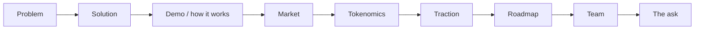

# EPIC‑02 — Pitch Deck & Fundraising Materials

**Goal:** produce the investor/grant pitch deck and supporting data room for the Antigravity
Protocol. Distinct from the existing course artifact `lab2_pitch_deck.pptx` (a lesson sample);
this is the **protocol's** fundraising deck.

**Inputs:** [Whitepaper](../whitepaper.md) · [Roadmap](../roadmap.md) · [Grants](../grants.md)

**Definition of done:** a 10–12 slide deck, a one‑pager, and a data‑room checklist that can be
attached to any grant application in the [Grants matrix](../grants.md) or sent to a backer.

---

## Narrative arc

## Tasks

### T1 — Deck structure & narrative (10–12 slides)
- **Why:** a tight story is the backbone every investor/grant reviewer expects.
- **Slides:** (1) Title/one‑liner · (2) Problem — unverifiable skills & agent competence ·
  (3) Solution — Proof‑of‑Skill · (4) How it works (the learn→attest→mint→earn loop) ·
  (5) Live demo / product · (6) Market & wedge (education + AI/agent economy) · (7) Tokenomics
  (AGT utility, allocation) · (8) Traction (academy usage, testnet metrics) · (9) Roadmap ·
  (10) Team · (11) The ask (grant/raise + use of funds) · (12) Contact.
- **Acceptance:** outline reviewed; every slide has a single clear takeaway.

### T2 — Tokenomics & metrics slide
- **Why:** the most scrutinized slide for a token project.
- **Implementation:** pull AGT utility/allocation from the [Whitepaper](../whitepaper.md) and
  the emission formula from the [Yellowpaper](../yellowpaper.md); add a simple emission chart.
- **Acceptance:** numbers reconcile with the papers; no unsupported claims.

### T3 — Data‑room checklist
- **Why:** grant programs ask for the same artifacts repeatedly ([Grants](../grants.md) checklist).
- **Implementation:** assemble whitepaper, yellowpaper, roadmap, repo + license, testnet
  addresses, audit status, team bios, budget‑by‑milestone, KYC/KYB readiness.
- **Acceptance:** every checklist item has a link or owner.

### T4 — One‑pager
- **Why:** the artifact most reviewers actually read first.
- **Implementation:** single page — problem, solution, traction, ask, links.
- **Acceptance:** fits one page; passes the "10‑second skim" test.

### T5 — Design system & build
- **Why:** consistent, credible visuals.
- **Implementation:** choose tooling (Slides/Figma/Pitch); reuse the architecture and roadmap
  mermaid diagrams from `docs/`; brand from EPIC‑03.
- **Acceptance:** deck exported to PDF + editable source committed to the repo.

### T6 — Demo‑day / pitch script
- **Why:** the deck needs a spoken narrative for accelerators (e.g. BNB MVB, Celo Camp).
- **Implementation:** 3‑minute and 60‑second versions, with Q&A prep.
- **Acceptance:** timed run‑through within limits.

## Dependencies

T1 → T2 → (T3, T4) → T5 → T6. Tokenomics (T2) depends on the Whitepaper/Yellowpaper being
frozen ([Roadmap](../roadmap.md) Phase 0). Traction figures improve after EPIC‑01 Phase 2.

---

*See also:* [EPIC‑03 Marketing](./EPIC-03-marketing.md) · [Grants](../grants.md)
