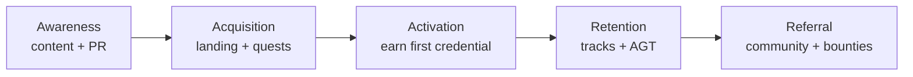

# EPIC‑03 — Marketing & Go‑to‑Market

**Goal:** build awareness, community, and developer adoption for the Antigravity Protocol —
distinct from fundraising ([EPIC‑02](./EPIC-02-pitch-deck.md)). This epic is about reaching
learners, builders, and ecosystems.

**Inputs:** [Whitepaper](../whitepaper.md) · [Roadmap](../roadmap.md)

**Definition of done:** a launched brand + landing page, an active community, a running content
calendar, and a testnet incentive campaign with tracked KPIs.

---

## Funnel

## Tasks

### T1 — Positioning & messaging
- **Why:** one consistent story across every channel.
- **Implementation:** define the one‑liner, audience segments (learners, agent builders, DAOs/
  employers), and 3 core messages. Anchor on the [Whitepaper](../whitepaper.md) narrative.
- **Acceptance:** a messaging doc the deck, site, and socials all draw from.

### T2 — Brand kit
- **Why:** recognizable, reusable visuals (also feeds EPIC‑02).
- **Implementation:** logo, palette, typography, diagram style (reuse the `docs/` mermaid look).
- **Acceptance:** brand kit committed; used by site + deck.

### T3 — Website / landing page
- **Why:** the conversion hub; also a grant‑review touchpoint.
- **Implementation:** extend the existing GitHub Pages site
  (`.github/workflows/static.yml`); sections — what it is, how to earn a credential, docs
  links, testnet CTA. Reuse academy front‑end assets.
- **Acceptance:** live page with a working "start earning" CTA into the testnet dApp.

### T4 — Content calendar
- **Why:** sustained awareness beats one‑off launches.
- **Implementation:** weekly cadence — protocol explainers, build‑in‑public updates, dev
  tutorials (tie to the 24 academy lessons), grant/milestone announcements.
- **Acceptance:** 8‑week calendar with owners and channels.

### T5 — Community (Discord / X / Telegram)
- **Why:** where learners and builders gather and advocate.
- **Implementation:** stand up channels, onboarding flow, roles tied to on‑chain credentials
  (holders get gated roles — dogfoods the protocol), moderation guidelines.
- **Acceptance:** channels live; credential‑gated role works end‑to‑end.

### T6 — Developer relations & docs
- **Why:** integrators (wallets, DAOs) drive distribution.
- **Implementation:** integration guide for reading the Skill Registry; sample verifier; office
  hours. Cross‑link from `docs/`.
- **Acceptance:** an external dev verifies a credential using only the public docs.

### T7 — Testnet incentive campaign (quests)
- **Why:** seed real usage and credentials before mainnet.
- **Implementation:** quest campaign (e.g. Galxe/Layer3‑style) — complete a lesson, earn an SBT,
  claim testnet AGT; leaderboard. Coordinate with EPIC‑01 T10/T11.
- **Acceptance:** campaign live; ≥N testers earn a credential (target set with team).

### T8 — KPIs & analytics
- **Why:** marketing without measurement is guesswork; grants ask for traction.
- **Implementation:** track credentials minted, unique wallets, retention, social reach,
  campaign conversion. Pipe into the EPIC‑02 traction slide.
- **Acceptance:** a dashboard the team reviews weekly.

## Dependencies

T1 → T2 → T3; T4/T5 run in parallel after T1. T7 depends on EPIC‑01 testnet (T8–T11). T8 spans
all tasks and feeds [EPIC‑02](./EPIC-02-pitch-deck.md).

---

*See also:* [EPIC‑02 Pitch deck](./EPIC-02-pitch-deck.md) · [Grants](../grants.md) ·
[Roadmap](../roadmap.md)
