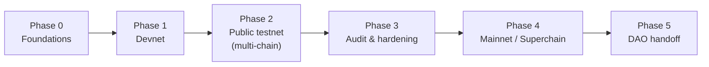
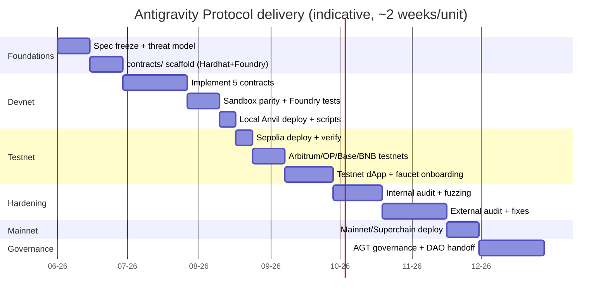

# Antigravity Protocol — Roadmap

From devnet to a DAO‑owned public good. Each **growth point** below is phrased as a task and
mirrored 1:1 in [EPIC‑01](./epics/EPIC-01-devnet-testnet-deployment.md).

> Companion docs: [Whitepaper](./whitepaper.md) · [Yellowpaper](./yellowpaper.md) ·
> [Grants](./grants.md)

---

## Phase flow

## Timeline (indicative)

## Phase detail

### Phase 0 — Foundations
- Freeze the [Yellowpaper](./yellowpaper.md) spec; write the threat model.
- Scaffold `contracts/` (Hardhat **and** Foundry) alongside the existing JS tooling.
- **Exit:** spec signed off, empty project compiles in CI.

### Phase 1 — Devnet
- Implement `AGT`, `SkillCredential`, `SkillRegistry`, `RewardDistributor`, `Attestor`.
- Achieve **sandbox parity** with `academy/courses/web3-genesis/assets/sandbox.js`.
- Deploy to local Anvil/Hardhat node with seed/fixture scripts.
- **Exit:** full Foundry suite green; local end‑to‑end mint + claim works.

### Phase 2 — Public testnet (multi‑chain)
- Deploy to **Sepolia**, **Arbitrum Sepolia**, **Optimism Sepolia**, **Base Sepolia**, **BNB
  testnet**; verify contracts on each explorer.
- Wire the testnet dApp (read registry, mint credential, claim AGT) via `viem`.
- Faucet + onboarding flow for testers.
- **Exit:** a public tester can earn an SBT and claim testnet AGT on ≥2 chains.

### Phase 3 — Audit & hardening
- Internal review + fuzz/invariant runs; then an external audit; fix and re‑test.
- **Exit:** audit report published, criticals resolved.

### Phase 4 — Mainnet / Superchain
- Mainnet deploy; prioritize an L2 / Superchain target chosen with the [Grants](./grants.md)
  matrix.
- **Exit:** verified mainnet contracts + monitoring/alerting live.

### Phase 5 — DAO handoff
- Move curriculum weights, emission `d`, and the attestor set under AGT governance; transfer
  treasury to the DAO.
- **Exit:** core multisig powers retired/timelocked; protocol is community‑owned.

## Growth points (tasks → EPIC‑01)

| # | Growth point | Why it matters |
| --- | --- | --- |
| G1 | **EAS attestations** | Trust‑minimize completion proofs; third‑party verifiable. |
| G2 | **Account abstraction onboarding** | New learners get a smart wallet without seed‑phrase friction. |
| G3 | **Gasless mint + claim (paymaster)** | Remove the "fund your wallet first" barrier on testnet/mainnet. |
| G4 | **zk proof of completion** | Eliminate the trusted Attestor; prove assessment passage in zero knowledge. |
| G5 | **Subgraph indexing** | Fast registry/profile queries for the dApp and integrators. |
| G6 | **Multi‑chain SBT sync** | Read credentials cross‑chain (Superchain interop / messaging). |
| G7 | **Mobile wallet flow** | Mirror the academy's mobile reach; in‑app credential wallet. |
| G8 | **DAO treasury & skill bounties** | Sponsors escrow AGT for targeted skill tracks. |

---

*Next:* [EPIC‑01 — Devnet/Testnet deployment](./epics/EPIC-01-devnet-testnet-deployment.md)
