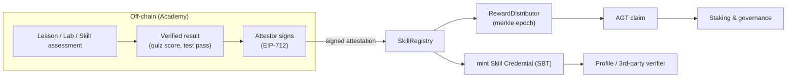

# Antigravity Protocol — Whitepaper

**Proof‑of‑Skill: verifiable, on‑chain credentials for the agentic‑coding era**

Version 0.1 (Draft) · Status: pre‑testnet · Network targets: EVM (Ethereum + L2s)

> This document describes the vision, economics, and high‑level architecture of the
> Antigravity Protocol. The low‑level technical specification lives in the
> [Yellowpaper](./yellowpaper.md). Delivery phases are in the [Roadmap](./roadmap.md).

---

## Abstract

Antigravity began as an open educational laboratory for agentic coding — 24 lessons, 30
hands‑on labs, and a library of reusable agent *Skills*. Today, completing that work
produces nothing portable: a learner's competence is locked inside a course platform and
cannot be independently verified by an employer, a DAO, or another autonomous agent.

The **Antigravity Protocol** turns proven competence into a **public, verifiable, on‑chain
asset**. When a learner completes a lesson, lab, or skill assessment, the result is attested
and a **soulbound Skill Credential (SBT)** is minted to their wallet. Verified completion
also accrues a **learn‑to‑earn token (AGT)**, claimable through a merkle distributor. A
public **Skill Registry** lets anyone — human or agent — look up exactly which competencies
an address has earned, and against which version of the curriculum.

The result is a neutral, chain‑native credentialing layer for the skills that matter in an
AI‑native software industry.

---

## 1. Problem

1. **Credentials are non‑portable.** Course completions live in centralized databases. They
   cannot be cryptographically verified, cross‑referenced, or composed by other applications.
2. **Agentic competence is unmeasured.** As autonomous agents take on real engineering work,
   there is no standard, machine‑readable way to assert *"this identity has demonstrated skill
   X at level Y."*
3. **Learning has no on‑chain economic loop.** Learners create value (tested, reviewed work)
   but capture none of it; there is no aligned incentive connecting curriculum, contributors,
   and sponsors.
4. **Sybil & credential fraud.** Self‑reported skills and transferable certificates are easy
   to fake or buy.

## 2. Solution — Proof‑of‑Skill

Antigravity issues **non‑transferable (soulbound) credentials** bound to the wallet that
actually earned them, backed by a verifiable attestation of the underlying assessment. Each
credential references an immutable **Skill ID** and curriculum version, so a credential's
meaning never silently changes.

Three primitives:

- **Skill Credential (SBT)** — a soulbound ERC‑721 (ERC‑5192 `locked`) token representing one
  earned competency.
- **AGT token (ERC‑20)** — the protocol's learn‑to‑earn and governance asset. The reference
  ERC‑20 semantics already exist in the academy sandbox
  (`academy/courses/web3-genesis/assets/sandbox.js`, symbol `AGT`) and are formalized in the
  [Yellowpaper](./yellowpaper.md).
- **Skill Registry** — the source of truth mapping `(address → skills earned)` and
  `(skillId → metadata, weight, curriculum version)`.

## 3. How it works

1. **Learn** — the learner completes a lesson, lab, or skill assessment in the Academy.
2. **Attest** — the result is verified off‑chain and signed by an authorized **Attestor**
   (EIP‑712 typed data, optionally anchored as an [EAS](https://attest.org) attestation).
3. **Mint** — the learner submits the attestation; `SkillRegistry` verifies the signature and
   mints the corresponding soulbound `SkillCredential`.
4. **Earn** — verified completions accrue AGT for the epoch; learners claim via a merkle proof
   from the `RewardDistributor`.
5. **Use** — wallets, DAOs, employers, and other agents read the registry to gate access,
   rank contributors, or compose reputation.

## 4. Token (AGT)

AGT aligns the four sides of the ecosystem: **learners** (earn by proving skill),
**curriculum contributors** (earn when their content drives verified completions),
**verifiers/operators** (stake to attest), and **sponsors/DAOs** (fund skill bounties).

| Utility | Description |
| --- | --- |
| Learn‑to‑earn | Verified completions accrue AGT per epoch (formula in the Yellowpaper). |
| Staking for attestation | Attestors stake AGT; provably false attestations are slashable. |
| Governance | AGT votes on curriculum weights, emission schedule, and treasury. |
| Skill bounties | Sponsors escrow AGT for completion of targeted skill tracks. |

**Indicative allocation (to be finalized before TGE):** Ecosystem & learn‑to‑earn rewards
~40%, Contributors & community ~20%, Treasury/DAO ~20%, Core contributors ~12% (vested),
Early backers/grants ~8% (vested). Emission decays per epoch toward a fixed cap. *These
figures are illustrative and subject to governance + legal review — see disclaimer.*

## 5. Why soulbound

A skill you earned should not be sellable. Soulbound credentials (ERC‑5192 `locked`) make
the credential non‑transferable so it reflects the holder's own demonstrated work, defeating
the "buy a certificate" attack. Revocation and re‑issuance handle curriculum updates and
fraud remediation (see Yellowpaper §credential lifecycle).

## 6. Governance & decentralization

Antigravity launches with a small multisig‑guarded core and progressively decentralizes:
curriculum weights and emission parameters move under AGT governance, and the Attestor set
opens from a permissioned allowlist to a staked, slashable operator set. The end‑state is a
DAO‑owned public good (see [Roadmap](./roadmap.md) Phase 5).

## 7. Ecosystem fit

The protocol is intentionally chain‑agnostic and public‑goods‑shaped: education credentials
and an AI/agent economy map directly onto multiple ecosystem grant mandates (Arbitrum,
Optimism, Base/Superchain, BNB Chain, Polygon, Celo's *AI & Agent Economy* pool, and Gitcoin/
Octant public‑goods funding). See the [Grants matrix](./grants.md).

## 8. Roadmap (summary)

Devnet → multi‑chain testnet → audit → mainnet/Superchain → DAO governance handoff. Full
phase breakdown, growth points, and a Gantt chart are in the [Roadmap](./roadmap.md).

## 9. Legal & disclaimer

This whitepaper is informational and does not constitute an offer of securities, investment
advice, or a binding commitment. Token mechanics, allocations, and timelines are drafts
subject to change pending legal, tax, and regulatory review in each relevant jurisdiction.
AGT is designed as a utility/governance token for protocol participation, not as an
investment. Nothing here is a promise of future value.

---

*See also:* [Yellowpaper](./yellowpaper.md) · [Roadmap](./roadmap.md) ·
[Grants](./grants.md) · [Epics](./epics/)
