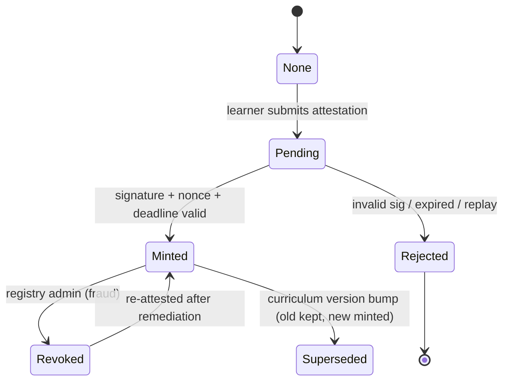

# Antigravity Protocol — Yellowpaper

**Technical specification of the Proof‑of‑Skill credential system**

Version 0.1 (Draft) · Companion to the [Whitepaper](./whitepaper.md)

> Audience: protocol engineers and auditors. This document specifies contracts, data
> structures, state transitions, the reward formula, and the security model. Implementation
> tasks are tracked in [EPIC‑01](./epics/EPIC-01-devnet-testnet-deployment.md).

---

## 1. Contract inventory

| Contract | Standard / base | Responsibility |
| --- | --- | --- |
| `AGT` | ERC‑20 (+ ERC‑20Votes) | Learn‑to‑earn & governance token. Reference semantics mirror the academy sandbox token (symbol `AGT`). |
| `SkillCredential` | ERC‑721 + ERC‑5192 (soulbound) | One token per earned competency; non‑transferable. |
| `SkillRegistry` | Ownable / AccessControl | Source of truth for skills, weights, curriculum versions; verifies attestations and orchestrates mint + reward accrual. |
| `RewardDistributor` | Merkle distributor | Per‑epoch AGT claims against a published merkle root. |
| `Attestor` | EIP‑712 verifier (lib) | Verifies signed completion attestations; optional [EAS](https://attest.org) anchoring. |

Contracts are deliberately small and composable; `SkillRegistry` is the only contract with
authority to mint `SkillCredential` and to publish reward epochs.

## 2. Data structures

```solidity
// Immutable description of a competency.
struct Skill {
    bytes32 id;            // keccak256(track, slug) — stable, content-addressed
    uint16  weight;        // reward weight (basis points of an epoch pool slice)
    uint32  curriculumVer; // curriculum version this skill belongs to
    bool    active;        // false = retired (no new mints; existing remain valid)
}

// On-chain record of a single earned credential.
struct Credential {
    bytes32 skillId;
    address holder;
    uint64  earnedAt;      // block timestamp
    uint32  curriculumVer; // snapshot at mint time (never mutated)
    bool    revoked;       // fraud / remediation flag
}

// Signed off-chain claim that `holder` completed `skillId`.
struct Attestation {
    address holder;
    bytes32 skillId;
    bytes32 resultHash;    // hash of the assessment result (score, test artifacts)
    uint64  deadline;      // signature expiry
    uint256 nonce;         // per-holder replay guard
}
```

The EIP‑712 type hash:

```
keccak256("Attestation(address holder,bytes32 skillId,bytes32 resultHash,uint64 deadline,uint256 nonce)")
```

## 3. Credential lifecycle (state machine)



- **Soulbound enforcement:** `SkillCredential` overrides `_update`/transfer hooks to revert on
  any transfer where `from != address(0) && to != address(0)`, and implements ERC‑5192
  `locked(tokenId) == true` + emits `Locked` on mint.
- **Revocation** does not burn by default; it flips `revoked = true` so the audit trail
  remains. Burn‑on‑revoke is a governance‑configurable option.

## 4. Attestation flow

1. Academy verifies the assessment result off‑chain and computes `resultHash`.
2. An authorized **Attestor** key signs the EIP‑712 `Attestation`.
3. Learner calls `SkillRegistry.claimCredential(attestation, signature)`.
4. Registry checks: signer ∈ attestor set, `block.timestamp <= deadline`, `nonce` unused,
   `Skill.active == true`, holder doesn't already hold an active credential for `skillId`.
5. On success: mint `SkillCredential`, store `Credential`, mark nonce used, emit
   `CredentialMinted`, and accrue reward weight for the current epoch.

Optional decentralization: attestations are also written to an EAS schema, letting third
parties verify provenance without trusting the Academy backend.

## 5. Reward emission

Let an epoch `e` have a fixed pool `P_e` of AGT (decaying geometrically):

```
P_e = P_0 * d^e         // d ∈ (0,1), e.g. d = 0.98 per epoch
```

A holder `h`'s share of epoch `e` is proportional to the summed weight of the *new* skills
they earned in that epoch, with a per‑address anti‑sybil cap:

```
raw_h   = Σ_{s ∈ newSkills(h,e)} weight[s]
cap     = min(raw_h, CAP_BP * Σ_all weights)     // CAP_BP caps any single address's share
reward_h = P_e * cap / Σ_{j} cap_j
```

**Worked example.** `P_0 = 1,000,000 AGT`, `d = 0.98`. In epoch 0 three skills (weights
50/30/20) are earned by Alice (50+30) and Bob (20). Ignoring the cap (no address exceeds it):
- Total earned weight = 100.
- Alice: `1,000,000 * 80/100 = 800,000 AGT`.
- Bob: `1,000,000 * 20/100 = 200,000 AGT`.
- Epoch 1 pool: `1,000,000 * 0.98 = 980,000 AGT`.

At epoch close, the operator publishes a merkle root over `(address, cumulativeAmount)`;
holders claim the delta via `RewardDistributor.claim(index, account, cumulativeAmount, proof)`.
Cumulative accounting makes missed epochs claimable later in a single transaction.

## 6. Gas & units

AGT uses 18 decimals (matching the sandbox default at `sandbox.js:183`). The academy sandbox
fixes reference costs that the deployed contracts should stay within an order of magnitude of:

| Op | Sandbox constant | Source |
| --- | --- | --- |
| ERC‑20 transfer | `TRANSFER_GAS = 51,000` | `sandbox.js:26` |
| approve | `APPROVE_GAS = 46,000` | `sandbox.js:29` |
| transferFrom | `TRANSFER_FROM_GAS = 56,000` | `sandbox.js:30` |
| deploy | `DEPLOY_GAS = 850,000` | `sandbox.js:33` |
| infinite allowance | `MAX_UINT256` untouched on `transferFrom` | `sandbox.js:404` |

Soulbound mint and merkle claim add their own costs; these are measured in the gas‑report task
of EPIC‑01 and must not regress the academy's taught expectations.

## 7. Security model

- **Access control:** `SkillRegistry` uses role‑based access (mint role held only by the
  registry; attestor role gated by stake). No EOA can mint a credential directly.
- **Solidity baseline:** follow the patterns taught in `labs/30` — **Checks‑Effects‑
  Interactions**, `Ownable`/role guards, and **custom errors** (not `require` strings).
- **Reentrancy:** `RewardDistributor.claim` follows CEI and uses `nonReentrant`; AGT transfer
  is the final interaction.
- **Replay protection:** per‑holder `nonce` + `deadline` in the EIP‑712 attestation; `chainId`
  bound via the domain separator.
- **Sybil resistance:** per‑address reward cap (`CAP_BP`) and soulbound credentials; attestor
  staking + slashing deters forged attestations.
- **Upgradeability:** v1 ships **immutable** contracts with a governance‑owned parameter
  surface (weights, emission `d`, attestor set). No proxy in v1; migration is via a new
  registry that reads prior credentials. (Revisit under governance.)
- **Merkle safety:** sorted‑pair hashing, index‑based leaves, and a per‑epoch root prevent
  double‑claims and cross‑epoch replays.

## 8. Test strategy

Extend the existing harness rather than starting over:

- The repo already ships `viem` and `tests/web3-*.test.js` exercising the in‑memory sandbox
  (deploy/transfer/approve/allowance, ERC‑20 completeness, RPC helpers).
- **Solidity tests (Foundry):** unit tests per contract + invariants (total minted credentials
  == sum of `CredentialMinted` events; no transferable SBT; merkle claims ≤ epoch pool).
- **Parity test:** assert deployed `AGT` matches the sandbox reference behavior (EIP‑20 +
  infinite‑allowance semantics) so the academy's teaching stays truthful.
- **Fuzz/invariant:** attestation replay, expired deadlines, double‑mint, over‑claim.

## 9. Open questions (track in EPIC‑01)

- EAS vs. bespoke attestation registry for v1.
- Account abstraction / gasless mint+claim (paymaster) to remove the wallet‑funding barrier.
- zk proof of completion to remove the trusted Attestor entirely (growth point).

---

*See also:* [Whitepaper](./whitepaper.md) · [Roadmap](./roadmap.md) ·
[EPIC‑01 Deployment](./epics/EPIC-01-devnet-testnet-deployment.md)
