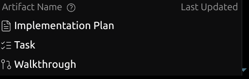

# Урок 2: Обратная связь на уровне артефактов (Artifact-level feedback)

В Google Antigravity артефакты — это специальные документы, которые агент использует для планирования, отслеживания прогресса и документирования результатов. Это позволяет пользователю видеть "ход мыслей" агента и контролировать процесс.

## Как пользоваться артефактами

Артефакты создаются в директории `.gemini/antigravity/brain/<id-разговора>/`.

### Типы артефактов и действия:



## Как открыть артефакт

Вы можете просматривать созданные артефакты несколькими способами:

1.  **Через иконку в UI**: В боковой панели или верхней части экрана (в зависимости от IDE) кликните на иконку документа рядом с названием артефакта. Это откроет его в новой вкладке.
2.  **По ссылке в чате**: Когда агент создает или обновляет артефакт, он присылает кликабельную ссылку (например, `walkthrough.md`). Просто нажмите на нее.
3.  **Через файловый менеджер**: Все артефакты физически находятся в папке `.gemini/antigravity/brain/<id-разговора>/`. Вы можете открыть их любым текстовым редактором.
4.  **Команда в чате**: Вы можете просто попросить агента: "покажи список задач" или "дай ссылку на план реализации".

### Основные типы:

    - Подробный чеклист всех этапов работы.
    - `[ ]` — не начато, `[/]` — в процессе, `[x]` — завершено.

2.  **`implementation_plan.md` (План реализации)**:
    - Описывает технический подход до начала написания кода.
    - Требует вашего **одобрения** (кнопка "Approve" или "LGTM").
3.  **`walkthrough.md` (Обзор результатов)**:
    - Итоговый документ с результатами работы и тестов.
4.  **`other` (Другое)**:
    - Сюда относятся дизайн-документы, результаты исследований, лог-файлы или специфические отчеты.

### Возможные действия с артефактами:

- **Одобрение (Approve)**: Активирует переход агента из режима `PLANNING` в `EXECUTION`.
- **Комментарии к строкам**: Вы можете кликнуть на номер строки в артефакте и оставить точечный комментарий. Агент увидит его и предложит исправления.
- **Общий фидбек**: Написание сообщения в чате после просмотра артефакта.
- **Регенерация**: Вы можете попросить "переделать план" или "уточнить детали", если предложенный вариант вас не устраивает.

### Форматирование и интерактивность:

- **Оповещения (Alerts)**: Используются GitHub-style блоки (`> [!NOTE]`, `> [!IMPORTANT]` и т.д.) для выделения критической информации.
- **Диаграммы Mermaid**: Для визуализации архитектуры и рабочих процессов.
- **Медиа-файлы**: Агент может встраивать скриншоты и видео прямо в артефакты для наглядности.
- **Ссылки на файлы**: Все пути в артефактах кликабельны и ведут на конкретные строки кода.

### Обратная связь:

Вы можете оставлять комментарии прямо к артефактам или к конкретным строкам. Агент проанализирует вашу обратную связь и обновит артефакты или план действий.

## Цикл обратной связи (Feedback Loop)

Процесс взаимодействия с агентом обычно выглядит так:

1. **План**: Агент предлагает `implementation_plan.md`.
2. **Ревью**: Вы проверяете план и оставляете комментарии (например: "Используй библиотеку X вместо Y").
3. **Корректировка**: Агент обновляет план с учетом ваших пожеланий.
4. **Исполнение**: После вашего одобрения (кнопка "Approve" или фраза "LGTM") агент приступает к кодингу.

### Пример итерации плана:

````carousel
```markdown
# [PLAN V1] Добавление API
...
#### [NEW] [api.py](file:///path/to/api.py)
Использование стандартной библиотеки `http.server`.
```
<!-- slide -->
> [!NOTE]
> **User Feedback:** "Давай лучше использовать FastAPI, это современнее."
<!-- slide -->
```markdown
# [PLAN V2] Добавление API (Updated)
...
#### [NEW] [api.py](file:///path/to/api.py)
Использование `FastAPI` для создания эндпоинтов.
```
````

Это позволяет вам контролировать архитектурные решения до того, как будет написан код.

## Горячие клавиши взаимодействия

Для эффективной работы с агентом и артефактами используйте следующие сочетания клавиш:

- `Ctrl + L` (**Режим комментариев**): Используется для обсуждения архитектуры, добавления глобального контекста или постановки общих задач по проекту.
- `Ctrl + I` (**Инлайновый режим**): Позволяет вносить правки или запрашивать изменения непосредственно в выделенном фрагменте кода или текста.
- `Ctrl + Shift + L` (**Асинхронные задачи**): Позволяет асинхронно отправить задание другому агенту или специфическому навыку (skill), не дожидаясь завершения текущей операции.

## Практические задания

Чтобы закрепить материал, выполните следующие действия:

1.  **Задание 1: Планирование**. Попросите агента создать новую функцию (например, "добавь скрипт для расчета площади круга"). Когда агент создаст `implementation_plan.md`, не одобряйте его сразу.
2.  **Задание 2: Обратная связь**. В созданном плане кликните на любую строку и оставьте комментарий, например: "Используй `math.pi` для точности". Дождитесь, пока агент обновит план.
3.  **Задание 3: Инлайновые правки**. Выделите этот текст в README и нажмите `Ctrl + I`. Попросите агента: "переведи этот список заданий на английский язык". Посмотрите, как изменятся строки.
4.  **Задание 4: Асинхронность**. Нажмите `Ctrl + Shift + L` и попросите другого агента: "найди все .py файлы в текущем каталоге". Проверьте, как создастся параллельный артефакт `task`.
