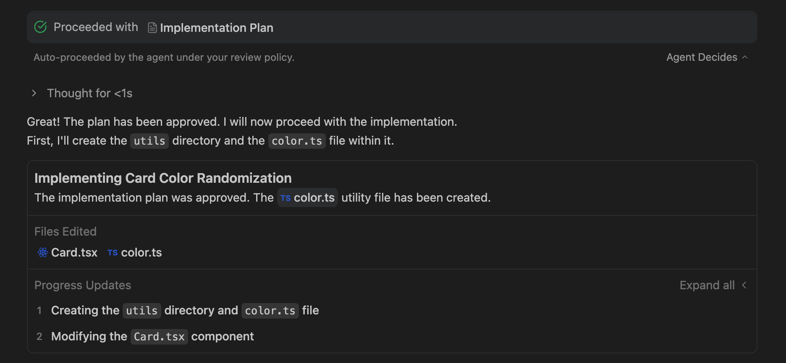
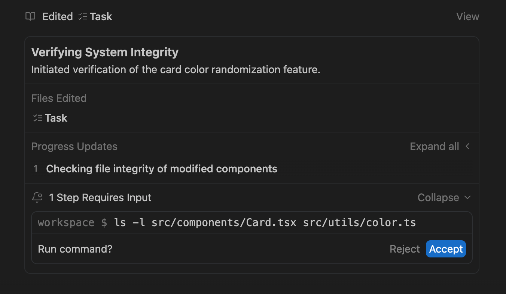

# Урок №8: Агентный Режим и Группы Задач (Task Groups)

В этом уроке мы погрузимся в механику работы Агента в **Plan Mode** (Режиме Планирования) и разберем, как сложные задачи структурируются с помощью **Task Groups** (Групп Задач).

Когда Агент находится в режиме планирования, большие и сложные запросы разбиваются на управляемые блоки. Мы называем эти блоки **Task Groups**. Это позволяет Агенту работать над несколькими частями большой задачи параллельно, сохраняя при этом прозрачность для пользователя.

---

## 🏗️ 1. Анатомия Task Group (Группа Задач)

Группа Задач — это основной контейнер для единицы работы.

### Архитектура Группы

1. **Overarching Goal (Главная цель)**:
   В верхней части группы указана глобальная цель текущего этапа. Это "заголовок" блока, который отвечает на вопрос "Что мы сейчас делаем?".
   _Пример:_ `Implementing Authentication Service` или `Refactoring Database Schema`.
2. **Summary of Changes (Сводка изменений)**:
   Краткое описание того, какие конкретно действия предпринимаются. Агент обновляет это описание по мере прогресса.

   
3. **Edited Files (Измененные файлы)**:
   Визуальный список файлов, затронутых в этой группе задач.

   > **Task Group Clicked Pill**: Это интерактивный элемент ("таблетка"). Нажав на название файла в этом списке, вы мгновенно увидите _текущее состояние_ файла с внесенными изменениями. Это позволяет проводить быстрый аудит работы агента без необходимости открывать файл в редакторе вручную.
   >

---

## 📦 2. Subtasks (Подзадачи) и Детализация

Внутри одной Группы Задач агент может выполнять множество мелких действий (Subtasks).

### Modularization (Модульность)

Агент идентифицирует подзадачи, чтобы структурировать изменения. Например, в задаче "Создать API" могут быть подзадачи: "Определить модели", "Написать контроллер", "Обновить роуты".

### Visibility (Видимость)

- **По умолчанию**: Детали каждой подзадачи и конкретные вызовы инструментов (tool calls) скрыты, чтобы не перегружать интерфейс. Вы видите только общий прогресс.
- **Task Group Expanded**: Если вам интересны технические детали (какую именно команду терминала выполнил агент или какой JSON отправил), стейтмент имеет переключатель (toggle), который разворачивает полный лог действий.

---

## ⏳ 3. Pending States (Режим Ожидания)

Иногда работа агента требует вашего вмешательства или подтверждения. В таких случаях Task Group переходит в состояние **Task Group Pending**.

Это происходит, когда:

- Агенту нужно запустить команду в терминале, которая требует вашего подтверждения (например, `rm -rf` или деплой).
- Агенту необходимо настроить браузер или пройти капчу.
- Агент запрашивает ревью дизайн-документа или плана.

В этом режиме в нижней части Группы Задач появляется специальная секция, где вы можете просмотреть ожидающие действия и одобрить (или отклонить) их. Агент не продолжит работу, пока критические шаги не будут подтверждены.

---

## 🧠 Дополнительная информация о режимах (Modes)

Группы задач тесно связаны с режимом работы агента:

- **PLANNING**: Агент исследует кодовую базу и создает план. Задача здесь — сформировать стратегию. Task Group будет называться, например, "Researching current implementation".
- **EXECUTION**: Агент пишет код. Здесь вы увидите больше всего изменений в файлах и "Clicked Pills".
- **VERIFICATION**: Агент тестирует решения. Task Group может называться "Running Unit Tests".

---

## 🎓 Задания для закрепления

Выполните следующие задания, используя полученные знания.

### Задание 1: Проектирование Task Group

Представьте, что вы Агент, и вам поручили задачу: "Добавить темную тему на сайт".
Распишите, как могла бы выглядеть **Task Group** для этой задачи:

1. Придумайте **TaskName** (Заголовок).
2. Напишите **TaskSummary** (1-2 предложения).
3. Перечислите 3 **Files**, которые скорее всего появятся в секции _Edited Files_.

### Задание 2: Анализ Pending State

В какой из следующих ситуаций Агент скорее всего покажет состояние **Task Group Pending**? Объясните свой выбор.

- А) Агент создает новый css файл.
- Б) Агент хочет удалить базу данных `production_db` через терминал.
- В) Агент читает содержимое файла `README.md`.

### Задание 3: Ролевая игра (Simulation)

Используя инструмент `task_boundary` (мысленно или в чате), сформулируйте вызов для начала этапа тестирования.

- **Mode**: ?
- **TaskName**: ?
- **TaskStatus**: ?
- **TaskSummary**: "Я завершил написание кода и теперь запускаю тесты, чтобы убедиться, что ничего не сломал."

---

Поздравляем! Теперь вы понимаете, как читать и интерпретировать интерфейс Агента при выполнении сложных задач.
