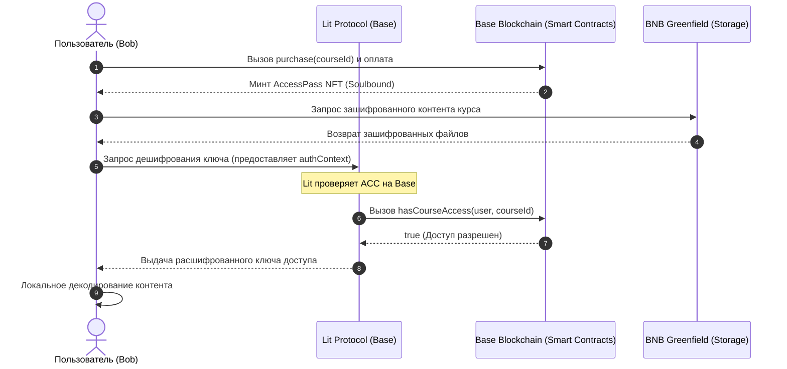

# Daskibo Academy — Docker Compose & Multi-Chain Gating Architecture

Этот документ описывает инфраструктуру оркестрации контейнеров для интеграционного тестирования, автоматизированных пайплайнов (CI/CD) и девнет-окружений. Вся система спроектирована с учетом поддержки двух ключевых архитектурных сценариев защиты контента (Lit Gating) при работе с BNB Greenfield.

---

## 1. Архитектурные Сценарии и Топология Сетей

В рамках платформы Daskibo Academy реализованы и тестируются два сценария развертывания смарт-контрактов и узлов Lit Protocol:

### Сценарий A: Base-Gated DRM (Односетевая конфигурация)
*   **Смарт-контракты (`CourseMarketplace`, `AccessPass` NFT)**: Развертываются в сети **Base** (L2).
*   **Lit Protocol Nodes**: Развернуты в сети **Base** и осуществляют проверку условий доступа (Access Control Conditions - ACC) непосредственно в той же сети.
*   **Хранилище контента**: Зашифрованные файлы курсов и метаданные хранятся в публичных бакетах **BNB Greenfield**.
*   **Потоки данных**:
    1. Автор шифрует контент с помощью симметричного ключа, шифрует этот ключ через Lit Protocol, привязывая его к вызову метода `hasCourseAccess` на Base, и загружает зашифрованный контент в Greenfield.
    2. Покупатель приобретает курс на Base, получая Soulbound NFT `AccessPass`.
    3. При запросе чтения Lit-узлы вызывают контракт `CourseMarketplace` на Base, подтверждают владение NFT и выдают ключ для дешифрования.



### Сценарий B: Cross-Chain Gate (BNB + Base конфигурация)
*   **Смарт-контракты (`CourseMarketplace`, `AccessPass` NFT)**: Развертываются в сети **BNB Chain (BSC)**. Контракт `AccessPass` поддерживает подписание транзакций через **Permit** (EIP-712/EIP-2612) для оптимизации UX.
*   **Lit Protocol Nodes**: Развернуты в сети **Base** (или используют ноды с Base-сетевой конфигурацией).
*   **Хранилище контента**: Зашифрованные файлы курсов хранятся в бакетах **BNB Greenfield**.
*   **Потоки данных**:
    1. Смарт-контракты на BNB Chain управляют продажами и токенами доступа.
    2. При запросе дешифрования Lit Protocol (сконфигурированный на Base) совершает **кросс-чейн запрос** к RPC BNB Chain для проверки баланса или статуса `hasCourseAccess` пользователя.
    3. Поддержка Permit позволяет пользователю подписывать разрешения на передачу/проверку прав без лишних затрат на газ в BSC.

---

## 2. Подробное описание потоков и вызовов API (Flow Specifications)

### Flow A: Mock SP Gating Stack (Эмуляция локального хранилища)
Используется для быстрой проверки фронтенда без реальных транзакций и блокчейн-сетей. Оркестрируется файлом `smartcontracts/docker-compose.yml`.

#### 1. Вызовы API и Ручки (API Handles)
*   **Получение списка провайдеров (Storage Providers)**
    *   *Ручка*: `GET http://localhost:9000/providers`
    *   *Ответ*:
        ```json
        [
          {
            "operatorAddress": "0xCDB08277328ea4460DFeb5eB88982A1ed1cE2b71",
            "endpoint": "http://localhost:9000"
          }
        ]
        ```
*   **Создание бакета (Create Bucket)**
    *   *Ручка*: `POST http://localhost:9000/buckets`
    *   *Тело запроса*:
        ```json
        {
          "bucketName": "course-bucket",
          "creator": "0x70997970C51812dc3A010C7d01b50e0d17dc79C8",
          "visibility": "VISIBILITY_TYPE_PUBLIC_READ",
          "paymentAddress": "0x70997970C51812dc3A010C7d01b50e0d17dc79C8"
        }
        ```
*   **Загрузка зашифрованного контента (Put Object)**
    *   *Ручка*: `PUT http://localhost:9000/buckets/course-bucket/objects/lessons/01/secret.md.enc`
    *   *Заголовки*: `Content-Type: text/plain`
    *   *Тело*: Зашифрованные бинарные данные / строка.

#### 2. Соответствие классов и модулей в коде
*   **`mock-sp`**: Реализован в `smartcontracts/integration/mock-sp.mjs` (Express.js сервер).
*   **`frontend`**: Клиентское приложение в `smartcontracts/index.html`, работающее через абстракции `greenfield-wallet-sdk.js` и `greenfield-sdk-tx.js`.

---

### Flow B: Lit NFT Gating Sandbox E2E (Полный TEE + Локальные блокчейны)
Оркестрируется файлом `smartcontracts/docker-compose.lit.yml`. Симулирует полноценный защищенный анклав (Intel SGX), локальный Greenfield и Base сети на Anvil.

#### 1. Вызовы API и Ручки (API Handles)
*   **Генерация PKP кошелька в TEE (Chipotle API)**
    *   *Ручка*: `GET http://chipotle-real:8000/core/v1/create_wallet`
    *   *Заголовки*: `X-Api-Key: dummy-api-key`
    *   *Ответ*:
        ```json
        {
          "wallet_address": "0x467e464543794f898ae1748a4dc0f2a9d5041b42",
          "pkp_public_key": "0x044d509129246cca37cc4597e31422a077c0c7ebba298a6c855858d8a2c7ed8fdd..."
        }
        ```
*   **Шифрование ключа в TEE (Chipotle API)**
    *   *Ручка*: `POST http://chipotle-real:8000/core/v1/encrypt`
    *   *Тело запроса*:
        ```json
        {
          "data_to_encrypt": "313233343536..." (hex-строка симметричного ключа),
          "access_control_conditions": [
            {
              "contractAddress": "0xDc64a140Aa3E981100a9becA4E685f962f0cF6C9",
              "standardContractType": "customContract",
              "chain": "ethereum",
              "method": "hasCourseAccess",
              "parameters": [":userAddress", "1"],
              "returnValueTest": { "comparator": "==", "value": "true" }
            }
          ]
        }
        ```
*   **Регистрация курса на смарт-контракте (Base - Anvil RPC)**
    *   *Вызов*: `registerCourse(price, contentHash, bucketName, accessDuration)`
    *   *Сериализация параметров*:
        ```javascript
        price = 10000000000000000n; // 0.01 ETH
        contentHash = "0x1234567890123456789012345678901234567890123456789012345678901234";
        bucketName = "daskibo-paid-lit-mpi3rc0o";
        accessDuration = 300n; // 5 минут подписки
        ```

*   **Подписание транзакции в Greenfield (EIP-712 Структура)**
    *   *Домен (`EIP712Domain`)*:
        ```json
        {
          "name": "Greenfield Tx",
          "version": "1.0.0",
          "chainId": 9000,
          "verifyingContract": "0x71e835aff094655dEF897fbc85534186DbeaB75d",
          "salt": "0"
        }
        ```
    *   *Типы сообщения (`Tx` Types)*:
        ```json
        {
          "EIP712Domain": [
            { "name": "name", "type": "string" },
            { "name": "version", "type": "string" },
            { "name": "chainId", "type": "uint256" },
            { "name": "verifyingContract", "type": "string" },
            { "name": "salt", "type": "string" }
          ],
          "Tx": [
            { "name": "account_number", "type": "uint256" },
            { "name": "chain_id", "type": "string" },
            { "name": "fee", "type": "Fee" },
            { "name": "memo", "type": "string" },
            { "name": "msg1", "type": "Msg1" },
            { "name": "sequence", "type": "uint256" },
            { "name": "timeout_height", "type": "uint256" }
          ]
        }
        ```
    *   *Значение сообщения (`Tx` Message)*:
        ```json
        {
          "account_number": "55",
          "chain_id": "greenfield_9000-1",
          "sequence": "0",
          "memo": "",
          "fee": {
            "amount": [{ "amount": "12000000000000", "denom": "BNB" }],
            "gas_limit": "2400",
            "payer": "0x70997970c51812dc3a010c7d01b50e0d17dc79c8",
            "granter": ""
          },
          "timeout_height": "0",
          "msg1": {
            "creator": "0x70997970c51812dc3a010c7d01b50e0d17dc79c8",
            "bucket_name": "daskibo-paid-lit-mpi3rc0o",
            "visibility": "VISIBILITY_TYPE_PUBLIC_READ",
            "payment_address": "0x70997970c51812dc3a010c7d01b50e0d17dc79c8",
            "primary_sp_address": "0x88262259cc540b474d627d7bd62eb996f022879f",
            "primary_sp_approval": {
              "expired_height": "0",
              "global_virtual_group_family_id": 1
            },
            "charged_read_quota": "0",
            "type": "/greenfield.storage.MsgCreateBucket"
          }
        }
        ```

*   **Публикация метаданных курса (`_lit/manifest.json`) в Greenfield**
    *   *Ручка*: `PUT http://greenfield-local:9033/daskibo-paid-lit-mpi3rc0o/_lit/manifest.json`
    *   *JSON-данные*:
        ```json
        {
          "slug": "daskibo-paid-lit-mpi3rc0o",
          "title": "E2E Same-Network Paid Subscription Gated Course",
          "lit": {
            "litNetwork": "chipotle",
            "chipotleUrl": "http://chipotle-real:8000",
            "pkpId": "0x467e464543794f898ae1748a4dc0f2a9d5041b42",
            "encryptedSymmetricKey": "0xabc123...",
            "accessControlConditions": [
              {
                "contractAddress": "0xDc64a140Aa3E981100a9becA4E685f962f0cF6C9",
                "standardContractType": "customContract",
                "chain": "ethereum",
                "method": "hasCourseAccess",
                "parameters": [":userAddress", "1"],
                "returnValueTest": { "comparator": "==", "value": "true" }
              }
            ]
          },
          "lessons": [
            {
              "key": "lessons/01/secret.md",
              "title": "Paid subscription Lesson",
              "contentType": "text/markdown"
            }
          ]
        }
        ```

#### 2. Соответствие классов и модулей в коде
*   **Смарт-контракты**:
    *   `CourseMarketplace` (`smartcontracts/contracts/src/CourseMarketplace.sol`): Отвечает за маппинг курсов и логику проверки доступов `hasCourseAccess`.
    *   `AccessPass` (`smartcontracts/contracts/src/AccessPass.sol`): Soulbound NFT, подтверждающий факт оплаты. Метод `transferFrom` перегружен для безусловного вызова реверта с ошибкой `Soulbound()`.
*   **SDK-слой**:
    *   `createSdkBackend` (`smartcontracts/greenfield-testnet/sdk-backend.mjs`): Инициализирует Greenfield JS-SDK `Client`. Применяет манки-патч для автовыбора GVG Family ID `1` и делегирует вызовы.
    *   `sdkCreateBucket` (`smartcontracts/buckets/greenfield-sdk-tx.js`): Конструирует структуру `MsgCreateBucket` и запускает подписание через EIP-712 транслятор `@bnb-chain/greenfield-js-sdk`.
*   **Тестовый раннер**:
    *   `run-e2e-lit-nft.mjs` (`smartcontracts/e2e/run-e2e-lit-nft.mjs`): Координирует Viem (блокчейн-транзакции на Anvil), Lit Access SDK (шифрование симметричных ключей в Chipotle) и Greenfield client (загрузка файлов).

---

### Flow C & D: Devnet / Testnet Deployment (Публичные тестовые сети)
Оркестрируется файлом `smartcontracts/greenfield-testnet/docker-compose.yml`.

#### 1. Вызовы API и Ручки (API Handles)
*   **Трансляция транзакций в тестовую сеть Greenfield (RPC)**
    *   *Ручка*: `POST https://gnfd-testnet-fullnode-tendermint.bnbchain.org` (Космос RPC)
    *   *Тип сети*: `greenfield_5600-1`
*   **Запросы к серверам хранения (Storage Provider API)**
    *   *Ручка*: `POST https://gnfd-testnet-sp1.bnbchain.org`
*   **Авторизация на публичных TEE Lit узлах (Habenero/Manzano)**
    *   *Ручка*: `POST https://api.litprotocol.com/core/v1/decrypt`

#### 2. Соответствие классов и модулей в коде
*   **`testnet-writer`**: Служба публикации на базе Node.js, выполняющая скрипт `write-testnet.mjs` или `write-testnet-lit.mjs`.
*   **`chipotle-mock`**: Сервер эмуляции Chipotle API для автономной локальной работы без сетевых задержек Lit-нод.

---

## 3. Фаза 2: Автоматизированное Тестирование (CI/CD Pipeline)

Интеграция в CI/CD реализована в GitHub Actions через workflow `.github/workflows/test.yml`. 

### Структура Пайплайна
Пайплайн разделен на несколько независимых параллельных задач:
1.  **`test` (Unit-тесты)**: Запускает быструю валидацию JS-кода в node-окружении (`vitest`).
2.  **`forge-test` (Contract Tests)**: Устанавливает Foundry и запускает юнит-тесты Solidity контрактов в `smartcontracts/contracts` (`forge test -vvv`), а также снимает снимок потребления газа.
3.  **`chipotle-real-integration`**: Запускается по расписанию или вручную. Склонирует репозиторий Chipotle, компилирует dstack simulator, поднимает TEE-ноду Chipotle и тестирует API.
4.  **`e2e-lit-integration` (Полный цикл)**: Поднимает весь стек из `docker-compose.lit.yml` (включая Greenfield и Lit TEE) на виртуальной машине раннера и запускает сквозной тест.

### Оптимизация и Кэширование в CI/CD
Для сокращения времени выполнения пайплайна (с 20+ минут до ~4 минут):
*   Используется кэширование Rust зависимостей через `Swatinem/rust-cache` для сборки Chipotle и dstack симулятора.
*   Используются предварительно собранные Docker-образы для Greenfield валидатора и SP (`ghcr.io/bnb-chain/greenfield` и `greenfield-storage-provider`), исключая компиляцию Go-ноды из исходников.
*   Настроено кэширование `npm` модулей раннера.

---

## 4. Фаза 3: Девнет (Devnet Tier)

Девнет-фаза — это этап сквозного тестирования на публичных тестовых сетях перед деплоем в продакшн. Для этой фазы используется файл `smartcontracts/greenfield-testnet/docker-compose.yml`.

### Конфигурационные Различия
| Параметр | Локальное Тестирование (Sandbox) | Девнет / Тестнет (Devnet Tier) |
|---|---|---|
| **Сеть Greenfield** | Локальная нода `greenfield_9000-1` (`:26750`) | Публичный тестнет `greenfield_5600-1` |
| **Storage Provider** | Локальный `sp0` шлюз (`:9033`) | Публичный тестовый SP (например, `https://gnfd-testnet-sp1.bnbchain.org`) |
| **Валюта транзакций** | Локальный тестовый BNB (Genesis) | Публичный Testnet tBNB (требует клейма из крана) |
| **Lit / TEE Сеть** | Локальный `chipotle` инстанс на Anvil | Live-тестнет Lit Protocol (например, `Habenero` или `Manzano`) |
| **Адреса контрактов** | Развертываются на лету в `chipotle-anvil` | Задеплоены стационарно в тестнеты Base Sepolia или BSC Testnet |

### Развертывание в Девнет (Сценарии A и B)
Для работы в девнете необходимо задать переменные окружения в файле `.env` в корне проекта:
```bash
GREENFIELD_TESTNET_PRIVATE_KEY=0x... # Приватный ключ кошелька автора курса
GREENFIELD_TESTNET_ADDRESS=0x...     # Адрес автора курса
```

Команды запуска девнет-сценариев:
```bash
# Вариант 1: Публикация контента в Greenfield тестнет с использованием локального Mock Chipotle (для тестирования логики API)
docker compose -f smartcontracts/greenfield-testnet/docker-compose.yml up -d chipotle-mock
docker compose -f smartcontracts/greenfield-testnet/docker-compose.yml run --rm chipotle-writer

# Вариант 2: Публикация с использованием live-тестнета Lit Protocol и проверка смарт-контрактов на Base Sepolia / BSC Testnet
CHIPOTLE_URL=https://api.litprotocol.com \
docker compose -f smartcontracts/greenfield-testnet/docker-compose.yml run --rm -e CHIPOTLE_URL testnet-writer node write-testnet-chipotle.mjs
```

---

## 5. План Действий (Action Plan)

Для завершения настройки, отладки и подготовки платформы Daskibo Academy к промышленному запуску определен следующий пошаговый план:

### Шаг 1: Разрешение проблемы с валидацией подписи в Greenfield SDK (Текущая задача)
*   **Проблема**: Возникает ошибка `signature verification failed` при отправке транзакции `MsgCreateBucket` локальным SDK-клиентом. Node.js клиент подписывает EIP-712 хэш, который восстанавливается нодой в неверный публичный ключ.
*   **Решение**:
    1. Проверить регистр букв в адресах (creator/payer) внутри полезной нагрузки EIP-712 — привести их принудительно к нижнему регистру перед подписанием.
    2. Проверить типы полей в EIP-712. Поле `chain_id` в типе `Tx` имеет тип `uint256`. В JS SDK передается строка `"greenfield_9000-1"`. Необходимо модифицировать SDK так, чтобы значение `chain_id` в сообщении передавалось как строгое числовое значение `9000` (для локальной сети) или преобразовать сериализацию на стороне клиента.
    3. Синхронизировать конфигурацию газа и лимитов между JS SDK и Go-нодой.

### Шаг 2: Реализация Permit-подписей для Сценария B (BNB Chain)
*   **Задача**: Разработать поддержку EIP-2612 / Permit для `AccessPass.sol` в BNB Chain.
*   **Решение**:
    1. Обновить смарт-контракт `AccessPass.sol` для поддержки метода `permit(address owner, address spender, uint256 value, uint256 deadline, uint8 v, bytes32 r, bytes32 s)`.
    2. Внедрить в тестовые сценарии генерацию структурированной подписи Permit пользователем.
    3. Обновить условия доступа в Lit ACC для проверки подлинности permit-разрешений.

### Шаг 3: Полная валидация локального сценария
*   **Задача**: Убедиться в полной работоспособности всего стека через `./run_e2e_lit.sh`.
*   **Решение**:
    1. Убедиться, что шаги с 1 по 10 в `run-e2e-lit-nft.mjs` проходят успешно.
    2. Зафиксировать стабильную работу тайм-аута подписки (Fast-forward времени в Anvil) и автоматического запрета доступа по истечении времени.

### Шаг 4: Развертывание в публичный Devnet и нагрузочное тестирование
*   **Задача**: Запустить сценарии A и B на публичных тестовых сетях.
*   **Решение**:
    1. Задеплоить `CourseMarketplace` и `AccessPass` в Base Sepolia и BSC Testnet.
    2. Записать тестовые курсы в Greenfield Testnet, используя полученные адреса.
    3. Запустить сквозные тесты дешифрования с реальными нодами Lit Protocol.

---

## 6. Проблемы при локальном docker-compose тестировании и рекомендации
Ниже — собранные возможные проблемы при локальном запуске стека через docker-compose и краткие рекомендации по диагностике и смягчению.

- Chipotle mock ограничения
  - Проблема: Mock использует единый симметричный ключ (CHIPOTLE_PKP_KEY) и не эмулирует TEE/IPFS/CID execution; NFT/balanceOf и некоторые ACC-проверки всегда ложны.
  - Пометка: Расшифровка/проверки, зависящие от on-chain вызовов, могут дать false-negatives локально.
  - Рекомендация: Для unit-интеграции тестировать логику приложения; для проверки ACC и подписей поднимать full Chipotle + Anvil по инструкции в docs/local-dev.md.

- Greenfield локальные расхождения
  - Проблема: Local SP emulation и EIP-712 транслятор могут создавать несовпадения сериализации (chainId, типы полей, регистр адресов).
  - Рекомендация: Приводить адреса к нижнему регистру перед подписанием; сверять типы полей (числа vs строки) в EIP-712; при неудаче включать verbose логи и сравнивать сериализованные payloads между SDK и нодой.

- EIP-712 / подписи и MsgCreateBucket
  - Проблема: `signature verification failed` при `MsgCreateBucket` из-за несоответствия типов/форматов/chainId.
  - Рекомендация: Проверять локально `eth_signTypedData` вход/выход, включать тесты сравнения хэшей; использовать фиксированные значения в .env для повторимости.

- Lit Actions / IPFS CID и поведение в mock
  - Проблема: Mock не поддерживает execution по IPFS CID и может по-другому привязывать identity action; действия, завязанные на CID, не будут идентичны продовому поведению.
  - Рекомендация: При тестировании ACC, зависящих от action identity, либо эмулировать CID на уровне теста, либо поднимать full Chipotle stack.

- Стабильность старта сервисов и порты
  - Проблема: Конфликты портов (Anvil, Greenfield, Chipotle), порядок старта и race conditions приводят к флейки тестам.
  - Рекомендация: Убедиться что docker-compose использует healthchecks и retry, добавить wait-for скрипты (wait-for-it), проверять логи `docker compose logs --no-color --follow`.

- Persisted state, PKP и ключи
  - Проблема: При перезапуске mock PKP и CHIPOTLE_PKP_KEY могут переинициализироваться → ciphertext несовместимы между запусками.
  - Рекомендация: Хранить CHIPOTLE_PKP_KEY в .env и монтировать volume для persistence; фиксировать pkpId в тестовых manifest.

- Тайм-ауты, дрейф времени и Anvil
  - Проблема: Временные проверки (accessDuration, expiry) могут вести себя по-разному на Anvil/host из‑за разницы времени и fast-forward поведения.
  - Рекомендация: В тестах явно контролировать время (anvil impersonate/evm_increaseTime) и не полагаться на wall-clock в контейнерах.

- Ресурсы, ограничения Docker и флейки
  - Проблема: CI runner с малым количеством CPU/RAM вызывает тайм-ауты, упавшие контейнеры и неустойчивые E2E.
  - Рекомендация: Ограничить параллелизм тестов, увеличивать тайм-ауты в CI, использовать предсборанные образы как кэш.

- Логи и отладка сетевых вызовов
  - Рекомендация: Включать verbose/DEBUG логи для Greenfield SDK, Chipotle client и Lit Actions; сохранять логи контейнеров при неудаче (docker compose logs > artifact).

- Отсутствие скилла BugHunter
  - Наблюдение: В репозитории не найден документированный "bughunter" скилл/инструкции. Поэтому не добавлены специфичные для него рекомендации.
  - Рекомендация: Если под BugHunter подразумевается security/fuzz-платформа — добавить отдельный документ с инструкциями по запуску сканеров и fuzzing для smart contracts и Lit Actions; пока использовать существующие тесты в /tests и ручной аудит.

---

(Короткая проверка после изменений: запустить `docker compose -f smartcontracts/greenfield-testnet/docker-compose.yml up --build --detach` и прогнать `npm run test:integration`.)
