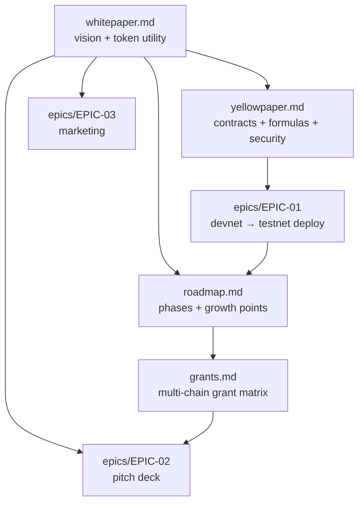

# Antigravity — Specifications & Docs

Central home for all specifications and design docs. (Lecture & lab texts stay under
`lessons/`, `academy/`, `labs/`; functional agent skills under `skills/`.) The root
[`README.md`](../README.md) mirrors this index.

## Contents

### Protocol (Proof‑of‑Skill)

| Doc | What it is |
| --- | --- |
| [whitepaper.md](./whitepaper.md) | Vision, problem, Proof‑of‑Skill solution, AGT token, governance |
| [yellowpaper.md](./yellowpaper.md) | Protocol contracts, data structures, reward formula, security model |
| [roadmap.md](./roadmap.md) | Phased delivery (devnet→DAO) + growth points, with Gantt |
| [grants.md](./grants.md) | Multi‑chain grants matrix (Arbitrum, Optimism, Base, BNB, Polygon, Scroll, zkSync, Linea, Celo, Avalanche, Gitcoin/Octant) |
| [epics/EPIC-01-devnet-testnet-deployment.md](./epics/EPIC-01-devnet-testnet-deployment.md) | Deployment tasks + growth‑point tasks + impl notes |
| [epics/EPIC-02-pitch-deck.md](./epics/EPIC-02-pitch-deck.md) | Pitch deck & data‑room epic |
| [epics/EPIC-03-marketing.md](./epics/EPIC-03-marketing.md) | Go‑to‑market & community epic |

### DRM platform — contracts & design

| Doc | What it is |
| --- | --- |
| [sc.md](./sc.md) | Smart‑contract reference (AccessPass, CourseMarketplace, Treasury, AuthorNft, ClientNft) |
| [NFT.md](../smartcontracts/contracts/NFT.md) | Access‑NFT explainer — author/buyer minting, P‑A Lit‑key storage, claim‑signer Lit Action, coverage |
| [RTM.md](./RTM.md) | Requirements Traceability Matrix — requirement → contract → test → doc |
| [SPEC.md](./SPEC.md) | On‑chain settlement ТЗ (BSC / Greenfield / Lit) |
| [AUDIT.md](./AUDIT.md) | Contracts audit — logic / deploy / mint, findings & status |
| [GREENFIELD.md](./GREENFIELD.md) | Bucket console, the 3 Greenfield flows (mock / private / testnet), backends, CI |
| [lit.md](./lit.md) | Lit Protocol access‑control design (encrypt → store → gated decrypt) |
| [crypto.md](./crypto.md) · [crypto_RU.md](./crypto_RU.md) | Full crypto map — protocols, encrypt/decrypt, diagrams (EN/RU) |
| [CHIPOTLE.md](./CHIPOTLE.md) | Chipotle DRM (mock TEE) implementation overview |
| [COMPOSE.md](./COMPOSE.md) | Docker Compose & multi‑chain gating architecture |
| [COMPOSE_AUDIT.md](./COMPOSE_AUDIT.md) | Compose‑stack audit |
| [osint.md](./osint.md) | OSINT — competitive analysis (Glacier, Keypo, 4EVERLAND, CyberConnect) vs our stack; growth points & risks |

### Testing & process

| Doc | What it is |
| --- | --- |
| [TESTING.md](./TESTING.md) | Smart‑contract test reference |
| [workflow_cicd.md](./workflow_cicd.md) | Testing scheme (as‑is/to‑be), CI gaps, implementation plan |
| [uc.md](./uc.md) | Use cases + Funding Matrix (per‑network native tokens) |
| [tc.md](./tc.md) | Test cases mapped to suites |
| [RTM.md](./RTM.md) | Requirements traceability matrix (req → code → test → doc) |
| [sdettest.md](./sdettest.md) | SDET testing report |

## Protocol doc map

## Status

Draft / pre‑testnet. Token mechanics and timelines are illustrative and subject to legal +
governance review (see the whitepaper disclaimer). These are planning documents; the
**protocol** contracts (`AGT`, `SkillCredential`, `SkillRegistry`, `RewardDistributor`,
`Attestor`) are not built yet — EPIC‑01 specifies that work.

> **Repo reality (actualized).** The repository is **not** greenfield‑Solidity. A related,
> working Solidity codebase already ships under `smartcontracts/contracts/` — the DRM course
> platform (`AccessPass`, `CourseMarketplace`, `Treasury`, and the soulbound role NFTs
> `SoulboundAccessNft`/`AuthorNft`/`ClientNft`), documented in [sc.md](./sc.md). It uses
> Foundry + OpenZeppelin v5.6.1, has a contracts CI gate (`.github/workflows/test.yml`), 178
> forge tests at 100% line/function coverage, and a Lit + BNB Greenfield e2e. EPIC‑01 should **reuse** these
> building blocks — especially the in‑repo soulbound ERC‑721 pattern and the Foundry/CI
> harness — rather than scaffold from scratch. Testing strategy: [workflow_cicd.md](./workflow_cicd.md);
> testnet funding: [uc.md](./uc.md) (Funding Matrix).
