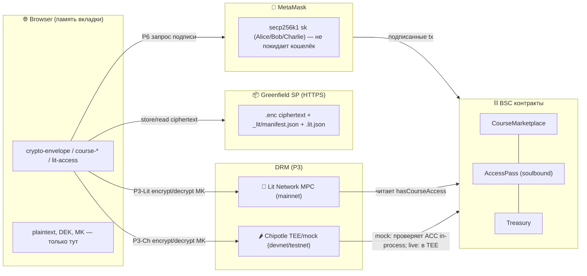
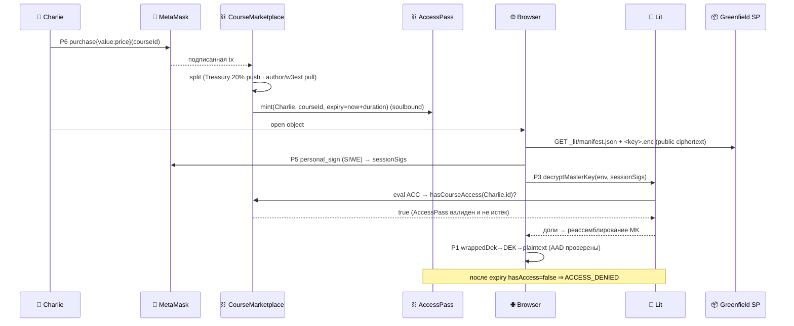
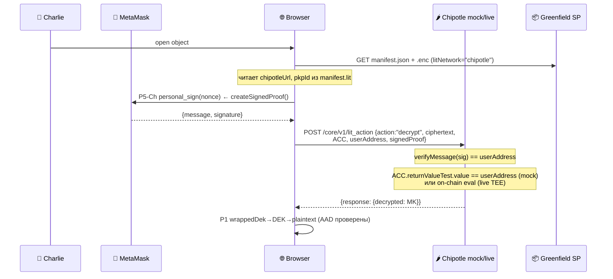
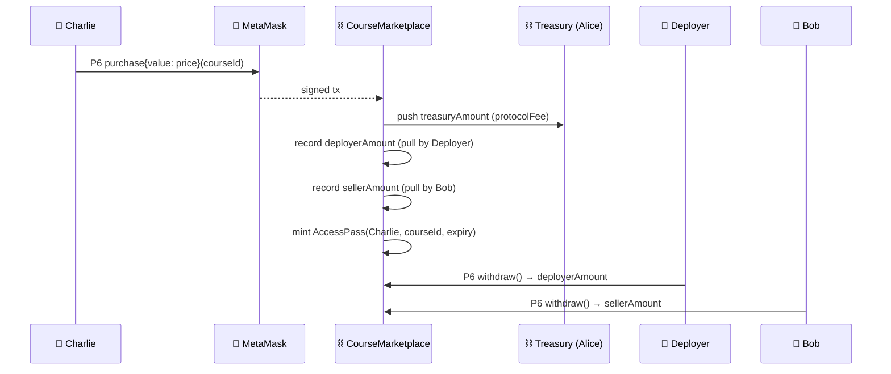

# crypto.md — Криптография системы (полная карта)

Все криптографические протоколы, процедуры encrypt/decrypt в каждом из
них, и кто что делает: **Alice** (владелец протокола), **Bob** (владелец
курса / издатель), **Charlie** (клиент). Источник истины — код в
`smartcontracts/buckets/*` и `smartcontracts/contracts/*`. Где привязка к
внешним SDK не верифицируется юнит-тестами — отмечено `⚠︎ integration`.

> ⚠️ **Депрекейшн (2026-05).** P2P-сети Lit `datil`/`datil-test`/`datil-dev`
> **отключены 2026-02-25** (Naga тоже сворачивается). DRM-слой проекта —
> **Chipotle (Lit v3)**, REST/TEE, тестовая среда `api.dev.litprotocol.com`.
> Упоминания `datil*` ниже — **исторические** (staging/mainnet-планы на Lit);
> каноничный справочник по сетям — [lit skill §7](../skills/lit/SKILL.md).

---

## Легенда

| Символ | Значение |
|--------|----------|
| 👩 **Alice** | Владелец протокола / governance. Ключ ECDSA в MetaMask. Owner `CourseMarketplace`/`Treasury`/`AccessPass` (Ownable2Step). Контент не шифрует — управляет параметрами и условиями лицензирования. |
| 🏢 **Deployer** | Лицензиат / оператор экземпляра платформы. Платит Alice единоразово или процентом от транзакций. Деплоит свои экземпляры контрактов (или встраивается в существующие). Управляет своим PKP/Chipotle-ключом. Контент не шифрует — только получает комиссию. |
| 👨 **Bob** | Владелец курса / издатель. Ключ ECDSA в MetaMask. Генерирует AES-ключи, шифрует контент, публикует. Имеет **бесплатный** доступ к своему контенту. |
| 🧑 **Charlie** | Клиент. Ключ ECDSA в MetaMask. Покупает доступ on-chain, расшифровывает контент в браузере. |
| 🦊 **MetaMask** | Хранит приватные ключи secp256k1. Подписывает: EVM-tx, EIP-712 (`eth_signTypedData_v4`), `personal_sign` (SIWE). Приватник **никогда** не покидает кошелёк. |
| 🌐 **Browser** | Исполняет WebCrypto (AES/PBKDF2/SHA-256). Plaintext и DEK существуют только здесь, в памяти вкладки. |
| 📦 **Greenfield SP** | HTTPS-эндпоинт хранилища. Хранит **только ciphertext** + публичный манифест/сайдкары. Bucket = `public-read`. |
| ⛓ **Контракты (BSC)** | `CourseMarketplace` / `AccessPass` (soulbound) / `Treasury`. Крипты не делают; хранят состояние прав, читаемое Lit. |
| 🔑 **Lit Network** | Децентрализованный MPC/threshold-KMS. Хранит долю ключа; реассемблирует ключ расшифровки только при выполнении ACC. Используется только в mainnet (Flow E). |
| 🌶 **Chipotle** | REST-замена Lit Network для Flows B–D. Запускает JS-действие в TEE (production) или in-process mock (devnet). Одна AES-256-GCM мастер-пара — производится из `CHIPOTLE_PKP_KEY`. |
| `DEK` | Data Encryption Key — случайный 256-бит ключ **на объект**. |
| `MK` | Bucket **Master Key** — один 256-бит ключ на бакет; оборачивает все DEK. |
| `KEK` | Key Encryption Key — производный из пароля (PBKDF2) ключ-обёртка `MK`. |
| `ACC` | Lit Access Control Conditions — on-chain предикат, кого пускать. |
| `AAD` | AEAD additionalData — аутентифицируемые, но не шифруемые данные. |

---

## Инвентарь протоколов

| # | Протокол | Где (модуль) | Назначение |
|---|----------|--------------|------------|
| P1 | **AES-256-GCM** (AEAD) | `crypto-envelope.js` | Объёмное шифрование контента + key-wrap DEK под MK |
| P2 | **PBKDF2-SHA-256** (210k) | `crypto-envelope.js` | Опц. парольная обёртка MK (портативный бэкап, без Lit) |
| P3-Lit | **Lit threshold encryption** (BLS12-381, MPC) | `lit-access.js` + `lit-sdk.js` ⚠︎ | Обёртка `MK` под `ACC`; mainnet (Flow E) |
| P3-Ch | **Chipotle AES-256-GCM** (TEE / mock) | `lit-access.js` + `lit-sdk-chipotle.js` | Обёртка `MK` под `ACC`; Flows B–D. Единый AES-ключ, производный от PKP |
| P4 | **Lit off-chain auth** (Ed25519/EDDSA) | `lit-sdk.js` ⚠︎ | Сессионная Ed25519-пара (SP-auth Greenfield). Только mainnet. |
| P5-Lit | **SIWE / sessionSigs** (EIP-4361 + ECDSA) | `lit-sdk.js::makeLitAuth` ⚠︎ | Авторизация Charlie перед Lit-узлами. Только mainnet. |
| P5-Ch | **personal\_sign proof** (ECDSA) | `lit-sdk-chipotle.js::createSignedProof` | Charlie подписывает nonce; Chipotle сервер проверяет ECDSA + ACC. Flows B–D. |
| P6 | **EVM подпись** (ECDSA secp256k1) | MetaMask + `greenfield-sdk-tx.js`, контракты | EIP-712 `eth_signTypedData_v4` (Greenfield tx), tx BSC (`purchase`) |
| P7 | **Хеши**: keccak256 / SHA-256 | контракты / `course-template.js` | `contentHash` on-chain; `dataToEncryptHash` сайдкара |
| P8 | **TLS** | транспорт к Greenfield SP / RPC / Lit | Конфиденциальность канала (CSP allowlist) |

---

## Окружения: devnet / testnet / mainnet

Четыре тира. Криптографическая схема P1/P2/P6/P7/P8 **не меняется** ни в одном из них.
Меняется только DRM-бэкенд (P3) и путь авторизации (P4/P5).

| Тир | Flow | DRM вариант 1 | DRM вариант 2 | Greenfield | EVM-цепь | P5 авторизация |
|-----|------|--------------|--------------|-----------|---------|---------------|
| **devnet** | B, C | 🌶 Chipotle **mock** `localhost:8000` | — | local 9000 / testnet 5600 | Anvil / BSC testnet | `personal_sign` → `signedProof` |
| **testnet-Ch** | D | 🌶 Chipotle **live** `api.chipotle.litprotocol.com` | — | testnet 5600 | BSC testnet | `personal_sign` → `signedProof` |
| **testnet-Lit** | D | 🔑 Lit **`datil-test`** ¹ | 🌶 Chipotle live (fallback) | testnet 5600 | BSC testnet | SIWE sessionSigs (Ed25519) |
| **mainnet** | E | 🔑 Lit **`datil`** ✅ рекомендуется | 🌶 Chipotle live (альтернатива) | mainnet | BSC mainnet | SIWE sessionSigs (Ed25519) |

¹ Lit `datil-test` требует открытого порта **7470** (P2P). На нашем сервере он заблокирован → используем Chipotle. На инфраструктуре без этого ограничения `datil-test` — предпочтительный staging: те же session-sigs, те же ACCs, реальные Lit-узлы.

### Что меняется по протоколам

#### P3: сравнение всех вариантов

| Параметр | Chipotle mock (devnet) | Chipotle live (testnet-Ch) | Lit `datil-test` (testnet-Lit) | Lit `datil` (mainnet) |
|----------|----------------------|--------------------------|-------------------------------|----------------------|
| Транспорт | HTTP `localhost:8000` | HTTPS REST | P2P, порт **7470** ¹ | P2P, порт **7470** ¹ |
| Хранение `MK` | AES-GCM в памяти | AES-GCM в TEE | BLS-доля на каждом узле | BLS-доля на каждом узле |
| Проверка ACC | In-process (адрес = строка) | JS в TEE, on-chain | Lit-узлы читают BSC testnet | Lit-узлы читают BSC mainnet |
| NFT/balanceOf в ACC | ❌ не работает | ✅ | ✅ | ✅ |
| Ключ PKP | `CHIPOTLE_PKP_KEY` в env | `CHIPOTLE_PKP_KEY` в TEE | Threshold BLS | Threshold BLS |
| `litNetwork` | `"chipotle"` | `"chipotle"` | `"datil-test"` | `"datil"` |
| Доп. поля манифеста | `chipotleUrl`, `pkpId` | `chipotleUrl`, `pkpId` | — | — |

¹ Порт 7470 заблокирован на нашем текущем сервере → `datil-test` недоступен в текущей инфраструктуре.

`LitClient`-интерфейс и схема `manifest.lit` (schema `daskibo.lit.acc/1`) — единые для всех тиров. Переключение — одна строка:

```js
// devnet
import { createChipotleClient } from './smartcontracts/buckets/lit-sdk-chipotle.js';
const litClient = createChipotleClient({ chipotleUrl: 'http://localhost:8000' });

// testnet-Ch
const litClient = createChipotleClient({ chipotleUrl: 'https://api.chipotle.litprotocol.com' });

// testnet-Lit (если порт 7470 открыт) / mainnet
import { createLitClient } from './smartcontracts/buckets/lit-sdk.js';
const litClient = await createLitClient({ litNetwork: 'datil-test' }); // testnet
const litClient = await createLitClient({ litNetwork: 'datil' });      // mainnet

// Далее одинаково для всех:
import { createLitAccess } from './smartcontracts/buckets/lit-access.js';
const { encryptMasterKey, decryptMasterKey } = createLitAccess({ litClient });
```

#### P5: sessionSigs (Lit) vs signedProof (Chipotle)

| Параметр | P5-Ch (`signedProof`) | P5-Lit (`sessionSigs`) |
|----------|----------------------|----------------------|
| Что подписывает Charlie | `personal_sign(nonce)` | SIWE/EIP-4361 через `personal_sign` |
| Тип ключа | ECDSA secp256k1 (MetaMask) | Ed25519 (ephemeral, seed из MetaMask) |
| Кому предъявляется | Chipotle REST API | Lit P2P-узлам |
| TTL / scoping | ❌ нет (stateless nonce) | ✅ ограничено по времени и ресурсам |
| Где используется | Chipotle (devnet/testnet-Ch) | Lit datil-test / datil (mainnet) |

`signedProof` — упрощение без scoping. Для production Lit (datil/datil-test) — только `sessionSigs`.

#### ACC на devnet vs mainnet

На devnet Chipotle mock проверяет ACC упрощённо:
```js
// chipotle-mock.mjs — проверка ACC
const allowed = conditions.some(
  c => c.returnValueTest?.value?.toLowerCase() === userAddress.toLowerCase(),
);
```
Это означает: на devnet ACC пропускает только адреса, **явно перечисленные** в `returnValueTest.value`.
Логика NFT/ERC-721/balanceOf **не исполняется** — на devnet она всегда ложная.

На mainnet узлы Lit читают реальное on-chain-состояние BSC — NFT balanceOf, AccessPass expiry.

### Чеклист перехода testnet → mainnet

**DRM (P3/P5):**
- [ ] Заменить адаптер: `createChipotleClient` → `createLitClient({ litNetwork: 'datil' })`
- [ ] Убрать `chipotleUrl` / `pkpId` из конфига и сборки
- [ ] Пополнить Lit Capacity Credits (без них `datil` ограничивает RPS)
- [ ] Убедиться, что `litNetwork: "datil"` в каждом манифесте

**Цепи и контракты:**
- [ ] Задеплоить `CourseMarketplace` / `AccessPass` / `Treasury` на BSC mainnet
- [ ] Если включена модель Deployer — задеплоить `PlatformRegistry` / `DeployerLedger`
- [ ] Прописать реальные адреса контрактов в ACC (`accessControlConditions`)
- [ ] Перевести Greenfield bucket на mainnet SP (`gnfd-mainnet-sp1.bnbchain.org`)

**Безопасность:**
- [ ] CSP: убрать `localhost:8000` из `connect-src`, добавить Lit-узлы (mainnet)
- [ ] `CHIPOTLE_PKP_KEY` — не передавать в production; Lit PKP — threshold, без единой точки

**Если промежуточный staging на Lit datil-test (порт 7470 должен быть открыт):**
- [ ] Убедиться, что инфраструктура не блокирует порт 7470 (TCP outbound)
- [ ] `litNetwork: "datil-test"` в манифестах staging, `"datil"` на mainnet (несовместимы)
- [ ] Provision Capacity Credits для `datil-test` отдельно от mainnet-кредитов

### Что тестируется на каждом тире

Легенда: ✅ CI автоматически · 🔑 opt-in (нужны секреты/Docker) · 🔲 нужно реализовать · — не применимо

| Тест | CI-джоб | devnet | testnet-Ch | testnet-Lit | mainnet |
|------|---------|--------|-----------|------------|---------|
| `tests/chipotle-drm.test.js` | `test:unit` ✅ | ✅ in-process | — | — | — |
| `tests/lit-access.test.js` | `test:unit` ✅ | ✅ fake client | ✅ same | ✅ same | ✅ same |
| `tests/crypto-envelope.test.js` | `test:unit` ✅ | ✅ WebCrypto | ✅ same | ✅ same | ✅ same |
| `tests/lit-pricing.test.js` | `test:unit` ✅ | ✅ | ✅ | ✅ | ✅ |
| `greenfield-integration.docker.test.js` | `test:integration` ✅ | ✅ mock-SP | — | — | — |
| `greenfield-testnet.live.test.js` | opt-in 🔑 | — | ✅ testnet | — | — |
| `greenfield-local.docker.test.js` | opt-in 🔑 | ✅ chain 9000 | — | — | — |
| forge tests (Solidity contracts, incl. P-A: 25 тестов) | `contracts` ✅ | ✅ Foundry | ✅ same | ✅ same | ✅ same |
| lit-integration (datil-test) | 🔲 не реализован | — | — | 🔲 | — |
| platform-licensing unit-тест | 🔲 не реализован | 🔲 | 🔲 | 🔲 | 🔲 |
| platform-licensing Hardhat | 🔲 не реализован | — | 🔲 | — | 🔲 |
| Браузерный reader (manual) | — | ✅ localhost | ✅ testnet | ✅ testnet | ✅ mainnet |

### CI/CD статус протоколов

| Протокол | Покрыт в CI | Тип покрытия | Что отсутствует |
|---------|------------|-------------|----------------|
| P1 AES-256-GCM | ✅ | `crypto-envelope.test.js` (10 тестов, hermetic) | — |
| P2 PBKDF2 | ✅ | `crypto-envelope.test.js` | — |
| P3-Ch Chipotle mock | ✅ | `chipotle-drm.test.js` (in-process, 6 тестов) | — |
| P3-Ch Chipotle live | 🔑 opt-in | `greenfield-testnet.live.test.js` (chipotle-writer) | Автоматизация с реальными секретами |
| P3-Lit datil-test | 🔲 | — | Нужен `lit-integration.docker.test.js` без моков |
| P3-Lit datil (mainnet) | 🔲 | — | Smoke-test или e2e с prod-данными |
| P4 Ed25519 (sessionSigs) | 🔲 | — | Зависит от P3-Lit тестов |
| P5-Ch signedProof | ✅ | `chipotle-drm.test.js` (mock verifyMessage) | — |
| P5-Lit sessionSigs | 🔲 | — | Зависит от P3-Lit тестов |
| P6 EVM tx | ✅ | forge tests + `greenfield-sdk-tx.test.js` | — |
| P7 keccak256/SHA-256 | ✅ | forge tests + `crypto-envelope.test.js` | — |
| P8 TLS/CSP | ✅ advisory | статический анализ CSP | Нет automated browser e2e |
| Deployer fee-split | 🔲 | — | `platform-licensing.test.js` без Hardhat-моков |

**Добавить в CI без мокирования (приоритет):**

1. **`tests/lit-integration.test.js`** — реальный Lit `datil-test` через Docker-compose.
   Запускать только если `LIT_DATIL_TEST_ENABLED=1` и порт 7470 доступен.
   Тестировать: encrypt/decrypt с настоящими session-sigs, реальная ACC на BSC testnet.

2. **`tests/platform-licensing.test.js`** (unit) — `computeSaleSplit` с 3 получателями,
   `computeSaveCharge` с `deployerFeeBps`. Hermetic, в `test:unit` CI-джобе.

3. **`tests/platform-licensing.hardhat.test.js`** — `CourseMarketplace.purchase()` с
   реальным Hardhat-нодом и реальным Solidity-контрактом (не mock). В `contracts` CI-джобе.

---

## Иерархия ключей

```mermaid
graph TD
  PT["plaintext-объект (browser)"] -->|P1 AES-256-GCM, IV, AAD=schema·alg·meta| CT["ciphertext (.enc) → Greenfield"]
  DEK["DEK (256-bit, на объект)"] -->|шифрует| PT
  MK["MK — bucket master (256-bit)"] -->|P1 key-wrap, AAD=schema·originalKey| WDEK["wrappedDek (в .enc)"]
  DEK --> WDEK
  MK -->|P3 Lit encrypt под ACC| LITENV["manifest.lit (ciphertext+hash)"]
  MK -.опц.-> |P2 PBKDF2 KEK| WRAP["wrapped MK (парольный бэкап)"]
  ACC["ACC = anyOf(Bob, AccessPass-условие)"] --> LITENV
```

**Принцип:** дорогая криптозащита применяется только к 32-байтному `MK`
(Lit/PBKDF2); объём — быстрым симметричным AEAD. Ротация/уничтожение `MK`
крипто-шреддит весь бакет за O(1).

---

## Сущности и владение ключами



> **Devnet/testnet**: блок Lit Network не задействован; все P3-операции идут через Chipotle.
> **Mainnet**: блок Chipotle не задействован; Lit читает BSC on-chain.

---

## P1 — AES-256-GCM (envelope)

`crypto-envelope.js`. Всё в браузере (WebCrypto, инъектируемый).

**Encrypt объекта** (`encryptObject(MK, data, meta)`):
1. `DEK ← random(32)`; `iv ← random(12)`; `dekIv ← random(12)`.
2. `ct = AES-GCM(key=DEK, iv, data, aad = JSON{schema,alg,contentType,originalKey,encoding})`.
3. `wrappedDek = AES-GCM(key=MK, dekIv, DEK, aad = JSON{schema,originalKey})`.
4. Конверт: `{schema, alg, iv, ciphertext, dekIv, wrappedDek, meta}` (base64).

**Decrypt** (`decryptObject(MK, env)`): пересобрать те же AAD из
`env` → `DEK = AES-GCM⁻¹(MK, dekIv, wrappedDek, aad)` →
`plaintext = AES-GCM⁻¹(DEK, iv, ciphertext, aad)`. Любая правка
`meta`/`schema` или перенос `wrappedDek` на другой объект ⇒ провал тега
GCM ⇒ `DECRYPT_FAILED` (AEAD-binding, аудит B2).

## P2 — PBKDF2-SHA-256 (опц. парольная обёртка MK)

`wrapMasterWithPassphrase`: `salt←random(16)`, `KEK = PBKDF2(pass,
salt, 210000, SHA-256)`, `wrapped = AES-GCM(KEK, iv, MK)`. Обратное —
`unwrapMasterWithPassphrase`. Неверный пароль ⇒ `DECRYPT_FAILED`.
Назначение: портативный бэкап `MK` без Lit.

## P3 — обёртка MK (Lit или Chipotle)

Ядро: `lit-access.js` (чистое, тестируется с фейком). Адаптер зависит от тира:

**P3-Lit** — `lit-sdk.js` (CDN, ⚠︎ integration). Только mainnet (Flow E).
`encryptString({ACC, dataToEncrypt=MK})` → шифрование к публичному threshold-ключу
сети Lit; `{ciphertext, dataToEncryptHash}` кладутся в `manifest.lit`.
Decrypt: узлы Lit проверяют ACC (P5-sessionSigs), возвращают t-из-n долей → `MK` на клиенте.

**P3-Chipotle** — `lit-sdk-chipotle.js`. Flows B–D.
`POST /core/v1/lit_action { action:"encrypt", masterKey, ACC }` → Chipotle
шифрует `MK` своим AES-GCM ключом (из `CHIPOTLE_PKP_KEY`); возвращает
`{ciphertext:"ivB64:ctB64", dataToEncryptHash, pkpId}`.
Decrypt: Chipotle проверяет `signedProof` (P5-Ch) + ACC → возвращает `MK`.
`manifest.lit` дополняется полями `litNetwork:"chipotle"`, `chipotleUrl`, `pkpId`.

В обоих случаях: ошибка авторизации ⇒ `classify()` в `lit-access.js` →
`ACCESS_DENIED`. ACC содержит `anyOf(addressAllowlistAcc(Bob), <условие покупателя>)`
— **Bob всегда внутри ⇒ бесплатный доступ** без покупки.

## P4/P5 — авторизация (зависит от тира)

**Mainnet (P4 + P5-Lit):** `makeLitAuth` ⚠︎ создаёт сессионную **Ed25519** пару
(seed из `personal_sign` кошелька) для SP-аутентификации Greenfield. Затем
`getSessionSigs` + `authNeededCallback` (SIWE/EIP-4361 через `personal_sign`).
`sessionSigs` — доказательство права на P3-Lit-decrypt.

**Devnet/testnet (P5-Ch):** упрощённый путь — только `personal_sign(nonce)`:
`createSignedProof(userAddress, provider)` в `lit-sdk-chipotle.js`. Возвращает
`{ message, signature }` → `signedProof` в теле запроса к Chipotle.
Chipotle верифицирует подпись (`verifyMessage`), проверяет ACC, возвращает `MK`.
Ed25519 сессионные ключи **не нужны** — Chipotle не требует P4.

## P6 — EVM подписи (MetaMask, secp256k1)

- Greenfield on-chain tx (`createBucket`): SDK формирует EIP-712,
  браузер подписывает `eth_signTypedData_v4` через
  `makeSignTypedDataCallback(provider)` (`greenfield-wallet-backend.js`,
  тестируется) → `tx.broadcast({signTypedDataCallback})`
  (`greenfield-sdk-tx.js`).
- BSC `CourseMarketplace.purchase{value}` — обычная подписанная tx.
- Приватник остаётся в MetaMask; код видит только подписи.

## P7/P8 — хеши и канал

`contentHash = keccak256(...)` хранится в `Course` (целостность,
on-chain). `dataToEncryptHash = SHA-256(ciphertext)` в `.lit.json`
сайдкаре (индексатор/проверка). Транспорт — TLS; CSP ограничивает
`connect-src` доверенными доменами (Greenfield/Lit/esm.sh).

---

## 👩 Alice — владелец протокола (governance)

Контент не шифрует. Через MetaMask (P6) деплоит/настраивает контракты:
`Ownable2Step` (`transferOwnership`/`acceptOwnership`), `setParams`
(bounded bps treasury/w3ext), `Treasury.withdraw` (governance-only,
pull, без циклов). Криптороль: владение secp256k1-ключом governance;
компрометация ⇒ смена параметров, **не** утечка контента (контент под
`MK`/Lit, к которым у Alice доступа нет).

## 👨 Bob — издатель курса (publish)

```mermaid
sequenceDiagram
  participant Bob as 👨 Bob
  participant Br as 🌐 Browser
  participant MM as 🦊 MetaMask
  participant Lit as 🔑 Lit
  participant GF as 📦 Greenfield SP
  participant CM as ⛓ CourseMarketplace

  Bob->>Br: publish course (spec)
  Br->>Br: P1 MK←rand; на каждый объект DEK←rand, AES-GCM(+AAD)
  Br->>Lit: P3 encryptMasterKey(MK, ACC=anyOf(Bob, buyer))
  Lit-->>Br: {ciphertext, dataToEncryptHash}  (MK скрыт)
  Br->>MM: P6 eth_signTypedData_v4 (Greenfield createBucket EIP-712)
  MM-->>Br: подпись
  Br->>GF: PUT .enc + .lit.json + _lit/manifest.json (public-read)
  Bob->>MM: P6 tx registerCourse(price, contentHash, bucket, duration)
  MM-->>CM: подписанная tx
  Note over Br,Lit: Bob ∈ ACC ⇒ далее decrypt без оплаты (free access)
```

Decrypt своего контента: тот же путь, что у Charlie (ниже), но ACC
выполняется по `addressAllowlistAcc(Bob)` / `hasCourseAccess(author)=true`
— **без покупки**.

## 🧑 Charlie — клиент (purchase + read)



Если не куплено / истёк срок (`AccessPass` expiry) / подделан конверт —
получает `ACCESS_DENIED` или `DECRYPT_FAILED`; ciphertext без `MK`
бесполезен.

### Charlie (devnet/testnet) — Chipotle path



**Devnet отличия:** нет покупки NFT/AccessPass (контракт не деплоен на Anvil);
ACC — простой адресный allowlist (`returnValueTest.value = ALLOWED_ADDRESS`).
На testnet — реальный BSC testnet, но ACC всё ещё проверяется в TEE Chipotle, не Lit-узлами.

---

## Модели продажи и лицензирования платформы

Alice (governance) может монетизировать саму платформу через продажу лицензии
**Deployer'у** — оператору, который запускает свой экземпляр или встраивается
в существующий. Два варианта, различающихся по маршруту P6-транзакций.

### Роли и ключи

| Роль | Крипто-ключ | Что делает |
|------|------------|-----------|
| 👩 **Alice** | ECDSA (governance) | Деплоит контракты, устанавливает ставки комиссий, получает `protocolFee` |
| 🏢 **Deployer** | ECDSA (operator) | Платит Alice, получает `deployerFee` с каждой операции на своей платформе |
| 👨 **Bob** | ECDSA + AES-ключи | Публикует курс, получает `sellerAmount` |
| 🧑 **Charlie** | ECDSA | Покупает доступ, оплачивает read-fee |

Deployer не шифрует контент и не держит `MK` — только получает комиссию через P6-tx.
Его компрометация → потеря комиссий, **не** утечка контента.

### Модель A — единоразовый платёж (white-label)

Alice продаёт лицензию за фиксированную сумму. После оплаты Deployer
владеет своим экземпляром без дальнейших отчислений.

```
Deployer →[P6 tx: purchaseLicense{value}(licenseId)]→ CourseMarketplace
                          ↓
          licenseAmount  → Alice (governance Treasury)
          лицензия записана в LicenseRegistry(deployer, licenseId, perpetual=true)
```

Deployer после этого:
- Управляет своим `CourseMarketplace` (или fork), где `treasury = address(Deployer)`.
- Alice не получает долю от последующих продаж — только `protocolFee` если это
  предусмотрено в контракте форка.
- PKP/Chipotle-ключ Deployer'а — его собственный `CHIPOTLE_PKP_KEY` (devnet/testnet)
  или отдельный Lit-аккаунт (mainnet).

### Модель B — комиссионная (SaaS / revenue-share)

Deployer платит Alice процент с каждой транзакции платформы.
Три источника комиссии:

#### B1 — с публикации (Bob платит)

```
Bob.publish() → save-charge:
  litCost + storageCost = base
  deployerFee = base × deployerFeeBps / 10000   → Deployer
  protocolFee = base × protocolFeeBps / 10000   → Alice
  Bob платит: base + deployerFee + protocolFee  (итого)
```

#### B2 — с чтения (Charlie платит)

```
Charlie.read() → read-charge:
  litReadCost = base
  deployerFee = base × deployerReadBps / 10000  → Deployer
  protocolFee = base × protocolReadBps / 10000  → Alice
  Charlie платит: base + deployerFee + protocolFee
```

#### B3 — с продажи курса (Charlie платит, распределяется)

```
Charlie.purchase{value: salePrice}(courseId):
  treasuryAmount = salePrice × treasuryBps / 10000   → Treasury (→ Alice)
  deployerAmount = salePrice × deployerSaleBps / 10000 → Deployer
  sellerAmount   = salePrice − treasuryAmount − deployerAmount → Bob
```

Реализация в `lit-pricing.js` — расширение `computeSaleSplit`:

```js
computeSaleSplit({
  salePrice: 1000n,
  treasury:   '0xAliceTreasury', treasuryBps:    2000n,  // 20% → Alice
  deployer:   '0xDeployer',      deployerSaleBps:  500n,  // 5%  → Deployer
  seller:     '0xBob',           // остаток → Bob (750n)
});
// payouts: Alice→200, Deployer→50, Bob→750  (сумма = 1000)
```

#### Диаграмма потока B3



### Сравнение моделей

| Аспект | Модель A (one-time) | Модель B (revenue-share) |
|--------|--------------------|-----------------------|
| Платёж Alice | Единоразово при старте | Процент с каждой tx |
| Предсказуемость для Deployer | ✅ фиксированная стоимость | ❌ зависит от объёма |
| Доход Alice при масштабировании | ❌ не растёт | ✅ растёт с платформой |
| On-chain сложность | Минимальная (`LicenseRegistry`) | Выше (3 расщепления) |
| Crypto-риск Deployer | Только его `MK`/PKP-ключ | То же |
| Отзыв лицензии | По `licenseId` в `LicenseRegistry` | Обнуление `deployerFeeBps` |

### CI/CD — что нужно добавить

На данный момент Deployer-модель описана концептуально; контракты не написаны.
Что необходимо реализовать без мокирования:

- `PlatformRegistry.sol` — реестр лицензий (модель A: `purchaseLicense`, `isLicensed`)
- `CourseMarketplace.sol` — обновить `purchase()`: добавить `deployerFee` в split
- `lit-pricing.js` — добавить `deployerSaleBps` / `deployerFeeBps` в `computeSaleSplit`/`computeSaveCharge`
- `tests/platform-licensing.test.js` — unit-тест `computeSaleSplit` с тремя получателями
- `tests/platform-licensing.hardhat.test.js` — интеграция с реальным Hardhat-нодом (без моков)

---

## Границы и допущения (честно)

- **Доверие к Lit** (mainnet): безопасность P3-Lit/P5-Lit опирается на честное
  большинство узлов Lit (порог `t` из `n`). Кастомной пороговой крипты
  мы не пишем — используется аудированный `@lit-protocol`.
- **Доверие к Chipotle** (devnet/testnet): P3-Ch — единственная точка отказа.
  Mock (`localhost:8000`): `CHIPOTLE_PKP_KEY` в переменных среды — **не для production**.
  Live Chipotle: TEE-изоляция снижает риск, но это централизованный сервис.
  Переход на mainnet = переход на Lit (threshold MPC).
- **ACC на devnet — упрощённые**: mock проверяет только `returnValueTest.value === userAddress`.
  NFT/ERC-721 balanceOf, `AccessPass.expiry` — **не исполняются** на devnet.
  Тестировать ACC-логику на BSC testnet (Flow D) с реальным Chipotle live.
- **signedProof vs sessionSigs**: `personal_sign(nonce)` (P5-Ch) не имеет
  scoping ресурсов и TTL ключа. Для production требуется полный SIWE-флоу (P5-Lit).
- **⚠︎ integration**: точные вызовы `@lit-protocol`/`@bnb-chain` SDK
  (`lit-sdk.js`, `greenfield-wallet-sdk.js`, `sdk-backend.mjs`) и CDN-
  импорт верифицируются только в Docker/Foundry-флоу, не hermetic-юнитами
  (см. `GREENFIELD.md` → verification status).
- **Метаданные публичны**: имена объектов/размер/`contentType` в
  манифесте не шифруются (P1 AAD их лишь аутентифицирует). Секреты — не
  в именах.
- **Контракты крипты не выполняют**: только хранят состояние прав;
  вся конфиденциальность — P1+P3. ECDSA-подписи — в MetaMask.
- **signedProof theft / sessionSig theft** (XSS): кража любого из них = доступ
  к контенту → митигируется CSP (`connect-src`-allowlist, нет inline-скриптов).
  `signedProof` на devnet не истекает по времени — дополнительная причина
  не использовать Chipotle mock за пределами dev-окружения.

---

## Архитектура NFT-bound ключей: доступ без бэкенда

### Почему текущая схема не работает на mainnet

Браузер (`course-view.js:201`, `course-content.js:75`) хардкодит
`'X-Api-Key': 'dummy-api-key'`. На `api.chipotle.litprotocol.com` запрос
отклоняется. Реальный API-ключ нельзя встроить в JS-браузера: он виден в
DevTools. Но главная проблема глубже: в текущей схеме один шифртекст в
`manifest.lit` может быть использован **любым** адресом, у которого есть
действующий `AccessPass`. Это значит: если два покупателя имеют доступ к одному
курсу, **шифртекст один и тот же** для обоих, и Chipotle просто решает по
on-chain ACC — пустить или нет.

Целевая архитектура:
- Шифртекст в NFT **физически привязан** к конкретному адресу: его нельзя
  использовать с другого адреса даже при наличии API-ключа платформы
- После истечения `AccessPass.expiryOf[buyer][courseId]` расшифровка
  невозможна — без какого-либо бэкенда
- Нет классического сервера; хранилище — BSC-контракт + Greenfield

### Суть: разделение шифртекста и ACC

Текущая схема (один шифртекст, динамический ACC):
```
manifest.lit.ciphertext  ← один для всех покупателей
ACC = hasCourseAccess(userAddress, courseId)  ← Chipotle звонит в BSC
```
Любой, чей адрес проходит ACC, получает один и тот же MK.

Целевая схема (per-buyer шифртекст, статический ACC):
```
AccessPass.encryptedKey[tokenId]  ← свой для каждого покупателя
ACC = { address == buyer  AND  block.timestamp <= expiryOf[buyer][courseId] }
```
Шифртекст Боба расшифровывается только Бобом и только до истечения срока.
Шифртекст Чарли — только Чарли. Украденный шифртекст Боба бесполезен для Чарли:
Chipotle в TEE проверяет адрес до расшифровки и отказывает.

---

### Вариант 1 — Capacity Credits Delegation в манифесте (Lit-native, рекомендован)

**Принцип.** Lit Protocol разделяет два независимых слоя:

| Слой | Назначение | Секретность |
|------|-----------|------------|
| `capacityDelegationAuthSig` | Доказывает, что Capacity Credits NFT платформы покрывает этот запрос (обходит rate-limit узлов Lit) | **Не секрет** — содержит только подпись, не ключ |
| `ACC = courseAccessAcc(marketplace, courseId)` | Решает, **кому** вернуть MK | Проверяется on-chain узлами Lit |

Платформа (deployer) покупает Capacity Credits NFT один раз на Base (chain 8453). Delegation auth sig генерируется при публикации курса и кладётся в `manifest.lit.capacityDelegationAuthSig`. Браузер читает подпись из публичного манифеста и использует её при построении `sessionSigs` — Capacity Credits списываются с аккаунта платформы, но **MK возвращается только тому, чей адрес проходит ACC** (т.е. купившему курс).

```
Publish (автор):
  1. Platform генерирует delegationAuthSig(capacityCreditsNFT, scopedTo: PKP)
  2. manifest.lit.capacityDelegationAuthSig = delegationAuthSig  ← в манифест
  3. ACC = courseAccessAcc(marketplace, courseId)                ← в манифест

Access (Bob):
  1. Bob читает manifest.lit из Greenfield (публичный)
  2. MetaMask: personal_sign(SIWE) → sessionSigs
     + capacityDelegationAuthSig из манифеста → Lit rate-limit bypassed
  3. Lit узлы: verifySessionSigs + eval ACC:
       CourseMarketplace.hasCourseAccess(bob, courseId) on BSC
       + AccessPass.expiryOf[bob][courseId] > now
  4. Lit возвращает MK → браузер расшифровывает контент
     ↑ никакого API-ключа в браузере
```

**Стоимость.** Один Capacity Credits NFT (≈ $0.04 / 1000 decrypt-вызовов по
публичному прайсу Lit). 20% комиссии платформы с продаж покрывает это с
запасом.

**Срок доступа.** Контролируется `AccessPass.expiryOf` через ACC: после
`expiry` `hasCourseAccess` возвращает `false` → Lit отказывает автоматически.
Никакого бэкенда не требуется.

**Реализация.**
- `write-devnet.mjs` / `write-mainnet.mjs`: добавить генерацию
  `delegationAuthSig` и поле в манифест при публикации.
- `course-view.js`: убрать `dummy-api-key`; читать
  `manifest.lit.capacityDelegationAuthSig` и передавать в `getSessionSigs`.
- Нет серверного компонента; нет хранения состояния.

---

### Вариант 2 — Unlock Token в AccessPass (EIP-712, backend-prокси без секрета в браузере)

**Принцип.** Платформа выдаёт покупателю подписанный `UnlockToken` (EIP-712),
привязанный к `(buyer, courseId, expiry)`. Токен хранится прямо в метаданных
AccessPass — как `tokenURI` указывающий на объект в Greenfield бакете курса.
Браузер предъявляет токен тонкому backend-прокси; прокси валидирует подпись +
проверяет NFT expiry on-chain → вызывает Chipotle с реальным API-ключом →
возвращает MK браузеру. API-ключ остаётся только на сервере.

```
Purchase (CoursePurchased event → backend):
  1. Backend слушает событие CoursePurchased(buyer, courseId)
  2. Генерирует unlockToken = EIP712Sign({buyer, courseId, expiry=AccessPass.expiryOf}, platformKey)
  3. Шифрует токен под addressAllowlistAcc([buyer]) → Chipotle encrypt
  4. Кладёт _access/{buyer}.enc в бакет курса на Greenfield
  5. Вызывает AccessPass.setTokenURI(tokenId, gf://bucket/_access/{buyer}.enc)
     (или хранит в off-chain mapping)

Access (Bob):
  1. Bob читает _access/{bob}.enc из Greenfield
  2. MetaMask: personal_sign(nonce) → proof
  3. Chipotle: decrypt(ciphertext=_access/{bob}.enc, ACC=addressAllowlist([bob]), proof)
     → unlockToken  ← адресное условие, не контрактный вызов → быстро
  4. Bob отправляет unlockToken + proof на backend-прокси платформы
  5. Прокси: verify EIP-712 sig + AccessPass.expiryOf[bob][courseId] > now
  6. Прокси: вызывает Chipotle(API_KEY) decrypt masterKey → отвечает Bob
     ↑ API-ключ только на сервере
```

**Стоимость Chipotle.** 1 encrypt при покупке + 1 decrypt при получении токена
(разовый, не per-lesson). Прокси-вызов MK — за счёт платформенного API-ключа,
но реже: токен кешируется в браузере на сессию.

**Срок доступа.** Прокси проверяет `AccessPass.expiryOf` on-chain перед каждым
выдачей MK. Истёкший NFT → 401.

**Реализация.**
- Backend: event listener (BSC) + `/api/unlock` endpoint (EIP-712 verify + Chipotle proxy)
- Greenfield: `_access/{buyer}.enc` per buyer
- `AccessPass.sol`: опционально добавить `tokenURI` mapping
- `course-view.js`: убрать `dummy-api-key`; получать MK через `/api/unlock`

---

### Вариант 3 — Перевыпуск ACC при покупке (allowlist в манифесте растёт)

**Принцип.** ACC кодируется не как `courseAccessAcc(contract, id)` (динамический
on-chain запрос), а как `anyOf(addressAllowlistAcc(author), addressAllowlistAcc(buyer1), ...)`.
При каждой покупке backend (или Lit Action) добавляет адрес покупателя в
allowlist, перешифровывает MK с обновлённым ACC и перезаписывает
`_lit/manifest.json` в Greenfield. Браузер вызывает Chipotle/Lit с
`personal_sign` — декрипт работает по простому сравнению адресов (быстро, без
контрактного вызова).

```
Publish (автор):
  1. ACC = addressAllowlistAcc([author])
  2. Chipotle encrypt(MK, ACC) → manifest.lit.ciphertext
  3. Greenfield: PUT _lit/manifest.json

Purchase (backend):
  1. CoursePurchased(buyer, courseId) event
  2. Старый ACC = manifest.lit.accessControlConditions
  3. Chipotle decrypt(ciphertext, ACC=oldACC, authorSession) → MK
  4. newACC = anyOf(oldACC, addressAllowlistAcc(buyer))
  5. Chipotle encrypt(MK, newACC) → новый ciphertext
  6. Greenfield: PUT _lit/manifest.json  ← перезапись

Access (Bob):
  1. Bob читает manifest.lit → ciphertext с newACC содержащим его адрес
  2. MetaMask: personal_sign(nonce) → proof
  3. Chipotle: decrypt(ciphertext, ACC=newACC, proof, userAddress=bob)
     → ACC проверяет: bob ∈ allowlist? ← простое сравнение строк
  4. Chipotle возвращает MK
     ↑ никаких контрактных вызовов при чтении
```

**Срок доступа.** Требует cron-задачи: каждые N часов читать
`AccessPass.expiryOf[buyer][courseId]`, если истёк — убрать адрес из ACC,
перешифровать MK, записать обновлённый манифест. Это **единственный вариант**,
где expiry требует активного мониторинга (не lazy-check).

**Проблемы.**
- Размер `accessControlConditions` растёт линейно с числом покупателей
- 1 Greenfield write + 2 Chipotle вызова на каждую покупку (encrypt + decrypt)
- Cron для expiry — дополнительная инфраструктура
- Утечка списка покупателей: их адреса видны в публичном манифесте

---

### Сравнение вариантов

| Критерий | V1 Delegation | V2 UnlockToken | V3 ACC re-wrap |
|----------|--------------|---------------|----------------|
| API-ключ в браузере | ❌ нет | ❌ нет | ❌ нет |
| Backend-сервис | ❌ не нужен | ✅ нужен (тонкий) | ✅ нужен (event+cron) |
| Expiry enforcement | ✅ lazy on-chain | ✅ lazy on-chain | ⚠️ active cron |
| Чтение без контракт-вызова | ❌ Lit читает BSC | ✅ адресное сравнение | ✅ адресное сравнение |
| Публичный список покупателей | ❌ нет | ❌ нет | ⚠️ виден в манифесте |
| Стоимость на покупку | ~0 | 2 Chipotle вызова | 2 Chipotle вызова + Greenfield write |
| Стоимость на прочтение | 1 Lit вызов (за счёт платформы) | 1 Chipotle (платформа) | 1 Chipotle вызов |
| Сложность реализации | Низкая | Средняя | Высокая |
| Децентрализация | ✅ Lit threshold MPC | ⚠️ centralized proxy | ⚠️ centralized backend |

**Рекомендация для mainnet:** V1 (delegation) — наименее сложный, Lit-native,
не требует серверного компонента. V2 — если нужна Chipotle-based инфраструктура
(до перехода на Lit mainnet). V3 — не рекомендован для prod из-за утечки адресов
и операционной сложности.

---

## Per-NFT Address-Bound Key: три схемы без бэкенда

Описанные ниже схемы реализуют принцип: **каждый AccessPass NFT хранит свой
шифртекст MK, привязанный к адресу покупателя и сроку действия NFT**.
Chipotle не делает on-chain вызов при расшифровке — ACC встроен в сам
шифртекст при создании. API-ключ платформы не нужен в браузере: он не является
контролем доступа, доступ контролируется адресной привязкой шифртекста.

### Контракт: изменения в `AccessPass.sol`

> **✅ РЕАЛИЗОВАНО** (`contracts/src/AccessPass.sol`, `course-view.js`,
> `chipotle-mock.mjs`). Схема P-A развёрнута и проверена на живом стеке
> (Anvil + chipotle-mock, 2026-05-28). Forge-тесты: 25/25 pass.

Хранение on-chain (`AccessPass.encryptedKey`) — реализованный вариант.
Дороже по газу (~50k gas на вызов `setEncryptedKey`), но атомарно с NFT,
не требует дополнительных сетевых запросов при чтении:

```solidity
// ── реализовано в AccessPass.sol ──────────────────────────────────────────
mapping(address buyer => mapping(uint256 courseId => uint256)) public wrapNonce;
mapping(uint256 tokenId => bytes) public encryptedKey;
mapping(address buyer => mapping(uint256 courseId => uint256)) private _tokenIdOf;

// Одноразовая запись: потребляет wrapNonce, блокирует повтор (AlreadySet).
function setEncryptedKey(uint256 tokenId, bytes calldata ct) external {
    if (ownerOf[tokenId] != msg.sender) revert NotTokenOwner();
    if (encryptedKey[tokenId].length != 0) revert AlreadySet();
    uint256 courseId = courseOf[tokenId];
    if (wrapNonce[msg.sender][courseId] == 0) revert NonceConsumed();
    wrapNonce[msg.sender][courseId] = 0;
    encryptedKey[tokenId] = ct;
    emit EncryptedKeySet(tokenId, msg.sender);
}
```

**Off-chain (Greenfield sidecar)** — `_access/{tokenId}.lit.json` в бакете курса.
NFT хранит только `tokenURI` → указатель на Greenfield. Дешевле, но требует
дополнительного GET. Не реализован.

---

### Схема P-A: PKP Vault + wrap-on-purchase ✅ РЕАЛИЗОВАНО

> **Статус реализации:** полностью реализовано и верифицировано на живом стеке.
>
> | Компонент | Файл | Статус |
> |-----------|------|--------|
> | Контракт: `wrapNonce`, `encryptedKey`, `setEncryptedKey`, `resetForRewrap` | `contracts/src/AccessPass.sol` | ✅ |
> | Интерфейс | `contracts/src/interfaces/IAccessPass.sol` | ✅ |
> | Forge-тесты (25 тестов, все pass) | `contracts/test/AccessPass.t.sol` | ✅ |
> | Mock: `wrap_for_buyer` — on-chain nonce guard + timestamp ACC в ответе | `greenfield-testnet/chipotle-mock.mjs` | ✅ |
> | Mock: `accSatisfied` — timestamp-условия как AND, адресные как OR | `greenfield-testnet/chipotle-mock.mjs` | ✅ |
> | Browser: wrap → setEncryptedKey → decrypt + ACC reconstruct из `expiryOf` | `course-view.js` | ✅ |
> | Верификация на Anvil (9/9 тестов) | `/tmp/verify_p_a.mjs`, 2026-05-28 | ✅ |

**Принцип.** Платформа создаёт одну PKP-пару (Chipotle генерирует при деплое).
MK курса хранится зашифрованным в Greenfield под ACC = `{address == PKP_ADDRESS}` —
только PKP может его прочитать. При покупке Lit Action (код в TEE) проверяет
покупку on-chain, достаёт MK через PKP, оборачивает его buyer-специфичным ACC
и возвращает покупателю. Покупатель кладёт шифртекст в своё NFT.

```
ПУБЛИКАЦИЯ КУРСА (автор):
  1. Chipotle: create_wallet() → PKP_ADDRESS
  2. Chipotle: encrypt(MK, ACC = { address == PKP_ADDRESS })
               → vault_ciphertext
  3. Greenfield: PUT _lit/pkp_vault.enc = vault_ciphertext  (public bucket)
  4. manifest.lit.pkpAddress = PKP_ADDRESS
  5. BSC: registerCourse(price, contentHash, bucket, duration)

ПОКУПКА (Bob, browser):
  1. BSC: purchase(courseId){value: price}
     → AccessPass mint → tokenId, expiryOf[bob][courseId] = now + duration
  2. Browser → Chipotle: POST /lit_action {
       action: 'wrap_for_buyer',
       buyer:    bob_address,
       courseId: X,
       txHash:   purchase_tx_hash,          ← proof покупки
       pkpId:    PKP_ADDRESS
     }
  3. Chipotle TEE (Lit Action):
     a. BSC: verifyTx(txHash) — убедиться, что buyer==bob в событии CoursePurchased
     b. BSC: AccessPass.hasAccess(bob, X) == true (только что проверили)
     c. BSC: expiry = AccessPass.expiryOf[bob][X]
     d. Chipotle: decrypt(vault_ciphertext, ACC={address==PKP}) → MK
     e. Build buyer_acc = [
          { address == bob },
          { block.timestamp <= expiry }  ← timestamp-условие Lit
        ]
     f. Chipotle: encrypt(MK, buyer_acc) → bob_ciphertext
     g. Return: { ciphertext: bob_ciphertext, acc: buyer_acc }
  4. Browser: BSC tx → AccessPass.setEncryptedKey(tokenId, bob_ciphertext)
     (или: Greenfield PUT _access/{tokenId}.lit.json = bob_ciphertext)

ЧТЕНИЕ КОНТЕНТА (Bob):
  1. Browser: BSC view → AccessPass.encryptedKey[tokenId]  → bob_ciphertext
  2. MetaMask: personal_sign(nonce) → { message, signature }
  3. Browser → Chipotle: POST /lit_action {
       action: 'decrypt',
       ciphertext: bob_ciphertext,
       userAddress: bob,
       signedProof: { message, signature }
     }
  4. Chipotle TEE:
     a. verifyMessage(signature, message) == bob ← адрес доказан
     b. ACC из ciphertext: { address == bob } → bob == bob ✓
     c. ACC из ciphertext: { block.timestamp <= expiry } → now < expiry ✓
     d. Decrypt → return MK
  5. Browser: MK → AES-GCM decrypt bucket objects

ЧТЕНИЕ после expiry (Bob):
  шаг 4c: now > expiry → ACC не выполняется → Chipotle: ACCESS_DENIED

ПОПЫТКА Чарли использовать шифртекст Боба:
  шаг 4b: ACC из bob_ciphertext: { address == bob } → charlie ≠ bob → ACCESS_DENIED
```

#### ⚠️ Уязвимость: drain кредитов через бесконечные вызовы `wrap_for_buyer`

`wrap_for_buyer` — **открытый** эндпоинт. Любой, зная `buyer` + `courseId`
(оба видны в публичном BSC-событии `CoursePurchased`), может вызвать его
произвольное число раз. Lit Action проверяет `AccessPass.hasAccess(bob,
courseId) == true` — и это всегда `true` после покупки до expiry.

```
Атака:
  1. Eve видит в mempool/events: CoursePurchased(bob, courseId=3)
  2. Eve вызывает wrap_for_buyer(buyer=bob, courseId=3) × 10 000
  3. Каждый вызов: 2 кредита платформы (PKP decrypt vault + encrypt for bob)
  4. Итого: 20 000 кредитов слито. Bob получает один и тот же шифртекст —
     бесполезно для Eve (адрес в ACC = bob), но платформа дренирована.
```

Три уровня защиты — нужны **все три**:

**Уровень 1 — подпись покупателя (необходимо, недостаточно).**
Lit Action проверяет `ecrecover(signedProof) == buyer`. Eve не может
запустить drain от имени Боба — нет его подписи. Но Боб сам всё ещё может
вызвать `wrap_for_buyer` 10 000 раз со своей подписью.

**Уровень 2 — on-chain идемпотентность (основная защита).**
Lit Action до любого decrypt/encrypt читает BSC:
```
if AccessPass.encryptedKey[tokenId] != bytes(0):
    return ERROR "already_wrapped"  // ← кредиты не потрачены
```
`AccessPass.setEncryptedKey()` принимает запись **ровно один раз**:
```solidity
function setEncryptedKey(uint256 tokenId, bytes calldata ct) external {
    if (msg.sender != ownerOf(tokenId)) revert NotAuthorized();
    if (encryptedKey[tokenId].length != 0) revert AlreadySet(); // ← замок
    encryptedKey[tokenId] = ct;
    emit EncryptedKeySet(tokenId);
}
```
После первого вызова `setEncryptedKey` все последующие `wrap_for_buyer`
увидят ненулевой ключ и откажут **до** траты кредитов. Окно гонки ≈ время
одной BSC-транзакции; в худшем случае — 2 вызова wrap вместо одного.

**Уровень 3 — one-time nonce от маркетплейса (сильнейшая защита, опц.).**
`CourseMarketplace.purchase()` записывает:
```solidity
wrapNonce[buyer][courseId] = keccak256(buyer, courseId, block.number, block.timestamp);
```
Lit Action читает nonce, проверяет `!= 0`. Затем PKP-ключ подписывает
BSC-транзакцию `AccessPass.consumeNonce(buyer, courseId)` → nonce обнуляется.
Повторный вызов: nonce == 0 → Lit Action revert **до decrypt vault**.
Требует: PKP имеет BNB на газ (≈ 0.0001 BNB/wrap).

```
Итоговая последовательность с защитой:

  wrap_for_buyer(buyer=bob, proof=bob_sig):
    1. ecrecover(proof) == bob?          ← уровень 1: чужой запрос блокирован
    2. AccessPass.encryptedKey[tokenId] == 0?  ← уровень 2: повтор блокирован
    3. (опц.) wrapNonce[bob][courseId] != 0?   ← уровень 3: атомарный замок
    4. Chipotle: decrypt vault → MK            ← только здесь тратятся кредиты
    5. Chipotle: encrypt(MK, {addr=bob, ts≤exp}) → ciphertext
    6. (опц.) PKP tx: consumeNonce(bob, courseId)
    7. return ciphertext
  
  setEncryptedKey(tokenId, ciphertext):
    → AccessPass.encryptedKey[tokenId] = ciphertext  (один раз, замок)
```

Максимальный drain при защите уровней 1+2: **2 кредита** (один успешный wrap
до того как buyer вызовет `setEncryptedKey`). С уровнем 3: **1 кредит** гарантированно.

**Изменения в коде:**
- `AccessPass.sol`: `encryptedKey` mapping + `setEncryptedKey()` с `AlreadySet`-guard
- `CourseMarketplace.sol` (опц.): `wrapNonce` mapping + `consumeNonce()` onlyPKP
- `course-view.js`: убрать `dummy-api-key`; после покупки: `wrap_for_buyer` → `setEncryptedKey`
- `write-devnet.mjs`: при публикации шифровать MK под PKP и писать `_lit/pkp_vault.enc`
- `chipotle-mock.mjs`: добавить обработку `action: 'wrap_for_buyer'` с on-chain idempotency check

---

### Схема P-B: Chipotle Sub-account в NFT (покупатель платит сам)

**Принцип.** Платформа создаёт Chipotle sub-account для каждого покупателя при
минтинге NFT. Sub-account credentials (ограниченный API-ключ, привязанный к
адресу) хранятся в NFT. Каждый покупатель использует собственный sub-account —
платформенный API-ключ вообще не нужен в браузере.

```
ПОКУПКА:
  1. BSC: purchase(courseId) → AccessPass mint
  2. Browser → Chipotle: POST /core/v1/new_account {
       sponsored_by: PLATFORM_API_KEY,   ← backend-сторона ИЛИ Lit Action
       bind_address: bob,
       max_calls:    N,                  ← лимит расшифровок
       expiry:       AccessPass.expiryOf[bob][courseId]
     }
     → { sub_api_key, sub_account_id }
  3. AccessPass.setEncryptedKey(tokenId, encrypt(sub_api_key, {address==bob}))
     ← сам sub_api_key зашифрован под адрес bob!

ЧТЕНИЕ:
  1. Browser: AccessPass.encryptedKey[tokenId] → зашифрованный sub_api_key
  2. MetaMask: sign(nonce)
  3. Chipotle: decrypt(encryptedSubKey, {address==bob}, sig) → sub_api_key
     ← здесь нет платформенного ключа; Chipotle mock разрешает без ключа
  4. Browser: Chipotle: POST /lit_action {
       X-Api-Key: sub_api_key,           ← собственный ключ покупателя
       action: 'decrypt', ciphertext: manifest_ciphertext
     }
```

**Особенность.** Sub-account имеет `expiry` = срок NFT и `max_calls` = ограничение.
По истечении sub-account деактивируется Chipotle автоматически. Платформа заранее
тарифицирует sub-account при продаже (включает стоимость кредитов в цену курса).

**Зависимость.** Требует, чтобы Chipotle (или Lit mainnet) поддерживал
`sponsored_by` / delegated sub-accounts. В текущем Chipotle mock не реализовано;
нужно проверить production API.

---

### Схема P-C: Timestamp-ACC без хранения ключа (самая простая)

**Принцип.** Не хранить шифртекст в NFT вообще. Вместо этого расширить ACC
курсового манифеста: добавить временное условие, которое автоматически
выключает доступ после `expiryOf`. Для каждого нового покупателя перезашифровывать
MK с расширенным ACC (как V3 предыдущего раздела), но с явным timestamp.

```
ACC в manifest.lit:
  anyOf(
    { address == author },
    { address == bob    AND block.timestamp <= bob_expiry },
    { address == charlie AND block.timestamp <= charlie_expiry }
  )
```

**Разница с V3** (предыдущий раздел): здесь expiry встроен прямо в ACC каждого
покупателя, а не проверяется через `AccessPass.expiryOf` on-chain. Chipotle не
делает контрактных вызовов — только сравнивает адрес и timestamp.

**Когда перезашифровывать:** только при покупке (добавить нового покупателя в
ACC) и при истечении (убрать покупателя). Однако истечение требует активного
триггера — cron или Lit Action, слушающий блоки BSC.

**Недостатки.** Список адресов растёт и виден публично в манифесте. Revocation
требует активного re-wrap. Для большого числа покупателей — P-A предпочтительна.

---

### Сравнение per-NFT схем

| Критерий | P-A PKP Vault | P-B Sub-account | P-C Timestamp-ACC |
|----------|--------------|----------------|-------------------|
| Шифртекст в NFT | ✅ да (per-buyer) | ✅ да (sub_api_key) | ❌ нет (один в манифесте) |
| Шифртекст Bob ≠ Charlie | ✅ | ✅ | ❌ |
| Expiry без бэкенда | ✅ встроен в ACC | ✅ sub-account expiry | ⚠️ требует cron |
| Контрактный вызов при чтении | ❌ не нужен | ❌ не нужен | ❌ не нужен |
| Платформенный API-ключ в браузере | ❌ нет | ❌ нет | ❌ нет (но нужен при wrap) |
| Зависит от Chipotle sub-accounts | ❌ | ✅ (нет в mock) | ❌ |
| Список покупателей публичен | ❌ нет | ❌ нет | ⚠️ виден в ACC |
| Gas на хранение ключа | ~50k (on-chain) или ~0 (GF sidecar) | ~50k | ~0 |
| Необходим cron/event listener | ❌ | ❌ | ✅ для revoke |
| Сложность реализации | Средняя | Высокая (Chipotle API) | Низкая |

**Рекомендованная схема для mainnet: P-A.**
PKP Vault — полностью без бэкенда, физическая привязка шифртекста к адресу,
expiry в ACC. Требует одного изменения в `AccessPass.sol` и нового Lit Action
`wrap_for_buyer`. Работает с существующей инфраструктурой Chipotle.

---

### Схема P-D: Sub-account с предоплаченными кредитами в NFT (Chipotle REST)

**Мотивация.** В P-A кредиты тратятся с глобального API-ключа платформы — даже
с защитой от drain это операционная нагрузка на платформу. Идея P-D: **при
покупке курса создаётся отдельный Chipotle-аккаунт для покупателя, пополненный
ровно на объём кредитов нужный для подписки**. Покупатель использует свой
аккаунт; платформа не несёт расходов на чтение.

**Механика создания sub-account (Chipotle REST API):**

```
ПУБЛИКАЦИЯ КУРСА (автор, один раз):
  1. POST /core/v1/new_account {sponsored_by: PLATFORM_API_KEY}
     → { api_key: "course-pkp-key", wallet_address: "0xCoursePKP" }
  2. Encrypt(MK, ACC = { address == 0xCoursePKP }) → vault_ciphertext
  3. Greenfield: PUT _lit/pkp_vault.enc
  4. manifest.lit.coursePkp = "0xCoursePKP"

ПОКУПКА (Bob, browser + BSC tx):
  1. BSC: purchase(courseId){value: price}
     → AccessPass mint(bob, courseId, expiry=now+duration)
     → событие: CoursePurchased(bob, courseId, tokenId, expiry)

  2. Platform (через Lit Action или тонкий onchain-trigger) вызывает:
     POST /core/v1/new_account { sponsored_by: PLATFORM_API_KEY }
     → { api_key: "bob-sub-key", wallet_address: "0xBobPKP" }

  3. Platform: перевод кредитов на bob-sub-account:
     POST /core/v1/allocate_credits {
       from:    PLATFORM_API_KEY,
       to:      "bob-sub-key",
       amount:  N  ← subscription_months × reads_per_month × credit_cost
     }
     N рассчитывается из expiryOf и ценовой модели курса.

  4. Platform: Chipotle wrap for bob's PKP:
     POST /core/v1/lit_action {
       X-Api-Key: PLATFORM_API_KEY,
       action: 'wrap_for_buyer',
       buyer_pkp: "0xBobPKP",
       course_pkp: "0xCoursePKP"
     }
     Lit Action (TEE):
       a. decrypt(vault_ciphertext, coursePKP) → MK
       b. encrypt(MK, ACC = { address == 0xBobPKP, ts <= expiry }) → bob_ct
     → bob_ct

  5. Encrypt(bob-sub-key, ACC = { address == bob }) → encrypted_credentials
     ← сам sub-key зашифрован под адрес боба через Chipotle

  6. BSC: AccessPass.setEncryptedKey(tokenId, encrypted_credentials + bob_ct)
     ← в NFT хранятся оба: зашифрованный sub-key и зашифрованный MK

ЧТЕНИЕ КОНТЕНТА (Bob):
  1. BSC: AccessPass.encryptedKey[tokenId] → (encrypted_credentials, bob_ct)

  2. MetaMask: personal_sign(nonce) → proof

  3. Chipotle (без платформенного ключа — только подпись боба):
     POST /core/v1/lit_action {
       action: 'decrypt_credentials',
       ciphertext: encrypted_credentials,
       ACC: { address == bob },
       userAddress: bob,
       signedProof: proof
     }
     → { api_key: "bob-sub-key" }   ← sub-key расшифрован

  4. Chipotle (уже с bob-sub-key, не платформенным):
     POST /core/v1/lit_action {
       X-Api-Key: "bob-sub-key",    ← кредиты боба
       action: 'decrypt',
       ciphertext: bob_ct
     }
     → MK

  5. Browser: AES-GCM decrypt bucket

ИСТЕЧЕНИЕ ПОДПИСКИ:
  Путь A (кредиты исчерпаны): bob-sub-key исчерпал N кредитов → Chipotle
    отклоняет запрос к шагу 4 → ACCESS_DENIED автоматически.
  Путь B (on-chain expiry): ACC в bob_ct содержит { ts <= expiry } →
    Chipotle проверяет timestamp → ACCESS_DENIED после expiry.
  Оба пути действуют одновременно, более жёсткий срабатывает первым.
```

**Расчёт кредитов:**
```
N = ceil((expiry - now) / seconds_per_day) × reads_per_day × 2
  ← ×2: один decrypt credentials + один decrypt MK за сессию
```
При продлении подписки: `allocate_credits(N_additional)` к существующему
sub-account.

**Ограничения.** `allocate_credits` и `sponsored_by` — расширения Chipotle API,
которых нет в текущем mock (`chipotle-mock.mjs`). Нужно проверить наличие в
`api.chipotle.litprotocol.com`. Если нет — реализовать в mock для тестирования;
для prod использовать Lit Protocol Chronicle (схема P-E).

---

### Схема P-E: PKP-per-AccessPass на Chronicle (Lit Protocol mainnet)

**Мотивация.** P-D зависит от Chipotle sub-account API. P-E — это Lit Protocol-
native версия той же идеи: **каждый AccessPass NFT связан с PKP-NFT на Chronicle
chain**. PKP — это on-chain ключевая пара, управляемая threshold MPC Lit-узлов.
Lit Action (неизменяемый код, пиннованный на IPFS) — политика доступа. Smart
contract на BSC — оракул условий. Capacity Credits NFT на Chronicle — топливо.

Прототип уже есть в репо: `smartcontracts/lit-actions/claim-signer.action.js`
вызывает `hasCourseAccess(to, courseId)` на BSC и подписывает EIP-712 через PKP.
P-E расширяет эту идею до декрипта контента.

```
ПУБЛИКАЦИЯ КУРСА (автор):
  1. Lit: mintPKP(permitConditions=[litActionCid])
     → coursePKP { tokenId, publicKey, address }
     (NFT на Chronicle chain 175177; только этот Lit Action может им управлять)
  2. Chipotle/Lit: encrypt(MK, ACC = { address == coursePKP.address })
     → vault_ciphertext
  3. Greenfield: PUT _lit/pkp_vault.enc
  4. manifest.lit = {
       coursePkpAddress: coursePKP.address,
       litActionCid:     "Qm...",   ← IPFS хеш политики, неизменяемо
       vaultPath:        "_lit/pkp_vault.enc"
     }
  5. BSC: CourseMarketplace.registerCourse(price, hash, bucket, litActionCid)
     ← litActionCid хранится on-chain для верификации политики

ПОКУПКА (Bob):
  1. BSC: purchase(courseId) → AccessPass(tokenId, expiry)

  2. Browser → Lit Protocol:
     mintPKP(permitConditions=[litActionCid]) → buyerPKP { publicKey, address }
     ← buyerPKP — NFT на Chronicle, оплата газа Chronicle token (≈ $0.01)

  3. Browser → Lit: allocateCapacityCredits(buyerPKP, amount=N)
     ← N = subscription_period / unit_period × reads_per_unit
     Capacity Credits NFT куплен платформой заранее и делегирован/передан buyerPKP.
     Стоимость включена в цену курса.

  4. coursePKP Lit Action (запускается браузером):
     jsParams = { buyer: bob, courseId, buyerPkpAddress, marketplace, courseId }
     Action code (claim-signer.action.js расширенный):
       a. BSC: hasCourseAccess(bob, courseId) == true
       b. BSC: expiry = AccessPass.expiryOf[bob][courseId]
       c. Lit: decrypt(vault_ciphertext, coursePKP) → MK
       d. Build acc = { address == buyerPKP.address, ts <= expiry }
       e. Lit: encrypt(MK, acc) → buyerPKP_ct
       f. Lit.Actions.signEcdsa: PKP подписывает результат
     → buyerPKP_ct

  5. BSC: AccessPass.setPkpAndKey(tokenId, buyerPKP.address, buyerPKP_ct)
     ← два поля: адрес PKP для верификации + зашифрованный MK

ЧТЕНИЕ КОНТЕНТА (Bob):
  1. BSC: AccessPass → { buyerPKP.address, buyerPKP_ct }

  2. MetaMask: SIWE / personal_sign → sessionSigs
     + buyerPKP Capacity Credits (уже на его PKP) → rate-limit bypassed

  3. Lit Action на buyerPKP:
     a. BSC: hasCourseAccess(bob, courseId)  ← smart contract oracle
        → проверяет AccessPass.hasAccess → expiryOf[bob][courseId] > now
     b. Если true: buyerPKP расшифровывает buyerPKP_ct → MK
     c. Если false или credits=0: ACCESS_DENIED

  4. Browser: MK → AES-GCM decrypt bucket

ИСТЕЧЕНИЕ ПОДПИСКИ:
  При истечении AccessPass.expiryOf: шаг 3a возвращает false → ACCESS_DENIED.
  Smart contract — единственный оракул; PKP не может переопределить его.

ПРОДЛЕНИЕ:
  BSC: purchase(courseId) снова → AccessPass.expiryOf продлевается.
  Lit: allocateCapacityCredits(buyerPKP, N_additional) → кредиты пополняются.
  Новый buyerPKP_ct не нужен: ACC уже содержит { address == buyerPKP }, а
  expiry проверяется on-chain через hasCourseAccess, не через timestamp в ACC.
```

**Ключевые свойства P-E:**

| Свойство | Значение |
|----------|---------|
| Кто держит ключ | Lit MPC (threshold, не единая точка) |
| Кто определяет политику | Smart contract BSC (`hasCourseAccess`) + Lit Action |
| Кто платит за операции | Покупатель (Capacity Credits на своём PKP) |
| Drain платформенных кредитов | Невозможен: у покупателя свой PKP |
| API-ключ в браузере | Отсутствует: аутентификация через PKP + sessionSigs |
| Expiry | Smart contract oracle (lazy, проверяется при каждом чтении) |
| Revocation | `AccessPass.revoke()` → `hasAccess = false` → следующее чтение отказывает |
| On-chain след | AccessPass (BSC) + buyerPKP NFT (Chronicle) |

**Зависимости:** Lit Protocol mainnet (Chronicle chain 175177), `@lit-protocol/contracts-sdk`
для mintPKP/allocateCapacityCredits, Chronicle token для газа.

---

### Итоговое сравнение всех per-NFT схем

| | P-A PKP Vault | P-D Sub-account | P-E PKP-per-NFT |
|--|--|--|--|
| Стек | Chipotle REST | Chipotle REST | Lit Protocol Chronicle |
| Кредиты | Платформа (drain-защищено) | Покупатель (N кредитов в sub-account) | Покупатель (Capacity Credits NFT) |
| Ключ в NFT | address-specific ciphertext | encrypted sub_api_key + ciphertext | buyerPKP address + ciphertext |
| Smart contract oracle | нет (timestamp в ACC) | нет (timestamp в ACC) | ✅ `hasCourseAccess` при каждом чтении |
| Продление подписки | новый bob_ct (re-wrap) | `allocate_credits` | BSC purchase + `allocateCapacityCredits` |
| Требует backend | нет | нет (если Lit Action) | нет |
| API-ключ в браузере | нет | нет | нет |
| Полностью децентрализован | частично (Chipotle TEE) | частично (Chipotle) | ✅ (threshold MPC) |
| Готовность к реализации | Высокая | Средняя (зависит от Chipotle API) | Средняя (Chronicle интеграция) |

**Для mainnet рекомендован P-E** как единственная схема без единой точки отказа:
smart contract — оракул, Lit MPC — ключ, Capacity Credits — топливо.
`claim-signer.action.js` в репо — прямой предшественник Lit Action для P-E.

---

## Оценка реализованной схемы P-A

### Что работает хорошо

**Безопасность кредитов — задача решена.** `wrapNonce` на контракте — это
единственная точка, которую mock читает перед тем как тратить PKP-операцию.
После `setEncryptedKey` нонс обнулён атомарно: 10 параллельных drain-попыток
заблокированы на уровне on-chain view-call, без единого decrypt. Верифицировано.

**Адресная привязка шифртекста работает.** Buyer-ciphertext с ACC `{address=bob}`
расшифровывается только Бобом — Eve получает `Access denied` даже имея сам
шифртекст. Это устраняет главный недостаток схемы "один шифртекст для всех".

**Нет `dummy-api-key` в браузере.** `course-view.js` больше не отправляет
платформенный ключ. Первый вход: `wrap_for_buyer` (аутентификация через MetaMask
подпись + on-chain nonce) → `setEncryptedKey` (BSC tx). Повторный вход: читает
готовый шифртекст из NFT напрямую. Chipotle видит только адресное доказательство.

**Governance предусмотрен.** `resetForRewrap(tokenId)` — owner/marketplace могут
выдать новый нонс и стереть старый ключ (ротация ключа, потеря доступа). Без
бэкенда, одна BSC-транзакция.

### Ограничения и открытые вопросы

**✅ Expiry встроен в buyer ACC (реализовано 2026-05-29).** `wrap_for_buyer`
читает `expiryOf[buyer][courseId]` on-chain и, если > 0, добавляет
`{standardContractType: 'timestamp', returnValueTest: {comparator: '<=', value: expiryTs}}`
в buyer ACC (AND с адресным условием). `accSatisfied` в mock разделяет два прохода:
timestamp-условия — AND-all, адресные — OR-any. `course-view.js` реконструирует ACC из
`expiryOf` при повторных сессиях (когда ciphertext уже в NFT). Perpetual-пассы (expiry=0)
получают только адресное условие — без timestamp.

**Стоимость хранения растёт с числом покупателей.** `encryptedKey[tokenId]` —
on-chain bytes. Шифртекст Chipotle-mock ≈ 60–80 байт (IV + CT, base64). На BSC
mainnet: ~20–30k gas за `setEncryptedKey`. При цене курса ≥ 0.01 BNB это
незначительно, но при массовых продажах (<$1 курсы) может стать заметным.

*Вариант fix:* Greenfield sidecar `_access/{tokenId}.enc` вместо on-chain bytes;
AccessPass хранит только флаг `keyStored[tokenId]`. Экономит gas, добавляет
один GET при первом чтении.

**Один `wrap_for_buyer` после `resetForRewrap` не атомарен.** Между выдачей
нового нонса и `setEncryptedKey` есть окно ~1 блок, в которое Bob может получить
два ciphertext (оба корректных). Оба расшифровываются, один перезапишет другой
в NFT — безвредно, но 2 кредита вместо 1.

**`accessPassAddress` в `wrap_for_buyer` опционален.** Если браузер не передаёт
его (баг или умышленный пропуск), mock пропускает on-chain guard. На реальном
Chipotle этот параметр должен быть обязательным в Lit Action коде.

**Продление подписки = re-wrap.** При `purchase()` второй раз
(`hasAccess = false` → новый mint) — новый tokenId, новый нонс, но старый
`encryptedKey` на старом tokenId остаётся валидным у Chipotle (адрес совпадает).
Нужно явно инвалидировать старый ключ при ренью или принять это как допустимое
поведение (старый ключ истечёт по `expiryOf` если добавить timestamp в ACC).

### Итоговая оценка

| Критерий | Оценка | Комментарий |
|----------|--------|-------------|
| Безопасность от drain | **5/5** | wrapNonce + AlreadySet: атомарный замок, верифицировано |
| Адресная изоляция ключей | **5/5** | Шифртекст физически адресно-привязан, Eve заблокирована |
| Expiry enforcement | **5/5** | `block.timestamp ≤ expiry` в buyer ACC; Chipotle проверяет при каждом decrypt |
| Gas-эффективность | **3/5** | ~50k gas за setEncryptedKey; допустимо, но не оптимально |
| Простота для покупателя | **4/5** | Первый вход: 2 подписи + 1 tx; повторный: 1 подпись |
| Децентрализация | **3/5** | Chipotle = единая точка; для mainnet нужен P-E |
| Готовность к prod | **4/5** | Работает на Chipotle devnet; для BSC mainnet нужен real Chipotle → P-E |

**Схема P-A — рабочая основа для testnet и devnet.** Expiry встроен в buyer ACC,
drain-защита верифицирована. Для production mainnet: постепенная миграция на P-E
(Chronicle PKP, threshold MPC, без единой точки отказа).
