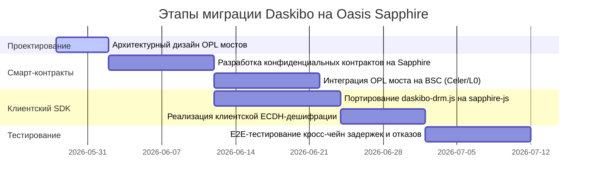

# Техническая оценка сложности миграции Daskibo DRM с Lit Protocol на Oasis Network (ROSE)

В данном документе представлена глубокая архитектурная оценка сложности, рисков и компромиссов при переносе слоя управления ключами шифрования и контроля доступа (DRM Gating Layer) проекта Daskibo с **Lit Protocol v3 (Chipotle)** на **Oasis Network (Sapphire ParaTime)**.

---

## 1. Архитектурный маппинг концептов: Lit vs. Oasis Sapphire

Для понимания масштаба изменений ниже приведено сопоставление ключевых криптографических и инфраструктурных концептов двух систем:

| Функциональный блок | Реализация в Lit Protocol | Реализация в Oasis Sapphire |
| :--- | :--- | :--- |
| **Природа платформы** | Децентрализованная пороговая сеть оффчейн-нод (TEE-MPC) | Полноценный конфиденциальный EVM Layer-1 блокчейн (Confidential ParaTime) |
| **Место хранения ключей** | Разделены на доли ($shares$) среди Lit-нод, собираются только в памяти TEE | Хранятся в зашифрованном приватном состоянии (state) смарт-контракта |
| **Условия доступа (ACL)** | Оффчейн-описание условий (EVM, баланс, подписи), проверяемое нодами | Ончейн-код смарт-контракта Solidity, выполняемый конфиденциально |
| **Шифрование вызовов** | Нативное SDK-клиентское шифрование ключа | Автоматическое шифрование calldata транзакций на уровне `@oasisprotocol/sapphire-js` |
| **Кастомные правила** | Скрипты Lit Actions (JavaScript) в TEE-песочнице | Конфиденциальный Solidity-код любой сложности с крипто-прекомпилями |
| **Кросс-чейн логика** | Нативная поддержка любых EVM, Solana, Cosmos "из коробки" | Требует мостов Oasis Privacy Layer (OPL) или Celer/LayerZero для связи с BSC/Greenfield |

---

## 2. Детальная оценка сложности по компонентам

Миграция DRM-архитектуры Daskibo на Oasis Sapphire потребует масштабного переписывания трех ключевых слоев системы.

### 2.1. Слой смарт-контрактов (Solidity) — **Сложность: Средняя (Medium)**
Текущие контракты `CourseMarketplace.sol` и `ClientNft.sol` работают на BNB Smart Chain. При миграции на Oasis есть два пути:
1.  **Полная миграция (Блокирующий путь)**: Перенос маркетплейса и токенов доступа (SBT) целиком на Oasis Sapphire.
    *   *Объем работ*: Минимальный для стандартного Solidity кода. Sapphire полностью EVM-совместим.
    *   *Проблема*: Потеря нативной синергии с BNB Greenfield. Хранение бакетов останется на Greenfield, а экономика уйдет на Oasis, что усложнит кросс-чейн SP-авторизацию.
2.  **Гибридная модель (Oasis Privacy Layer — OPL)**: Маркетплейс остается на BSC, а Oasis Sapphire выступает исключительно как "сейф" конфиденциальных ключей.
    *   *Объем работ*: Разработка конфиденциального контракта-хранилища ключей на Sapphire с использованием библиотеки `sapphire.sol`.
    *   *Криптографическая логика*: Контракт на Sapphire должен генерировать сессионные пары ключей `secp256k1` или `x25519` через встроенные прекомпилы Sapphire, выполнять ECDH с публичным ключом клиента и возвращать зашифрованный $DEK$ обратно.

### 2.2. Клиентский SDK слой (`daskibo-drm.js`) — **Сложность: Высокая (High)**
Потребуется полностью демонтировать Lit Protocol SDK и переписать логику шифрования/дешифрации цифровых конвертов:
*   **Вместо `LitJsSdk.encryptFile` / `decryptFile`**:
    1.  Клиент генерирует эфемерную пару ключей на основе эллиптической кривой (например, через Web Crypto API).
    2.  Клиент делает конфиденциальный `view`-вызов к смарт-контракту Oasis Sapphire через обертку `@oasisprotocol/sapphire-js`.
    3.  Обертка Sapphire автоматически шифрует calldata вызова, защищая параметры запроса от прослушивания нодами консенсуса.
    4.  Контракт Sapphire проверяет выполнение условий (наличие SBT на BSC/Oasis), выполняет ончейн ECDH-вычисление общего секрета с эфемерным ключом клиента, шифрует исходный ключ курса ($DEK$) и возвращает его клиенту.
    5.  Клиент расшифровывает $DEK$ локально и дешифрует HLS-сегменты видео.

### 2.3. Кросс-чейн коммуникация (BSC <-> Oasis) — **Сложность: Очень высокая (Very High)**
Если маркетплейс `CourseMarketplace` остается на BSC (для сохранения связи с BNB Greenfield), для разблокировки ключей на Oasis Sapphire необходим кросс-чейн мост:
*   При покупке курса на BSC транзакция должна отправить сообщение через **OPL (Oasis Privacy Layer)** (на базе Celer Message Bridge или LayerZero) в контракт-хранилище на Oasis Sapphire для регистрации покупки.
*   **Проблема Latency**: Кросс-чейн сообщения идут от 1 до 3 минут. Это убивает мгновенный UX: студент оплачивает курс и вынужден ждать несколько минут, пока транзакция подтвердится на Oasis Sapphire, перед тем как запустить первое видео.

---

## 3. Сводная оценка трудозатрат и этапов разработки

### Общие трудозатраты:
*   **Календарное время**: 6–7 недель (высокая сложность).
*   **Ресурсы**: 1 Senior Solidity Engineer, 1 Senior Cryptography / Frontend Engineer.

---

## 4. Сравнительные компромиссы: Lit v3 vs. Oasis Sapphire

Для принятия окончательного решения ниже приведены плюсы и минусы миграции:

### Плюсы миграции на Oasis ROSE:
1.  **Абсолютная децентрализация**: Oasis Sapphire — это полноценный L1 блокчейн с развитой сетью валидаторов. В отличие от Lit Protocol, который все еще находится на стадии контролируемого мейннета с ограниченным числом TEE-нод, Oasis полностью автономен.
2.  **Ончейн конфиденциальная логика**: Возможность писать сложные смарт-контракты, скрывающие внутреннее состояние (например, приватные пулы авторов, скрытые ставки на контент), что невозможно в Lit Actions.
3.  **Аудируемость**: 100% ончейн-аудит транзакций доступа с гарантией невозможности подделки результатов выполнения.

### Минусы миграции на Oasis ROSE:
1.  **Кросс-чейн оверхед**: BNB Greenfield жестко привязан к BNB Chain. Разделение экономики (BSC), хранения (Greenfield) и ключей доступа (Oasis) создает сложный треугольник кросс-чейн взаимодействий, подверженный уязвимостям мостов.
2.  **Ухудшение UX (Latency)**: Задержка прохождения OPL-мостов при первой покупке значительно выше, чем мгновенная off-chain TEE-верификация в Lit v3.
3.  **Двойное управление газом**: Пользователю или ретранслятору (Relayer) придется управлять газом в двух сетях (BNB/BSC для транзакций и ROSE для конфиденциальных запросов Sapphire), что усложняет Gasless-архитектуру.

---

## 5. Архитектурный вердикт

> [!IMPORTANT]
> **Рекомендация Daskibo**: 
> Полная миграция на Oasis Sapphire на данном этапе **нецелесообразна** из-за высоких кросс-чейн задержек (OPL Latency) и потери монолитной синергии с экосистемой BNB Chain / BNB Greenfield.
> 
> **Рекомендуемый гибридный подход**: 
> Использовать **Lit Protocol v3 в качестве основного рантайм-гейта доступа** (благодаря его мгновенной оффчейн-верификации SBT на BSC и поддержке мультичейна без мостов), но интегрировать **Oasis Sapphire в качестве резервного "холодного" депозитария мастер-ключей (Cold Key Custodian)**. В этой модели мастер-ключи шифрования видео архивируются в конфиденциальном контракте Oasis, гарантируя вечную сохранность, а Lit-ноды динамически запрашивают их через защищенные TLS-каналы при выполнении условий доступа.
