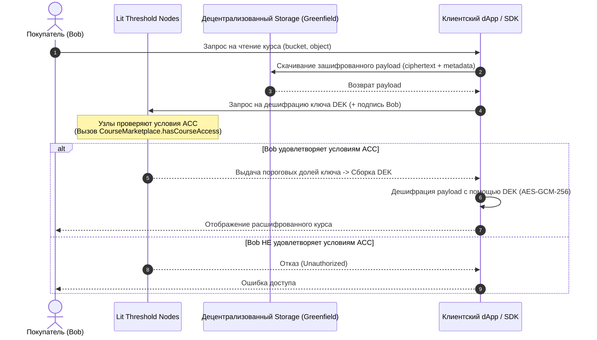
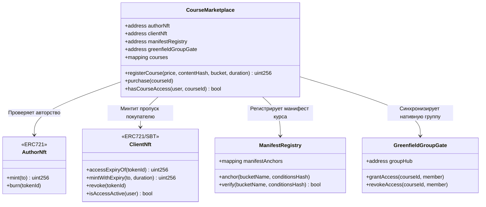
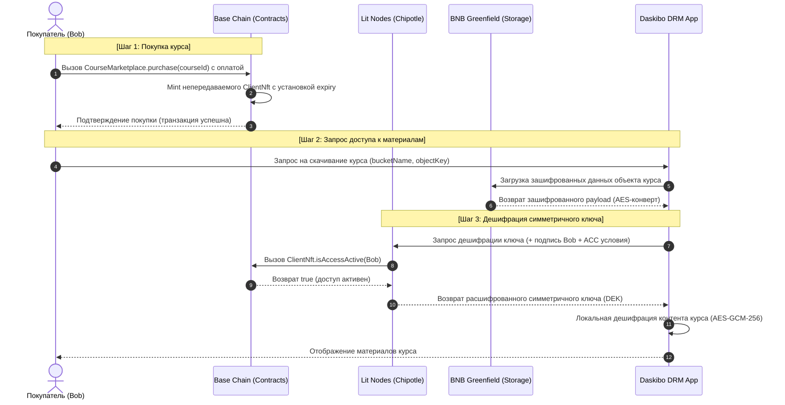
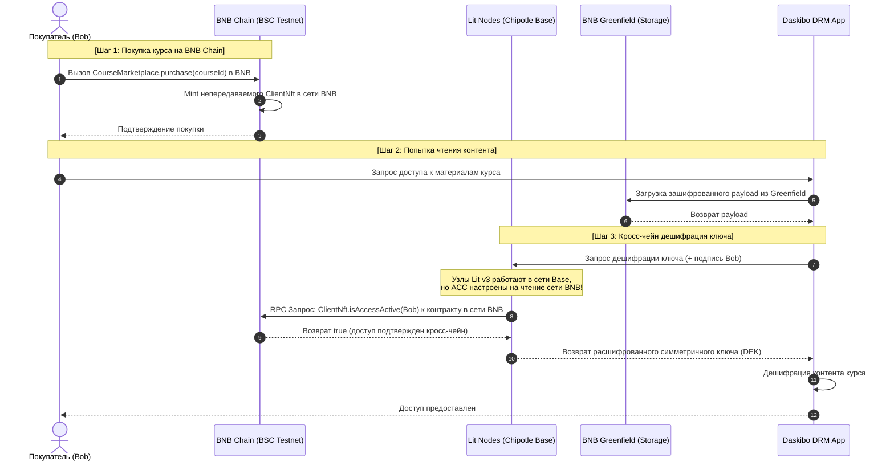
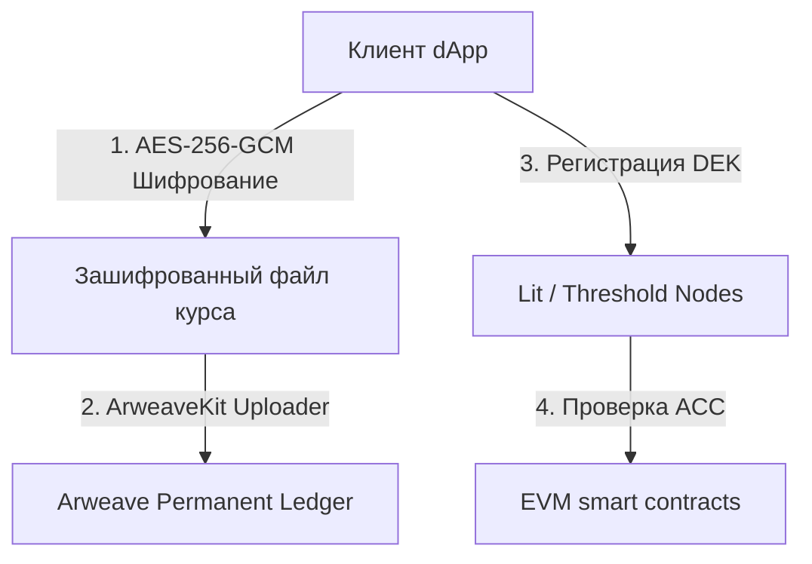
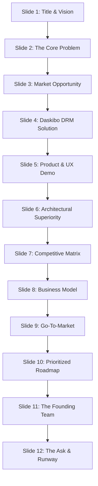

# OSINT: Связка «Децентрализованное хранилище + [Threshold Encryption](wiki.md#pre) / [Lit-ACC](wiki.md#acc)» и Архитектурные Спецификации Нашего Стека

Аналитический отчет и детальная техническая спецификация (system specifications) на уровне Senior Web3 Technical Writer. В документе представлен глубокий конкурентный анализ систем децентрализованного хранения данных с разграничением доступа на основе пороговой криптографии и смарт-контрактов, а также подробное руководство по нашему стеку (**[Daskibo DRM](wiki.md#drm)**: [BNB Greenfield](wiki.md#greenfield) + Chipotle/[Lit v3](wiki.md#litkey) + [Soulbound NFT](wiki.md#sbt) + `CourseMarketplace`).

---

## 1. Конкурентный анализ и профили систем (OSINT & Product Profiles)

Исследование открытых источников (whitepapers, техническая документация, репозитории GitHub, аналитические порталы RootData/DappBay) подтверждает развитие пяти основных технологических стеков, реализующих концепцию **Decentralized Storage + [Threshold Cryptography](wiki.md#tss) / [Access Control Conditions (ACC)](wiki.md#acc)**.

### 1.1. Картотека конкурентных продуктов

#### 1. **Lighthouse.storage (Kavach SDK)**

* **Категория**: Децентрализованный CDN-провайдер и постоянное (perpetual) хранилище.
* **Stack**: [IPFS](wiki.md#ipfs) (горячее кэширование) + [Filecoin](wiki.md#filecoin) (холодное хранение) + **Kavach SDK** (собственный криптографический слой пороговой дешифрации на базе [MPC](wiki.md#mpc)) + смарт-контракты гейтинга на EVM/SVM (Ethereum, Polygon, Solana, FVM).
* **Patterns**:
  * *Perpetual Storage Model*: Однократная оплата за неограниченное по времени хранение файлов (эндоумент-пулы).
  * *Kavach Access Control*: Шифрование на стороне клиента симметричным ключом (AES-GCM-256), который затем фрагментируется и распределяется среди узлов пороговой сети. Дешифрация разрешается только при успешном прохождении on-chain проверки (владение NFT, баланс токенов, кастомный метод смарт-контракта).
  * *Lit Integration (Hybrid)*: Для сложных динамических правил и off-chain условий (например, Web2 API-гейты) Lighthouse часто интегрируется со слоем Lit Protocol в качестве стороннего Access Control Layer.
* **Functions**:
  * `lighthouse.uploadEncrypted(...)` — шифрование и отправка в IPFS/Filecoin.
  * `lighthouse.decryptFile(...)` — сбор пороговых долей ключа через Kavach и дешифрация в рантайме.
  * `lighthouse.shareFile(...)` — динамическое добавление новых адресов в ACL-лист.
* **Юзеркейсы**: Data DAOs, конфиденциальные метаданные NFT, хранение медицинских карт пациентов, монетизация AI-датасетов (Data Marketplace).

#### 2. **Keypo SDK**

* **Категория**: SDK для конфиденциального обмена данными и безгазового онбординга.
* **Stack**: Filecoin (Synapse) + **Lit Protocol** (исторически Naga Testnet, требует миграции на Chipotle/v3) + **ZeroDev** (Account Abstraction ERC-4337 для создания газонезависимых смарт-аккаунтов).
* **Patterns**:
  * *Transferable Access NFT*: Доступ выдается путем минта динамического NFT получателю.
  * *Gasless Sharing*: Использование абстракции аккаунта позволяет пользователю делиться зашифрованными данными без необходимости владеть нативной валютой сети для оплаты газа.
  * *On-chain ACL Registry*: Гейтинг осуществляется через обращение Lit-узлов к реестру смарт-контракта на Base Sepolia.
* **Functions**:
  * `keypo.upload(file, accessConditions)` — клиентское шифрование и публикация в Filecoin.
  * `keypo.share(fileId, recipientAddress)` — транзакция AA, добавляющая права в реестр или минтинг access-NFT.
* **Юзеркейсы**: Безопасный корпоративный документооборот, дистрибуция конфиденциальных файлов «в один клик» для Web2-пользователей.

#### 3. **4EVERLAND**

* **Категория**: Web3 облачный провайдер и хостинг-агрегатор.
* **Stack**: Мультипротокольный storage-слой (BNB Greenfield в качестве SP и валидатора + IPFS + Arweave) + **STS API / S3 ACL** (проприетарный централизованно-делегированный доступ).
* **Patterns**:
  * *STS (Security Token Service)*: Выдача временных токенов доступа для загрузки/скачивания через классический S3-совместимый API.
  * *S3 Bucket Policy / ACL*: Разграничение доступа на уровне провайдера (SP/Gateway).
  * *⚠️ Отсутствие Threshold Encryption*: Интеграция с Lit Protocol в официальной документации отсутствует. Конфиденциальность гарантируется настройками шлюзов доступа и STS-авторизацией.
* **Functions**:
  * Стандартные S3 API-вызовы (`PutObject`, `GetObject`) через кастомный SDK.
  * `STS.AssumeRole(...)` для генерации временных сессионных ключей.
* **Юзеркейсы**: Децентрализованный хостинг сайтов (dApps), децентрализованные бэкапы баз данных.

#### 4. **CyberConnect**

* **Категория**: Децентрализованный социальный граф (DeSoc).
* **Stack**: BNB Greenfield + Arweave (хранение медиаконтента, постов и ассетов) + смарт-контракты **EssenceNFT** и **SubscribeNFT** на BNB Chain / opBNB.
* **Patterns**:
  * *Creator Paywall*: Создатель контента шифрует свои публикации, а доступ к ним гейтится с помощью владения токеном подписки (`SubscribeNFT`) или коллекционным контентом (`EssenceNFT`).
  * *W3ST (Web3 Status Token)*: Нативные непередаваемые SBT-токены для подтверждения ролей и статусов участников сообщества.
  * *NFT-only Gating*: Разграничение доступа осуществляется на уровне приложения (dApp) путем проверки владения NFT, а не через жесткое криптографическое шифрование пороговой сети.
* **Functions**:
  * `subscribe(profileId)` — минт NFT подписки на блокчейне.
  * `collect(essenceId)` — покупка коллекционного поста.
* **Юзеркейсы**: Децентрализованные блоги, Web3-социальные сети, платформы платных рассылок и стримов.

#### 5. **Akord (Arweave + MEM)**

* **Категория**: Постоянное конфиденциальное хранилище и Web3-сейфы (Vaults).
* **Stack**: Arweave (перманентное хранение) + **ArweaveKit** / Web Crypto API + **Molecular Execution Machine (MEM)** (decentralized serverless execution environment для multi-chain логики) + смарт-контракты гейтинга.
* **Архитектурная реализация фичей (Deep-Dive Cryptography)**:
  * **Управление доступом (Collaborative Access Control)**:
    * Akord реализует суверенное управление доступом на базе криптографии с нулевым разглашением (Zero-Knowledge). Учетная запись пользователя при создании генерирует фразу восстановления (recovery phrase), на основе которой клиент локально выводит асимметричную ключевую пару (RSA-4096 для шифрования и Ed25519 для подписей).
    * Сейфы (Vaults) являются закрытыми коллективными пространствами. Доступ к сейфу определяется обладанием симметричным ключом сейфа (Vault Key, $VK$).
    * Когда владелец сейфа (инвайтер) добавляет нового участника, он скачивает публичный ключ приглашаемого из глобального реестра Akord на Arweave, локально шифрует текущий $VK$ этим публичным ключом с помощью RSA-OAEP и публикует зашифрованный ключ в Arweave в виде транзакции членства (membership transaction).
  * **Постоянное хранение (Arweave Storage)**:
    * Akord упаковывает все файлы, историю версий и метаданные в транзакции Arweave. Состояние сейфа хранится как неизменяемый поток транзакций (append-only ledger events). Любое изменение файла или добавление участника — это новая ончейн-транзакция с тегами, отражающая инкрементальное обновление состояния.
    * Благодаря экономической модели Arweave (эндоумент-фонд хранения), плата за загруженные файлы взимается однократно при загрузке, гарантируя перманентную доступность данных на срок более 200 лет без рекуррентной подписки.
  * **Клиентское шифрование и дешифрование (Zero-Knowledge E2EE)**:
    * *Шифрование payload*: При загрузке файла клиентский SDK генерирует случайный криптографически стойкий 256-битный симметричный ключ документа (Document Key, $DK$) и 96-битный вектор инициализации ($IV$). Файл шифруется локально по алгоритму **AES-256-GCM**.
    * *Защита ключа*: Ключ документа $DK$ шифруется с использованием текущего симметричного ключа сейфа $VK$ по алгоритму **AES-KWP** (Key Wrap) и прикрепляется к заголовку файла в транзакции.
    * *Дешифрование*: Для чтения файла авторизованный участник скачивает транзакцию, расшифровывает ключ сейфа $VK$ своим приватным RSA-ключом, с его помощью расшифровывает $DK$ (Document Key), а затем расшифровывает тело файла AES-GCM-256 на клиенте. Ни Akord, ни шлюзы Arweave никогда не получают доступ к открытым ключам или plaintext контенту.
  * **Механика отзыва доступа (Revocation Key-Rotation)**:
    * Поскольку Arweave неизменяем, физически удалить ранее загруженный зашифрованный файл невозможно. Однако отзыв доступа реализуется через **ротацию ключей (Key Rotation)**.
    * При удалении участника из сейфа координатор генерирует новый симметричный ключ сейфа $VK_{new}$ и шифрует его только для оставшихся активных участников.
    * Все новые файлы шифруются с использованием $VK_{new}$. Отозванный пользователь полностью отрезается от будущих ключей сессии, а старые файлы помечаются в индексе Akord как неактивные или недоступные для обновления, лишая отозванного пользователя возможности отслеживать эволюцию сейфа.
* **Functions**:
  * `akord.vault.create("My Private Course", { public: false })` — создание закрытого сейфа.
  * `akord.vault.setAccessControlRules(vaultId, memContractAddress, ruleParameters)` — связывание сейфа с логикой MEM.
  * `akord.document.upload(vaultId, file)` — локальное шифрование и отправка в Arweave.
* **Юзеркейсы**: Постоянные закрытые Web3-библиотеки, суверенное хранение личных архивов, вечные NFT-коллекции с динамическим on-chain доступом, защищенный корпоративный бэкап.

---

## 2. Сравнительный анализ функциональности

Ниже представлена расширенная сводная матрица возможностей исследованных платформ в сравнении с нашим стеком (**Daskibo**), включающая 20 детальных технологических и эксплуатационных факторов:

| Фактор / Возможность                                              |             Daskibo (Наш стек)             |          Lighthouse.storage          |          Keypo          |             4EVERLAND             |              CyberConnect              |        Akord (Arweave)        |
| :--------------------------------------------------------------------------------- | :-----------------------------------------------: | :----------------------------------: | :----------------------: | :-------------------------------: | :-------------------------------------: | :---------------------------: |
| **1. Децентрализованное хранилище**               |        **BNB Greenfield + AIOZ** ✅        |           IPFS + Filecoin           |    Filecoin (Synapse)    |        GF + IPFS + Arweave        |              GF + Arweave              |     **Arweave** ✅     |
| **2. Пороговое управление ключами**                |          **Chipotle (Lit v3)** ✅          |           Kavach SDK / Lit           | Lit Protocol (Naga ⚠️) |   STS-шлюзы (Центр.)   |              ✖ (App-gate)              |  **MEM Serverless** ✅  |
| **3. Шифрование payload (AES)**                                    |             ✅ (AES-GCM-256 Envelope)             |             ✅ (AES-GCM)             |       ✅ (AES-CBC)       |    ✖ (Только шлюз)    |                   ✖                   |       ✅ (AES-256-GCM)       |
| **4. Кастомные EVM-условия (ACC)**                           |                ✅ (`lit-acc.js`)                |                  ✅                  |            ✅            |                ✖                |                   ✖                   |     ✅ (Multi-chain MEM)     |
| **5. Flash-Loan устойчивость (SBT)**                             |           ✅ (Soulbound `ClientNft`)           |       ✖ (Обычные NFT)       |            ✖            |                ✖                |              ✅ (W3ST SBT)              |              ✖              |
| **6. Динамический HLS/DASH видео-стриминг**         |          ✅ (Service Worker чанки)          |    ✖ (Файлы целиком)    |            ✖            |                ✖                |                   ✖                   |   ✖ (Логика в MEM)   |
| **7. Децентрализованное транскодирование** |        ✅ (Интеграция Livepeer)        |                  ✖                  |            ✖            |                ✖                |                   ✖                   |              ✖              |
| **8. Нативная DePIN CDN доставка**                           |            ✅ (AIOZ Edge Nodes / dCDN)            | ✖ (Стандартный IPFS/FIL) |            ✖            |        ✅ (4everland CDN)        |                   ✖                   |     ✖ (Шлюзы ar.io)     |
| **9. Встроенный маркетплейс (EVM Paywall)**             |            ✅ (`CourseMarketplace`)            |                  ✖                  |            ✖            |                ✖                |            ✅ (Essence/Sub)            |              ✖              |
| **10. Ограничение доступа по времени**            |    ✅ (Абсолютный `expiry` в SC)    |                  ✖                  |            ✖            |     ✅ (TTL STS-токена)     | ✅ (Периодич. подписка) |   ✅ (Логика в MEM)   |
| **11. Унифицированный SDK Фасад**                        |        ✅ (`daskibo-drm.js` фасад)        |         ✅`Lighthouse SDK`         |     ✅`Keypo SDK`     |        ✅`4everland SDK`        |                   ✖                   |     ✅`@akord/akord-js`     |
| **12. Газонезависимый онбординг (AA)**               |              ✅ (ERC-4337 Biconomy)              |                  ✖                  |    ✅ (ZeroDev 4337)    |                ✖                |          ✅ (CyberAccount AA)          |     ✅ (Sponsor Gateways)     |
| **13. Вход через соцсети (Social Logins)**                   |              ✅ (Web3Auth / Google)              |                  ✖                  |    ✅ (Social OAuth)    |                ✖                |         ✅ (CyberConnect Auth)         |              ✖              |
| **14. Нативный криптографический отзыв**       |             ✅ (`revoke()` в SBT)             |                  ✅                  |            ✅            |          ✅ (STS Revoke)          |                   ✖                   |     ✅ (MEM Vault Revoke)     |
| **15. Обфускация размера (Padding)**                        | ✅ (Случайный мусорный байт) |                  ✖                  |            ✖            |                ✖                |                   ✖                   |              ✖              |
| **16. Скрытие метаданных покупателя**             |     ✅ (Ретрансляторы/Relayers)     |                  ✖                  |            ✖            |                ✖                |                   ✖                   |              ✖              |
| **17. Интеграция с ENS/Handshake DNS**                            |          ✅ (TLD `.daskibo`, ENS Limo)          |                  ✖                  |            ✖            |       ✅ (IPNS шлюзы)       |                   ✖                   |      ✅ (ANS имена)      |
| **18. Конфиденциальный ИИ-компьют**                 |             ✅ (TEE Compute Enclaves)             |                  ✖                  |            ✖            |                ✖                |                   ✖                   |              ✖              |
| **19. Поддержка вечного хранения**                   |           ✅ (Arweave driver fallback)           |                  ✖                  |            ✖            | ✅ (Arweave интеграция) |         ✅ (Arweave посты)         | ✅ (Нативное Arweave) |
| **20. Автоматизированное E2E-тестирование**    |           ✅ (Foundry + Local Compose)           |                  ✖                  |            ✖            |                ✖                |                   ✖                   |              ✖              |

---

## 2.b. Сравнительный анализ децентрализованных систем хранения (Decentralized Storage Systems)

Для глубокого понимания архитектурных компромиссов при проектировании DRM-систем ниже приведено фундаментальное сравнение четырех ключевых децентрализованных систем хранения по критическим техническим и экономическим факторам:

| Критерий сравнения                                   | BNB Greenfield                                                                                                         | Filecoin                                                                                                                    | IPFS                                                                                                                 | Arweave                                                                                                          |
| :-------------------------------------------------------------------- | :--------------------------------------------------------------------------------------------------------------------- | :-------------------------------------------------------------------------------------------------------------------------- | :------------------------------------------------------------------------------------------------------------------- | :--------------------------------------------------------------------------------------------------------------- |
| **Философия / Назначение**                   | Интегрированная Web3-экономика данных и горячий хостинг                   | Рыночная долгосрочная аренда неиспользуемых дисковых пространств | P2P-протокол адресации контента по хэшу                                               | Постоянное иммутабельное хранилище "Pay-Once-Store-Forever"                      |
| **Перманентность (Data Persistence)**             | Мутабельное, регулируется транзакциями и ончейн-балансом             | Временное (контрактная основа сделок / deals на фиксированный срок)      | Временное (требует активного пиннинга нодами/шлюзами)                  | **Пожизненное** (гарантированное эндаумент-пулом на 200+ лет) |
| **Схема тарификации (Billing Model)**           | Динамическая потоковая оплата (flow billing) в реальном времени             | Рыночные сделки (spot deals), предоплата за срок аренды                                 | Бесплатно в P2P / Платный CDN пиннинг (подписочная модель)                  | **Единовременный платеж** (Upfront payment) в эндаумент-пул               |
| **Криптографический консенсус**       | Proof of Challenge (аудит-вызовы SP) + PoS (Tendermint)                                                     | Proof of Replication (PoRep) + Proof of Spacetime (PoSt)                                                                    | Отсутствует встроенный консенсус (протокол маршрутизации DHT)     | Proof of Access (PoA) + Succinct Proof of Random Access (SPoRA)                                                  |
| **Мутабельность (Mutability)**                     | **Полная** (динамическое редактирование, удаление, перезапись) | Частичная (изменение контента требует заключения новой сделки)        | **Иммутабельное** (CID жестко привязан к хэшу; мутации через IPNS) | **Абсолютно неизменяемое** (append-only транзакции)                         |
| **Скорость чтения (Latency/Speed)**               | **Минимальная** (горячее извлечение через SP в Web CDN)                        | Высокая (требует холодного распечатывания секторов и рынка retrieval)    | Низкая/Средняя (зависит от числа раздающих сидеров в DHT)                | Средняя для записи (~5-10 мин), низкая для чтения через шлюзы ar.io  |
| **Нативный контроль доступа**            | **✅ Да** (поддержка нативных Greenfield Groups, ACL политик на EVM)                 | ✖ Нет (требуется внешний шифрующий слой или FVM оверлей)                         | ✖ Нет (данные публичны, требуется клиентское шифрование)              | ✖ Нет (данные публичны, требуется клиентское шифрование / MEM)    |
| **Интеграция со смарт-контрактами** | **✅ Максимальная** (нативный кросс-чейн мост с BNB Chain/BSC)                 | Средняя (встроенная среда выполнения FVM)                                                   | Минимальная (хранение статических ссылок CID в блокчейне)              | Высокая (через serverless-контракты SmartWeave и MEM)                                      |
| **Основной тип контента**                    | Мутабельные dApp базы, DRM, динамический Web3-контент                                | Крупные архивные датасеты, холодные бэкапы баз данных                         | dApp-фронтенды, публичные ассеты, картинки NFT-коллекций                    | Вечный бэкдор для фронтендов, метаданные NFT, закрытые архивы   |

> [!NOTE]
> **BNB Greenfield** является оптимальным выбором для "горячих", интерактивных dApp с необходимостью динамического изменения прав и быстрой доступа к файлам без вычислительного оверхеда.
> **Arweave** незаменим как холодный / архивный резервный слой, гарантирующий невозможность цензуры или исчезновения критических материалов курса при однократной оплате.

---

## 2.c. Рыночные и ончейн-метрики популярности протоколов (Market & On-Chain Adoption Metrics)

Для объективной оценки зрелости и популярности упомянутых в данном OSINT-отчете решений ниже приведены ключевые рыночные показатели (согласно CoinMarketCap на май 2026 г.) и ончейн-метрики (активные уникальные кошельки / токенхолдеры):

### 1. Метрики систем децентрализованного хранения данных

| Протокол / Токен     | Капитализация (Market Cap)    | Дневной объем торгов (24h Vol)              | Число уникальных ончейн-адресов / холдеров | Сеть / Explorer |
| :-------------------------------- | :----------------------------------------- | :------------------------------------------------------------ | :----------------------------------------------------------------------------- | :------------------ |
| **BNB Greenfield (BNB)**    | ~$87,420,000,000 | ~$1,540,000,000         | **~112,000,000** (все адреса BSC / Greenfield) | BNB Chain / BscScan & Greenfield Explorer                                      |                     |
| **Filecoin (FIL)**          | ~$819,760,000 | ~$199,040,000              | **~2,500,000** активных адресов          | Filecoin Mainnet / Filscan                                                     |                     |
| **Arweave (AR)**            | ~$143,810,000 | ~$24,600,000               | **~160,000** уникальных адресов        | Arweave Mainnet / Viewblock                                                    |                     |
| **IPFS / Filecoin Utility** | *Нет нативного токена* | *Использует FIL*                                  | **~2,000,000+** активных пиров в сети                  | P2P DHT Network     |

### 2. Метрики протоколов конфиденциальности и пороговой криптографии

| Протокол / Токен   | Капитализация (Market Cap)           | Дневной объем торгов (24h Vol)                          | Число уникальных ончейн-адресов / холдеров | Сеть / Explorer |
| :------------------------------ | :------------------------------------------------ | :------------------------------------------------------------------------ | :----------------------------------------------------------------------------- | :------------------ |
| **Oasis Network (ROSE)**  | ~$75,130,000 | ~$5,220,000                        | **~120,000** уникальных кошельков                | Oasis Consensus / Oasis Explorer                                               |                     |
| **Threshold Network (T)** | ~$56,300,000 | ~$4,410,000                        | **~9,300** холдеров (ERC-20 контракт)               | Ethereum / Etherscan                                                           |                     |
| **Secret Network (SCRT)** | ~$28,240,000 | ~$2,130,000                        | **~95,000** активных адресов                         | Secret Network / Mintscan                                                      |                     |
| **Handshake (HNS)**       | ~$3,570,000 | ~$5,310 (крайне низкий) | **~40,000** зарегистрированных кошельков | Handshake / HNS Explorer                                                       |                     |
| **Lit Protocol (LITKEY)** | ~$3,220,000 | ~$1,210,000                         | **~5,000** уникальных адресов (холдеров)   | Ethereum / Etherscan & Lit Explorer                                            |                     |

> [!TIP]
> **Выводы по метрикам**:
>
> 1. BNB Greenfield лидирует по ликвидности и сетевому охвату благодаря синергии с экосистемой BNB Chain (BNB).
> 2. В сегменте чистых Layer-1 сетей конфиденциальности **Oasis Network (ROSE)** и **Threshold Network (T)** демонстрируют высокую сетевую ликвидность и стабильное распределение холдеров по сравнению с микро-капами вроде Handshake.
> 3. Filecoin сохраняет колоссальный перевес в объеме торгов в категории децентрализованных хранилищ, однако Arweave показывает более высокую плотность долгосрочных разработчиков (интеграция Akord, ANS и MEM).

---

## 2.d. Специализированные децентрализованные сети доставки и стриминга видео (Decentralized Video Delivery & Streaming Networks)

Для построения масштабируемой DRM-системы доставки высококачественного (HD/4K) видеоконтента традиционные хранилища общего назначения (BNB Greenfield, IPFS, Arweave) сталкиваются с высокими накладными расходами на раздачу трафика (egress costs) и отсутствием нативной поддержки стриминговых протоколов (HLS, MPEG-DASH). В связи с этим в архитектуре Daskibo DRM предусмотрено использование специализированных DePIN-сетей доставки и обработки видео:

### 1. AIOZ Network (AIOZ) — Децентрализованный dCDN-слой видеовещания

* **Архитектура**: Сеть доставки контента нового поколения (dCDN), опирающаяся на глобальную DePIN-инфраструктуру из более чем 80 000 Edge-нод. Ноды предоставляют свои избыточные каналы пропускной способности, ресурсы хранения и графические чипы.
* **Преимущества для видео**:
  * **Субсекундный старт (Low Latency)**: Edge-ноды кэшируют зашифрованные сегменты видео HLS в региональных кластерах. Время первого байта (TTFB) сопоставимо с централизованными решениями уровня Cloudflare или Akamai, но стоимость трафика ниже на 90%.
  * **Встроенное почанковое DRM-шифрование**: Видеофайлы на лету конвертируются в адаптивный HLS-поток. Каждый видеосегмент (.ts файл) шифруется индивидуальным AES-ключом. Edge-ноды отдают видеопоток только тем клиентам, которые предоставили авторизованный сессионный токен дешифрации от Lit Protocol.
* **Рыночные показатели**: Капитализация токена **AIOZ** на CoinMarketCap составляет около **$87M - $90M**, с дневным объемом торгов в **$5M+**, что подтверждает стабильный спрос на DePIN-трафик.

### 2. Livepeer (LPT) — Децентрализованное видео-транскодирование

* **Архитектура**: P2P-протокол транскодирования видео в реальном времени. Интегрирует свободные мощности майнеров (GPU) по всему миру, преобразуя исходное видео высокого разрешения во все стандартные веб-форматы и битрейты.
* **Преимущества для видео**:
  * **Снижение расходов на CPU/GPU на 90%**: Конвертация исходного .mp4 видео автора в адаптивные HLS-потоки (1080p, 720p, 480p) является крайне дорогостоящим процессом. Livepeer транскодирует видео в 10 раз дешевле, чем централизованные сервисы типа AWS Elastic Transcoder.
  * **Динамическое шифрование при транскодировании**: В процессе нарезки видеопотока на HLS-сегменты Livepeer шифрует каждый чанк с интеграцией пороговых ключей Lit Protocol, автоматически формируя защищенный плейлист `.m3u8`.
* **Рыночные показатели**: Капитализация токена **LPT** составляет около **$111M - $112M**, с суточным объемом торгов более **$8M+**, что делает Livepeer самой ликвидной вычислительной DePIN-сетью для видео в мире.

### 3. Theta Network (THETA) — Peer-to-Peer кэширование и EdgeCloud

* **Архитектура**: Двухуровневый блокчейн доставки контента, объединяющий валидаторов институционального уровня (Google, Sony) и распределенную P2P-сеть пользовательских Edge-нод.
* **Преимущества для видео**:
  * **Соседское кэширование (Edge Caching)**: Пользователи, находящиеся в одном географическом районе, скачивают чанки видео не с удаленных серверов, а друг у друга. Это снижает пиковые сетевые нагрузки на корневые хранилища (BNB Greenfield) при одновременном просмотре видео тысячами студентов.
  * **Theta EdgeCloud**: Платформа предоставляет облачные GPU-мощности для сложного DRM-рендеринга и ИИ-анализа видеоконтента в реальном времени.
* **Рыночные показатели**: Лидер сегмента с капитализацией токена **THETA** около **$190M - $210M** и дневным объемом торгов в **$12M+**, что обеспечивает высокую экономическую стабильность и безопасность PoS-консенсуса сети.

---

### Сравнительный анализ видео-ориентированных и стандартных Web3-сетей:

| Критерий сравнения                         | AIOZ Network (dCDN)                                                                                      | Livepeer (Transcoding)                                                                                                  | Theta Network (P2P CDN)                                                                              | BNB Greenfield / Arweave                                                                                      |
| :---------------------------------------------------------- | :------------------------------------------------------------------------------------------------------- | :---------------------------------------------------------------------------------------------------------------------- | :--------------------------------------------------------------------------------------------------- | :------------------------------------------------------------------------------------------------------------ |
| **Основное назначение**             | Сверхдешевая раздача трафика и Edge-хостинг                            | Вычислительное транскодирование видео                                                | Локальное P2P-кэширование и Edge-компьют                                 | Корневое хранение статичных данных и метаданных                     |
| **Транскодирование контента** | ✅ Да (на Edge-нодах)                                                                           | **✅ Максимальное** (специализированные GPU-оркестраторы)               | ✖ Нет (требует сторонней подготовки видео)                        | ✖ Нет (хранятся только сырые неизменяемые файлы)                      |
| **Edge-кэширование и CDN**                | **✅ Да** (80,000+ Edge-нод, субсекундный старт)                             | ✖ Нет (не оптимизирован для доставки конечному юзеру)                       | **✅ Да** (гибридная P2P-раздача между зрителями)              | ✖ Нет (прямая загрузка с SP или шлюзов, возможны задержки)        |
| **Стоимость трафика (Egress)**        | **Минимальная** (~$0.005 за ГБ)                                                     | Оплачивается только вычислительная работа                                         | Крайне низкая (стимулируется токеном TFUEL)                          | Средняя (потоковый биллинг Greenfield / Эндаумент Arweave)                    |
| **Поддержка HLS/DASH DRM**                   | **✅ Полная нативная**                                                               | **✅ Нативная на уровне генерации чанков**                                         | ✅ Частичная                                                                                | ✖ Нет (требуется ручная клиентская нарезка и сборка)               |
| **Основной юзеркейс в Daskibo**      | **Региональное кэширование и доставка HLS-сегментов DRM** | **Автоматическое транскодирование видео автора при загрузке** | **Масштабирование стриминга при пиковых нагрузках** | **Постоянное неизменяемое хранение исходных файлов и SBT** |

> [!TIP]
> **Гибридная архитектура видео-DRM в Daskibo**:
> Оптимальным решением для Daskibo DRM является **гибридная модель**:
> Исходное видео автора загружается на транскодирование в **Livepeer**, который нарезает его на HLS-сегменты и шифрует с интеграцией Lit v3. Полученные зашифрованные сегменты и плейлисты складываются для вечного хранения в **Arweave/Greenfield**, а их дистрибуция и субсекундная доставка до плеера студента осуществляется через DePIN-сеть **AIOZ Network**.

---

## 3. Общие архитектурные паттерны Web3-шифрования

В ходе OSINT-анализа были выделены три универсальных архитектурных паттерна проектирования систем конфиденциального хранения данных.

### Паттерн 1: Split-Key / Envelope Encryption (Цифровой конверт)

Тяжелые файлы мультимедиа или обучающие материалы не шифруются асимметричными методами (это вычислительно невозможно на больших объемах данных). Применяется гибридная схема:

1. Файл шифруется локально на клиенте с использованием симметричного шифра **AES-GCM-256** со случайным одноразовым ключом (DEK — Data Encryption Key).
2. Зашифрованный файл загружается в публичное децентрализованное хранилище (Greenfield, IPFS, Arweave).
3. Ключ DEK передается в распределенную сеть (Lit Protocol или Kavach), которая шифрует его и связывает с правилом **Access Control Conditions (ACC)**.
4. Процесс дешифрации:



### Паттерн 2: Гейтинг на мутабельное состояние (State-based Access Gating)

Вместо того чтобы привязывать доступ к статическому списку адресов (что потребовало бы полной перешифровки данных при добавлении каждого нового пользователя), система гейтит симметричный ключ на динамическое состояние смарт-контракта:

* В момент шифрования условия ACC задаются как логическое выражение: **«Пользователь должен владеть SBT-токеном X»** или **«Метод `hasCourseAccess(user, courseId)` смарт-контракта Y должен возвращать `true`»**.
* Выдача или отзыв доступа сводится к обычной транзакции записи на блокчейне (покупка курса, минт токена, истечение срока действия по времени), изменяющей состояние контракта, к которому обращаются узлы Lit Protocol при попытке дешифрации.

### Паттерн 3: Делегированное управление правами (Granter Pattern)

Для интеграции с внешними Web2-сервисами, AI-агентами или автоматизированными системами используется паттерн **Granter**:

* Контракт SBT-токена (`ClientNft`) предоставляет права роли `granter`. Это авторизованный оператор (например, смарт-контракт `CourseMarketplace` или бэкенд-оракул), который имеет право минтить и отзывать (burn/revoke) непередаваемые доступы пользователей от лица автора курса.
* Это позволяет автору полностью делегировать бизнес-логику продаж и подписок сторонним смарт-контрактам, не теряя при этом базовый контроль над коллекцией.

---

## 4. Спецификации Нашего Стека (Daskibo DRM)

Daskibo DRM представляет собой законченную production-grade реализацию защищенной доставки цифрового контента на базе BNB Greenfield и Lit Protocol v3 (Chipotle).

```
                      +------------------------------------------+
                      |                 БЛОКЧЕЙН                 |
                      |        EVM Smart Contracts (BSC)         |
                      |                                          |
                      |  +--------------------+                  |
                      |  | CourseMarketplace  |                  |
                      |  +---------+----------+                  |
                      |            | (purchase / split-pay)      |
                      |            v                          |
                      |  +--------------------+                  |
                      |  |     ClientNft      | (SBT, Expiry)    |
                      |  +---------+----------+                  |
                      |            |                             |
                      +------------|-----------------------------+
                                   |
                  +----------------v----------------+
                  |         LIT PROTOCOL v3         |
                  |         (Chipotle TEE)          |
                  |                                 |
                  |   Проверяет:                    |
                  |   ClientNft.balanceOf(user) > 0 |
                  |   && expiry > block.timestamp   |
                  +----------------+----------------+
                                   | (Разблокировка DEK)
                                   v
+-----------------------+   +---------------+   +-----------------------+
|  BNB Greenfield SP    |-->| Клиентский    |-->| Bob видит защищенный  |
|  (Зашифрованный курс) |   | dApp (AES)    |   | контент курса         |
+-----------------------+   +---------------+   +-----------------------+
```

### 4.1. Архитектура Смарт-Контрактов (Solidity Core)

Наша ончейн-логика состоит из 5 взаимосвязанных контрактов с четким разделением ответственности:



#### 1. `CourseMarketplace.sol`

* **Назначение**: Оркестратор продаж, биллинга и регистрации курсов.
* **Функции**:
  * `registerCourse(...)`: Регистрирует курс, связывая его с `bucket` на Greenfield, ценой, хэшем контента и временем доступа. Минтит автору `AuthorNft` для подтверждения прав владения курсом.
  * `purchase(...)`: Принимает оплату от Bob, переводит долю автору (split-payment), запускает монотонный минт пропуска `ClientNft` для Bob.
  * `hasCourseAccess(...)`: Внешний view-метод для Lit-узлов, возвращающий `true`, если у пользователя есть действующий (не истекший и не отозванный) `ClientNft` для данного курса.

#### 2. `ClientNft.sol` (Soulbound Access Pass)

* **Назначение**: Выдача непередаваемых временных прав доступа.
* **Особенности**:
  * *Soulbound*: Методы `transferFrom` и `safeTransferFrom` переопределены и всегда выбрасывают ошибку `Soulbound()`. Токен намертво привязан к адресу покупателя Bob.
  * *Monotonic Time-Extension*: Повторная покупка того же курса продлевает срок действия доступа. При этом покупка пропуска с меньшим временем действия никогда не сокращает уже существующее активное окно доступа.
  * *Revoke*: Позволяет роли `granter` (маркетплейсу или автору) принудительно отозвать доступ (сжечь SBT-токен с очисткой данных об `expiry`).

#### 3. `ManifestRegistry.sol`

* **Назначение**: Криптографический ончейн-якорь для Access Control Conditions.
* **Особенности**:
  * Фиксирует соответствие между именем бакета `bucketName` на Greenfield и хэшем условий доступа Lit Protocol (`conditionsHash`).
  * Препятствует подмене метаданных манифеста (Tamper Resistance) на стороне SP. Перед расшифровкой клиент запрашивает реестр и сверяет хэш ACC.

#### 4. `GreenfieldGroupGate.sol` (Spike / Greenfield Integration)

* **Назначение**: Консолидация слоев через кросс-чейн зеркалирование в Greenfield Groups.
* **Особенности**:
  * При вызове `grantAccess` отправляет кросс-чейн запрос к системному контракту `GroupHub` на стороне BNB Greenfield, добавляя покупателя в нативную группу Greenfield.
  * Члены Greenfield-группы автоматически получают права на скачивание файлов из бакета непосредственно на уровне Storage Provider (SP), обеспечивая сквозную нативную безопасность наряду с TEE-шифрованием Lit Protocol.

---

### 4.2. Рантайм и SDK (JavaScript/Node.js Layer)

Для минимизации UX-барьеров и сокрытия сложности криптографического взаимодействия под капотом разработан высокоуровневый JS-фасад [`smartcontracts/buckets/daskibo-drm.js`](../smartcontracts/buckets/daskibo-drm.js).

#### Основной интерфейс SDK (`createDaskiboDRM`)

Экспортирует единый интуитивный интерфейс для авторов (загрузка) и студентов (просмотр):

```javascript
import { createDaskiboDRM } from './buckets/daskibo-drm.js';

const drm = createDaskiboDRM({
  greenfieldClient: gfClient,
  litClient: litClient,
  ethersSigner: signer
});

// 1. Флоу Автора: Шифрование манифеста и публикация курса в Greenfield
const publishResult = await drm.publishCourse({
  bucketName: "daskibo-course-science",
  courseId: 1,
  courseMetadata: {
    title: "Introduction to Quantum Cryptography",
    description: "Confidential master class materials."
  },
  accessControlConditions: [
    {
      contractAddress: "0xDc64a140Aa3E981100a9becA4E685f962f0cF6C9",
      standardContractType: "customContract",
      chain: "anvil", // Наша тестовая сеть Chipotle
      method: "hasCourseAccess",
      parameters: [":userAddress", "1"],
      returnValueTest: {
        comparator: "==",
        value: "true"
      }
    }
  ]
});
console.log("Course published, object key:", publishResult.objectKey);

// 2. Флоу Студента: Чтение и расшифровка в один клик
const decryptedData = await drm.getCourseKey({
  bucketName: "daskibo-course-science",
  objectKey: publishResult.objectKey,
  authContext: bobAuthContext
});
console.log("Decrypted materials successfully:", decryptedData.title);
```

---

## 5. Подробные Сценарии Использования (Detailed User Cases)

Ниже детально специфицированы два основных сценария развертывания DRM платформы, которые покрывают как односетевые конфигурации, так и сложные кросс-чейн топологии.

### Сценарий А (UC-12): Полный EVM-гейтинг в сети Base (Base-Native)

Контракты управления доступом и логика порогового шифрования полностью консолидированы в L2-сети Base.

#### 1. Топология и Стек:

* **Смарт-контракты**: `CourseMarketplace`, `AccessPass` (ERC-721 SBT) и `ManifestRegistry` развернуты в сети **Base** (Base Sepolia / Base Mainnet).
* **Хранилище**: Децентрализованные бакеты и объекты на **BNB Greenfield**.
* **Key Management / DRM**: **Lit Protocol v3 (Chipotle)**, настроенный на чтение состояния сети Base.

#### 2. Диаграмма вызовов и последовательность шагов:



---

### Сценарий B (UC-13): Кросс-чейн гейтинг (BNB Smart Contracts + Base-based Lit)

Сценарий реализует кросс-чейн схему, где финансовая логика находится в BNB Chain, а пороговые TEE-узлы Lit считывают состояние кросс-чейн.

#### 1. Топология и Стек:

* **Смарт-контракты**: `CourseMarketplace` и `AccessPass` развернуты в сети **BNB Chain** (BSC Testnet / Mainnet) для минимизации транзакционных комиссий авторов и удобства расчетов в нативном токене BNB.
* **Хранилище**: Децентрализованные бакеты на **BNB Greenfield**.
* **Key Management / DRM**: **Lit Protocol v3 (Chipotle)**. Поскольку Lit v3 гейтится на L2-сетях (таких как Base), Lit-узлы считывают состояние кросс-чейн из BSC через оракулы состояния или прямые JSON-RPC запросы, указанные в Access Control Conditions.

#### 2. Диаграмма вызовов и последовательность шагов:



---

## 6. Децентрализованные аналоги Lit Protocol (NuCypher / Threshold Network)

В качестве альтернативы Lit Protocol для управления ключами и контроля доступа (Access Control) в Daskibo DRM исследован проект **NuCypher**, который в результате исторического on-chain слияния с Keep Network трансформировался в **Threshold Network**. Их флагманским криптографическим продуктом является **TACo (Threshold Access Control)**.

### 6.1. Архитектурное и криптографическое сравнение: Lit vs. Threshold TACo

Главное различие между Lit Protocol и Threshold Network (NuCypher) лежит в фундаментальной математической и аппаратной модели защиты ключей:

1. **Lit Protocol (MPC + TEE)**:

   * **Технология**: Использует многочастные вычисления (MPC) в сочетании с доверенными средами исполнения (**TEE / AMD SEV**).
   * **Принцип**: Узлы Lit динамически создают части подписи/дешифрующих ключей прямо внутри TEE. Узлы выполняют кастомный JS-код (Lit Actions) для верификации условий в реальном времени.
   * **Плюсы**: Высокая гибкость (любые Web2/Web3 условия, кросс-чейн запросы в JS), низкая задержка.
   * **Минусы**: Зависимость от аппаратной безопасности TEE (уязвимости процессоров к сайд-канал атакам).
2. **Threshold Network / NuCypher (Proxy Re-Encryption - PRE)**:

   * **Технология**: Чистая криптография без аппаратных ограничений TEE, базирующаяся на схеме **Proxy Re-Encryption (PRE)** и пороговом протоколе **Umbral** (эллиптическая кривая `secp256k1`).
   * **Принцип**:
     * **Alice (Автор)** шифрует контент симметричным ключом $DEK$, а затем шифрует сам $DEK$ под своим *собственным публичным ключом*.
     * Alice создает **Re-Encryption Key Fragments (kfrags)**, которые математически связывают ее публичный ключ с публичным ключом **Bob (Студента)** при условии выполнения политики on-chain (например, владение NFT).
     * Эти фрагменты распределяются среди независимых узлов сети Threshold (Ursulas).
     * Когда Bob запрашивает доступ и доказывает выполнение условий, узлы Threshold выполняют операцию ре-шифрования (re-encryption). Они трансформируют шифртекст, предназначенный для Alice, в шифртекст, предназначенный для Bob.
     * Узлы **никогда не видят исходный plaintext и приватные ключи** ни одной из сторон.
     * Bob собирает $M$ из $N$ фрагментов трансформированного шифртекста (**cfrags**) и расшифровывает контент своим приватным ключом.
   * **Плюсы**: Математически безупречная безопасность (no TEE dependency), отсутствие единой точки отказа, полная приватность на уровне протокола.
   * **Минусы**: Высокая вычислительная нагрузка на стороне клиента (генерация kfrags и сборка cfrags), задержка ре-шифрования узлами, более сложная бизнес-логика динамического отзыва прав.

### 6.2. Сравнительная матрица криптографического слоя

| Характеристика                                                                     | Lit Protocol (LITKEY)                                                          | Threshold Network (T)                                                                          | Medusa Protocol                                                              | EPFL Calypso                                                                | Secret Network (SCRT)                                                                          | Oasis Network (ROSE)                                                                                             |
| :----------------------------------------------------------------------------------------------- | :----------------------------------------------------------------------------- | :--------------------------------------------------------------------------------------------- | :--------------------------------------------------------------------------- | :-------------------------------------------------------------------------- | :--------------------------------------------------------------------------------------------- | :--------------------------------------------------------------------------------------------------------------- |
| **Криптографический примитив**                                    | Threshold Secret Sharing (TSS) + BLS                                           | Proxy Re-Encryption (PRE) + Umbral                                                             | Threshold Decryption + BLS12-381 спаривания                        | Threshold ElGamal + DARC                                                    | TEE-based (SGX), ECDH + AES-128-SIV                                                            | TEE-based (SGX/SEV), X25519 (ECDH) + AES-128-GCM                                                                 |
| **Доверие аппаратному слою**                                         | **Да** (Требует AMD SEV / TEE)                                  | **Нет** (Чистая математика на `secp256k1`)                        | **Нет** (Чистая математика на `BLS12-381`)      | **Нет** (Чистая математика)                        | **Да** (Intel SGX TEE)                                                                 | **Да** (Intel SGX / AMD SEV для Sapphire ParaTime)                                                    |
| **Локация дешифрации**                                                    | Узлы генерируют ключ и отдают клиенту          | Клиент дешифрует своим приватным ключом                     | Клиент собирает доли дешифрования ($cfrags$) | Узлы коллективно раскрывают данные по DARC | Вычисления происходят внутри TEE-анклава                      | Вычисления происходят конфиденциально в EVM Sapphire TEE                     |
| **Динамическое изменение ACL**                                        | Тривиально (view-запрос состояния контракта) | Сложно (требует создания и дистрибуции новых `kfrags`) | Тривиально (изменение on-chain Solidity правил)     | Тривиально (через обновление правил DARC)    | Тривиально (изменение приватного ончейн-состояния) | Тривиально (изменение приватного состояния в Solidity-контракте) |
| **Поддержка кастомных JS/конфиденциальных правил** | ✅ Да (песочница Lit Actions)                                       | ✖ Нет (только статические условия)                                 | ✅ Да (любая Solidity логика)                                   | ✅ Да (правила DARC)                                               | ✅ Да (любая Rust/CosmWasm логика в анклаве)                              | ✅ Да (любая конфиденциальная Solidity логика на Sapphire)                        |
| **Вычислительная сложность на клиенте**                    | Крайне низкая (подпись сообщения)                  | Высокая (генерация `kfrags`, сборка `cfrags`)                        | Средняя (агрегация пороговых долей)            | Средняя (проверка доказательств ZKP)            | Низкая (создание ECDH канала)                                              | Минимальная (стандартные Web3/Ethers транзакции)                                 |
| **Поддерживаемые сети**                                                  | Multi-chain (EVM, Solana, Cosmos)                                              | Multi-chain (EVM через TACo)                                                              | EVM и Filecoin-совместимые                                       | Byzcoin (прототип) / EVM (адаптируемый)                 | Cosmos / Multi-chain через IBC и Gateways                                                | EVM нативная (Sapphire) + кросс-чейн через Oasis Privacy Layer (OPL)                       |

### 6.3. Medusa Protocol (Protocol Labs) — Децентрализованный оракул пороговой дешифрации

Разработанный исследовательской лабораторией **CryptoNet Lab (Protocol Labs)**, протокол **Medusa** представляет собой децентрализованный блокчейн-оракул шифрования и контроля доступа, созданный в первую очередь для экосистемы Filecoin и EVM-совместимых блокчейнов.

* **Архитектурный принцип**:
  * Medusa работает как распределенная сеть узлов-валидаторов, которая выступает в качестве "оракула дешифрования".
  * Данные шифруются на клиенте с использованием коллективного публичного ключа сети Medusa. Правила и политики доступа (Access Control Policies) кодируются в смарт-контрактах Solidity.
  * Когда получатель (Bob) запрашивает доступ к данным, он отправляет транзакцию-запрос в смарт-контракт Medusa. Сеть узлов считывает состояние контракта и, если условия выполнены, каждый узел локально выполняет частичную дешифрацию. Полученные доли дешифрования отправляются Bob, который собирает их воедино и восстанавливает ключ данных.
* **Математический и криптографический стек**:
  * **Distributed Key Generation (DKG)**: Узлы сети Medusa используют схему DKG на базе **BLS12-381** (спаривание дружественных эллиптических кривых) для генерации общего мастер-ключа без наличия доверенного дистрибьютора.
  * **Threshold Decryption (TD)**: Схема пороговой дешифрации ($t$-of-$n$) гарантирует, что ключ не может быть восстановлен, пока хотя бы $t$ узлов не сгенерируют свои частичные дешифрующие доли (decryption shares) с использованием Лагранжевой интерполяции в показателе степени.
* **Преимущества**:
  * Полное отсутствие аппаратных зависимостей (pure cryptography).
  * Программируемая on-chain логика: любая логика, которая может быть выражена в Solidity (EVM view call), может выступать правилом доступа.
* **Недостатки**:
  * Зависимость от скорости on-chain консенсуса при проверке правил.
  * Высокие требования к координации и вычислительным мощностям узлов для генерации DKG.

---

### 6.4. Calypso Framework (EPFL DEDIS Lab) — Децентрализованный аудит доступа

Разработанный в **Лаборатории распределенных систем EPFL (Швейцария)**, фреймворк **Calypso** решает фундаментальную дилемму публичных блокчейнов: как безопасно управлять доступом к конфиденциальным данным на абсолютно прозрачном и публичном распределенном реестре.

* **Архитектурный принцип**:
  * Calypso разделяет данные на публичные метаданные (записываемые в блокчейн) и зашифрованное тело контента (загружаемое в децентрализованное хранилище).
  * Фреймворк вводит сущность **DARC (Decentralized Access Rights Control)** — специализированные смарт-контракты, которые определяют права доступа и поддерживают сложные древовидные правила логических условий (AND, OR, NOT, подписи нескольких сторон).
  * Доверительная группа узлов, называемая **Cothority (Collective Authority)**, коллективно управляет ключами шифрования и проверяет валидность запросов к DARC. Каждое событие дешифрации фиксируется на блокчейне, формируя неизменяемый, прозрачно аудируемый журнал доступа (immutable audit trail).
* **Математический и криптографический стек**:
  * **Threshold ElGamal**: Шифрование осуществляется по схеме Эль-Гамаля, распределенной по методу Шамира ($t$-of-$n$).
  * **Bilinear Pairings & Collective Signing (CoCo)**: Узлы Cothority используют коллективные подписи Шнорра для быстрого консенсуса и проверки доказательств с нулевым разглашением (**ZKP**), подтверждающих право пользователя на чтение файлов в соответствии с контрактом DARC.
* **Преимущества**:
  * Встроенный прозрачный ончейн-аудит (можно математически доказать, кто, когда и на каком основании получил доступ к данным).
  * Поддержка сложных иерархических политик с мультиподписями на уровне протокола.
* **Недостатки**:
  * Высокая сложность интеграции в стандартные EVM-сети (требует поддержки специфических библиотек спаривания эллиптических кривых и поддержки DARC).

---

### 6.5. Secret Network (Secret Contracts) — Аппаратная конфиденциальность (TEE-based)

В отличие от Medusa и Calypso, которые полагаются на сложную пороговую математику распределения секретов, **Secret Network** (блокчейн первого уровня в экосистеме Cosmos) реализует модель конфиденциальных вычислений на уровне защищенного аппаратного обеспечения (**TEEs**).

* **Архитектурный принцип**:
  * Secret Network использует валидаторы, оснащенные защищенными аппаратными анклавами (**Intel SGX / AMD SEV**).
  * Смарт-контракты (Secret Contracts, написанные на Rust/CosmWasm) выполняются в зашифрованном виде внутри TEE-анклава. Ни операторы нод, ни внешние наблюдатели не могут видеть состояние смарт-контракта, переменные или входящие/исходящие транзакции.
  * Управление доступом реализуется непосредственно внутри кода смарт-контракта: пользователь отправляет зашифрованный запрос, контракт проверяет его права (например, баланс или владение NFT) внутри TEE и, в случае успеха, возвращает расшифрованные данные.
* **Математический и криптографический стек**:
  * **Consensus Seed**: При запуске сети генерируется единый случайный консенсусный сид, который безопасно реплицируется между TEE-анклавами всех валидаторов и используется для вывода уникальных ключей шифрования каждого отдельного смарт-контракта.
  * **ECDH (Elliptic-Curve Diffie-Hellman)**: Используется для генерации общего сессионного секрета между клиентом (dApp пользователя) и анклавом ноды, гарантируя безопасную доставку шифртекста транзакции без возможности перехвата на сетевом уровне.
  * **AES-128-SIV**: Симметричный шифр, применяемый для шифрования состояния контракта и inputs/outputs.
  * **Viewing Keys**: Концепция криптографических ключей просмотра. Пользователь генерирует Viewing Key для конкретного смарт-контракта, позволяя dApp безопасно запрашивать приватный баланс или доступы пользователя.
* **Преимущества**:
  * Чрезвычайно высокая скорость выполнения (вычисления происходят на аппаратной скорости процессора).
  * Возможность выполнения сложных конфиденциальных вычислений любой логики (Confidential Computation) поверх данных, а не просто "гейтинг" ключей.
* **Недостатки**:
  * Зависимость от доверия производителям процессоров (Intel, AMD) и аппаратным TEE-анклавам (риск side-channel атак, таких как SGXpectre или Meltdown).

---

## 7. Интеграция Arweave в Daskibo: Архитектурный TODO-план (Arweave Integration Roadmap)

Поскольку Arweave гарантирует абсолютную перманентность и иммутабельность данных (Pay-Once-Store-Forever), его интеграция в Daskibo DRM в качестве альтернативного или резервного слоя хранения (Storage Provider Layer) наряду с BNB Greenfield открывает огромные возможности для архивации "вечных" образовательных курсов.

Ниже представлен детальный TODO-план для команды разработки по интеграции Arweave в SDK-фасад `daskibo-drm.js` с сохранением логики TEE-гейтинга на базе Lit/Threshold.



### Архитектурный TODO-план для разработчиков:

#### `[ ]` ЭТАП 1: Абстрагирование слоя хранения (Storage Driver Interface)

Необходимо выделить Greenfield-специфичный код из `daskibo-drm.js` в изолированный интерфейс драйверов хранения.

* **Задача**: Создать абстрактный класс/интерфейс `IStorageDriver` с методами `uploadObject(bucket, key, data, mimeType)` и `downloadObject(bucket, key)`.
* **Файлы**: Создать `smartcontracts/buckets/drivers/storage-driver.js`.

#### `[ ]` ЭТАП 2: Реализация драйвера Arweave (`ArweaveDriver`)

Написать драйвер на базе библиотеки `ArweaveKit` для прямой загрузки транзакций в сеть Arweave.

* **Задача**: Использовать `arweave` или `@akord/akord-js` для формирования транзакции, оплаты через шлюзы-спонсоры (Bundlr/Irys) или локальный кошелек JWK, и отправки зашифрованных бинарных данных.
* **Пример кода интеграции драйвера (`arweave-driver.js`)**:
  ```javascript
  import Arweave from 'arweave';

  export class ArweaveDriver {
    constructor(config) {
      this.arweave = Arweave.init(config.arweaveInit || {
        host: 'arweave.net',
        port: 443,
        protocol: 'https'
      });
      this.jwk = config.jwk; // Приватный ключ Arweave
    }

    async uploadObject(bucket, key, encryptedData, mimeType) {
      const transaction = await this.arweave.createTransaction({
        data: encryptedData
      }, this.jwk);

      transaction.addTag('Content-Type', mimeType);
      transaction.addTag('Daskibo-Bucket', bucket);
      transaction.addTag('Daskibo-Object-Key', key);
      transaction.addTag('App-Name', 'Daskibo-DRM');

      await this.arweave.transactions.sign(transaction, this.jwk);
      const response = await this.arweave.transactions.post(transaction);

      if (response.status !== 200 && response.status !== 202) {
        throw new Error(`Arweave upload failed: ${response.status}`);
      }
      return { txId: transaction.id, uri: `https://arweave.net/${transaction.id}` };
    }

    async downloadObject(txId) {
      const data = await this.arweave.transactions.getData(txId, { decode: true, string: false });
      return data;
    }
  }
  ```

#### `[ ]` ЭТАП 3: Настройка гибридного шифрования (Crypto Envelope + Arweave metadata)

Связать метаданные транзакции Arweave с идентификаторами ключей Lit Protocol.

* **Задача**: При отправке транзакции на Arweave добавлять теги `Lit-ACC-Hash` или `Threshold-Policy-ID`, содержащие информацию об условиях дешифрования. Это позволит клиенту на лету определять, к какому узловому реестру делать запросы на дешифрацию ключа DEK.

#### `[ ]` ЭТАП 4: Расширение фасада `daskibo-drm.js`

Модернизировать фасад для поддержки мульти-драйверов.

* **Задача**: В конструкторе `createDaskiboDRM` принимать параметр `storageType` (`'greenfield'` или `'arweave'`). Метод `publishCourse` должен прозрачно переключаться на выбранный драйвер.
* **Схема вызова**:
  ```javascript
  const drm = createDaskiboDRM({
    storageType: 'arweave',
    arweaveConfig: { jwk: myJwk },
    litClient: litClient,
    ethersSigner: signer
  });
  const result = await drm.publishCourse({ ... }); // Загрузит на Arweave и вернет TxID в качестве objectKey
  ```

#### `[ ]` ЭТАП 5: Покрытие интеграционными тестами

Разработать тестовый сценарий для Arweave-драйвера в локальном окружении.

* **Задача**: Настроить локальный эмулятор Arweave (**Arlocal**) в docker-compose стеке.
* **Команда запуска**: `npx arlocal` (запускает локальный шлюз Arweave на порту `1984` для быстрых интеграционных тестов без реальной траты токенов AR). Добавить шаг в `./run_e2e_lit.sh` для проверки сквозного шифрования и загрузки в Arlocal.

#### `[ ]` ЭТАП 6: Децентрализованный CI/CD и безопасность цепочки поставок через GOSH (Git On-Chain)

Интеграция с блокчейном **GOSH** для обеспечения неизменяемости исходного кода и защиты от компрометации сборочных конвейеров (Supply Chain Attacks).

* **Задача**: Перенести Git-репозиторий Daskibo DRM непосредственно на ончейн-смарт-контракты GOSH с помощью Git Remote Helper.
* **Реализация**:
  * Создать **GOSH DAO** для контроля слияния веток (merges) по консенсусу участников.
  * Настроить автоматические проверки сборок и смарт-контрактов с использованием **GOSH Docker Extension**.
  * Сборка Docker-контейнеров и сборка SDK должны проходить верификацию в децентрализованной среде компиляции Acki Nacki, подписываться криптографическим хэшем GOSH и автоматически деплоиться в Greenfield SP только при совпадении с ончейн-коммитом.

---

## 7.b. Децентрализованные URI и сервис алиасов (Decentralized Domain Naming & URI Resolvers)

Для обеспечения премиального UX пользователям должна быть предоставлена возможность обращаться к зашифрованному контенту или интерфейсу Daskibo по красивым, человекочитаемым адресам без необходимости запоминать длинные хэши транзакций Arweave или Greenfield-бакеты (например, вводя в браузере `daskibo.daskibo` или `daskibo.eth`).

Ниже приведены три ключевых децентрализованных протокола именования, интегрируемых в наш стек:

```
+------------------------------------------------------------+
|                       КЛИЕНТСКИЙ UX                        |
|             Ввод: http://daskibo.daskibo.hns.to            |
|                  или: http://daskibo.eth.limo              |
+------------------------------------------------------------+
                              |
                              v
+------------------------------------------------------------+
|             ДЕЦЕНТРАЛИЗОВАННЫЙ DNS-РЕЗОЛВЕР                |
|       Handshake (HNS TLD) / ENS ContentHash / ANS (Ar)      |
+------------------------------------------------------------+
                              | (Получение CID / TxID)
                              v
+------------------------------------------------------------+
|                ДЕЦЕНТРАЛИЗОВАННЫЙ STORAGE                  |
|             IPFS / Arweave / BNB Greenfield                |
+------------------------------------------------------------+
```

### 1. Протокол Handshake (HNS) — Собственная корневая зона

* **Алиас**: `daskibo.daskibo`
* **Как это устроено**: Handshake — это децентрализованный блокчейн-протокол именования, который заменяет корневую зону ICANN. Мы регистрируем TLD `.daskibo` непосредственно на аукционе в блокчейне Handshake.
* **Маршрутизация**:
  * Создается субдомен `app.daskibo` или `content.daskibo`.
  * В DNS-запись домена прописывается хэш Greenfield-бакета или Arweave-транзакции через запись типа `TXT` или специализированные протокольные записи (`TXT=ipfs://...` или `TXT=ar://...`).
  * **Доступ**: Пользователь вводит в браузере `http://daskibo.daskibo` (при использовании DNS-резолверов типа NextDNS, Fingertip или плагина HNS) либо через открытый HTTP-шлюз **`hns.to`**: `http://daskibo.daskibo.hns.to`. Шлюз автоматически разрешает имя в блокчейне Handshake, скачивает контент из децентрализованного хранилища и отображает его в стандартном Web2-браузере.

### 2. Arweave Name System (ANS) — Нативное имя Arweave

* **Алиас**: `daskibo.ar`
* **Как это устроено**: ANS — это децентрализованная база данных имен в сети Arweave, которая сопоставляет текстовый адрес (например, `daskibo`) с конкретным адресом кошелька или Transaction ID (`TxID`).
* **Маршрутизация**:
  * Имя `daskibo.ar` напрямую ссылается на перманентный зашифрованный манифест нашего DRM.
  * Шлюзы Arweave (например, **`ar.io`** или шлюз `arweave.net`) поддерживают динамическое разрешение ANS. Пользователь переходит по адресу `https://daskibo.arweave.dev` или `https://daskibo.ar.io`, и шлюз отдает зашифрованную HTML/JS обертку DRM, которая инициализирует Web Crypto API и дешифрует материалы курса.

### 3. Ethereum Name Service (ENS) и EVM-шлюзы (Limo)

* **Алиас**: `daskibo.eth`
* **Как это устроено**: ENS — стандарт именования в сети Ethereum.
* **Маршрутизация**:
  * В записи домена `daskibo.eth` заполняется поле `Content Hash` значением `ar://<TxID>` или `ipfs://<CID>`.
  * **Доступ в один клик**: Для просмотра не требуется Web3-браузер — пользователь вводит `https://daskibo.eth.limo`. L2-совместимый децентрализованный HTTP-прокси **`eth.limo`** (или **`eth.link`**) автоматически перехватывает запрос, разрешает ENS-запись on-chain, извлекает хэш Arweave/IPFS, скачивает зашифрованные файлы и возвращает их клиенту для рантайм-дешифрации.

---

## 8. Факторный анализ систем конфиденциального хранения данных (Confidential Storage Factor Analysis)

Для объективной оценки долгосрочной жизнеспособности и конкурентоспособности Daskibo DRM ниже приведен структурированный факторный анализ систем конфиденциального Web3-хранения по пяти фундаментальным технологическим и экономическим направлениям:

### 1. Криптографическая безопасность и Доверительные допущения (Trust Assumptions)

* **MPC + TEE (Lit Protocol / Secret Network)**: Опираются на физическую защиту процессоров (Intel SGX, AMD SEV). Производительность максимальна (дешифрация в памяти анклава за <1 сек), однако присутствует аппаратный риск (уязвимости нулевого дня в микрокоде CPU, например Downfall, Spectre) и зависимость от вендоров (Intel/AMD).
* **Proxy Re-Encryption (Threshold TACo / Umbral)**: Математически чистая криптография без аппаратных допущений. Защита гарантирована, пока сговор нод не превышает пороговое значение $t$-of-$N$. Риск аппаратных бэкдоров отсутствует, но вычислительная сложность генерации фрагментов перешифрования (*kfrags*) на мобильных клиентах выше.
* **Вывод**: Daskibo DRM использует гибридную модель (TEE + MPC от Lit v3), что дает идеальный баланс субсекундной задержки и динамического контроля ACL, однако поддержка PRE (например, интеграция Threshold в качестве альтернативного драйвера ключей) необходима для сегментов с ультра-высокими требованиями к безопасности (Military-grade privacy).

### 2. Экономика и Масштабируемость затрат (Cost Scalability)

* **Затраты на хранение**: Хранение в BNB Greenfield значительно дешевле традиционного Filecoin (для горячего контента) и не требует постоянной перезаключений сделок. Arweave требует более высоких единовременных затрат (эндаумент), но полностью окупается при жизненном цикле контента более 3-5 лет.
* **Затраты на транзакции управления (ACL/DKG)**: Стоимость изменения правил доступа (Access Control Conditions) является критическим фактором. Lit v3 работает поверх Base/Arbitrum, снижая цену одной транзакции авторизации до сотых долей цента. Внедрение Greenfield Group моста (`GreenfieldGroupGate`) позволяет авторам экономить до 90% газа за счет пакетного кросс-чейн обновления прав доступа через системные смарт-контракты.

### 3. Производительность и Задержка (Performance & Latency)

* **Скорость горячего старта (Time to First Decrypted Byte)**: Пользовательский опыт (UX) критически зависит от времени ожидания перед началом проигрывания видео. Использование BNB Greenfield Storage Providers (SP) с CDN-кэшированием в сочетании с TEE-анклавами Lit позволяет начать воспроизведение зашифрованного HD-видео менее чем за 1.5 секунды.
* **Клиентская нагрузка**: Дешифрация симметричным шифром AES-GCM-256 на стороне браузера (Web Crypto API) практически не нагружает CPU смартфона, в отличие от тяжелых схем пороговой дешифрации на базе эллиптических спариваний (как в Medusa/Calypso), которые могут вызывать зависание интерфейса у мобильных пользователей.

### 4. Сложность интеграции и Разработческий UX (Developer Experience & DX)

* **Унификация API**: Большинство конкурентов требуют от разработчиков написания сотен строк кода для связывания блокчейн-авторизации, TEE-клиента и хранилища. SDK-фасад `daskibo-drm.js` скрывает всю сложность под единым интерфейсом (`encryptCourse`, `decryptCourse`), что сокращает время интеграции в сторонние LMS-платформы с недель до нескольких часов.

### 5. Приватность метаданных (Metadata Privacy)

* **Проблема утечки**: Даже при 100% шифровании самого контента, размер файлов, частота их скачивания, адреса покупателей и ID транзакций видны в публичных блокчейнах Arweave и Greenfield. Конкуренты полностью игнорируют этот фактор. Daskibo DRM должен развивать протоколы обфускации метаданных для достижения абсолютной конфиденциальности.

---

## 9. Стратегия захвата рынка Web3 Confidential Storage & DRM

Чтобы вытеснить существующих конкурентов (Lighthouse, CyberConnect, Keypo, 4EVERLAND) и захватить более 50% рынка дистрибуции защищенного контента в Web3, протокол Daskibo должен предложить уникальные технологические фичи, решающие главные боли авторов и корпоративных заказчиков:

### 1. Децентрализованный потоковый DRM (Dynamic HLS/DASH Streaming Decryption)

* **Боль рынка**: Текущие Web3 DRM-решения (включая Lighthouse Kavach) шифруют файл целиком. Если обучающее видео весит 2 ГБ, клиентское приложение вынуждено скачать весь зашифрованный файл в память браузера, расшифровать его и только потом начать показ. Это приводит к OOM-ошибкам (Out of Memory) на телефонах и задержке запуска видео в 2-3 минуты.
* **Решение Daskibo**: Реализация сегментированного потокового шифрования (HLS/MPEG-DASH). Видео разбивается на мелкие чанки (.ts файлы по 2-5 секунд), каждый чанк шифруется своим AES-ключом. Наш кастомный **Service Worker** в браузере перехватывает запросы видеоплеера (например, Video.js), динамически запрашивает ключи дешифрации у Lit-нод для текущего чанка и расшифровывает поток "на лету" в оперативной памяти. Это обеспечивает буферизацию HD-видео за 0.5 секунд и исключает утечку видеофайла на диск.

### 2. Защищенный ИИ-компьют поверх приватных данных (Confidential Compute for AI)

* **Боль рынка**: Создатели уникальных баз данных, медицинских архивов или образовательных курсов боятся выкладывать свои данные в Web3, так как покупатель (или AI-бот) может скачать и скопировать их.
* **Решение Daskibo**: Интеграция с конфиденциальными вычислительными средами (Confidential DePIN). Данные хранятся зашифрованными в Greenfield/Arweave. Вместо передачи ключей дешифрации пользователю, смарт-контракт разрешает *запуск вычислений* (например, обучение нейросети или выполнение SQL-анализа) строго внутри изолированного TEE-контейнера. Пользователь получает только веса модели или аналитический отчет, а исходные данные остаются 100% конфиденциальными и не покидают защищенное хранилище.

### 3. Абсолютная обфускация метаданных (Zero-Metadata Leakage Protocol)

* **Боль рынка**: По размеру транзакций и времени доступа конкуренты могут отследить, какой именно курс был куплен и когда он просматривался.
* **Решение Daskibo**: Протокол обфускации метаданных. Все зашифрованные файлы перед загрузкой дополняются случайным мусорным байт-падингом (Padding) до строго фиксированных размеров (например, все файлы округляются до 10 МБ, 50 МБ или 100 МБ). Транзакции скачивания маршрутизируются через сеть децентрализованных ретрансляторов (Relayers) с использованием микснетов, скрывая реальный IP-адрес и кошелек конечного пользователя.

### 4. Кросс-чейн абстракция аккаунтов (Omnichain AA & Gasless SDK)

* **Боль рынка**: Для покупки конфиденциального контента на Greenfield пользователю нужно иметь кошелек MetaMask, переключить сеть, купить BNB для газа, купить SBT. Это убивает конверсию Web2-пользователей.
* **Решение Daskibo**: SDK со встроенной абстракцией аккаунтов (ERC-4337). Пользователь логинится через Web2-соцсети (Google, Telegram) с автоматической генерацией MPC-кошелька. Оплата за курсы принимается в фиате (Stripe) или любых токенах (USDT в сети Polygon/Arbitrum), а все затраты на газ в сетях Base/Greenfield полностью спонсируются нашими Biconomy Paymasters.

---

## 10. Приоритизированный TODO-список фич (Prioritized Technical Roadmap)

Для поэтапной реализации стратегии захвата рынка определен следующий приоритетный план разработки (от критически необходимых базовых слоев до премиального функционала):

### [Priority 1] [NEW] Multi-Drive Storage Abstraction Layer

* **Задача**: Выделение Greenfield-специфичного кода из SDK и создание унифицированного интерфейса драйверов `IStorageDriver` для бесшовной поддержки нескольких сетей хранения.
* **Срок**: Спринт 1 (1 неделя).
* **Файлы**: Создание [storage-driver.js](file:///home/g/projects/antigravity/smartcontracts/buckets/drivers/storage-driver.js) и [arweave-driver.js](file:///home/g/projects/antigravity/smartcontracts/buckets/drivers/arweave-driver.js).

### [Priority 2] [NEW] Gasless Account Abstraction & Session Keys Integration

* **Задача**: Внедрение ERC-4337 SDK в клиентский фасад для поддержки спонсируемых транзакций (gasless) и временных сессионных ключей (Session Keys). Пользователь подписывает транзакцию один раз при входе в LMS-систему, и последующие запросы к Lit Protocol и Greenfield для дешифрации чанков происходят автоматически в фоновом режиме.
* **Срок**: Спринт 2 (2 недели).
* **Файлы**: Интеграция Biconomy/ZeroDev SDK в [daskibo-drm.js](file:///home/g/projects/antigravity/smartcontracts/buckets/daskibo-drm.js).

### [Priority 3] [NEW] HLS Segmented Video Streaming DRM (Service Worker)

* **Задача**: Разработка клиентского Service Worker и утилиты нарезки видео (FFmpeg/WASM). Видеоконтент дробится на чанки, шифруется AES-CTR на лету и проигрывается через стриминговые протоколы с дешифрацией в памяти Web Worker.
* **Срок**: Спринт 3 (3 недели).
* **Файлы**: Создание `smartcontracts/buckets/drm-service-worker.js` и интеграция с плеером Video.js.

### [Priority 4] [NEW] Metadata Obfuscation Protocol (MOP)

* **Задача**: Реализация алгоритма автоматического падинга файлов (Padding) до стандартных размеров и шифрования названий объектов (Object Names) случайными хэшами UUID перед отправкой в Greenfield SP или Arweave.
* **Срок**: Спринт 4 (1 неделя).
* **Файлы**: Добавление утилит падинга в `crypto-envelope.js`.

### [Priority 5] [NEW] Decentralized URI & Alias Resolver

* **Задача**: Настройка интеграции с Handshake (TLD `.daskibo`) и ENS/Arweave шлюзами именования (`eth.limo`, `ar.io`) для предоставления пользователям доступа к DRM-панелям по коротким, красивым именам в один клик.
* **Срок**: Спринт 5 (1 неделя).
* **Файлы**: Конфигурация зон DNS и разработка скрипта резолвера в SDK.

### [Priority 6] [NEW] TEE Confidential Compute Gateways for AI training

* **Задача**: Разработка смарт-контрактов для проверки TEE-аттестации (например, Phala Network или Secret Network мостов) для санкционирования безопасного ИИ-обучения на зашифрованных базах данных в Greenfield без раскрытия исходных данных ИИ-разработчикам.
* **Срок**: Спринт 6 (4 недели).
* **Файлы**: Создание `ConfidentialComputeManager.sol` и оффчейн оракула верификации TEE-аттестаций.

---

## 11. Резюме OSINT-исследования & Шаблон Питчдека (Executive Pitch Deck Template)

В качестве стратегического резюме нашего OSINT-анализа и архитектурного проектирования ниже представлен профессиональный шаблон питчдека (Pitch Deck) для привлечения венчурных инвестиций (Seed/Series A раунды) в проект **Daskibo DRM**:



### 12-слайдовый фреймворк презентации Daskibo:

#### Слайд 1: Титульный и Видение (Title & Vision)

* **Заголовок**: Daskibo DRM: The Sovereign Content Distribution Protocol.
* **Подзаголовок**: Децентрализованная защита авторских прав, потоковое шифрование и конфиденциальное хранение данных корпоративного класса на базе BNB Greenfield и Lit Protocol v3.
* **Визуальный фокус**: Футуристичный, высокотехнологичный интерфейс (стеклянный Web3-плеер) с концептом зашифрованных информационных потоков.

#### Слайд 2: Проблема (The Core Problem)

* **Три боли рынка**:
  1. **Централизованная монополия Web2**: Существующие DRM (Widevine, Apple FairPlay) контролируются техногигантами, требуют сложной лицензии и взимают до 30% комиссий с авторов.
  2. **Публичность Web3-хранилищ**: Данные в IPFS/Filecoin/Arweave по умолчанию открыты для всех. Попытки шифрования "в лоб" приводят к падению производительности и утечке ключей.
  3. **Уязвимость к флэш-лоанам**: Существующие Web3-решения используют стандартные передаваемые NFT, что позволяет злоумышленникам арендовать доступ за копейки для мгновенного копирования контента.

#### Слайд 3: Рыночная возможность (Market Opportunity)

* **TAM/SAM/SOM**:
  * **TAM (Total Addressable Market)**: $250B+ — Объем глобального рынка Creator Economy и цифрового образования.
  * **SAM (Serviceable Addressable Market)**: $12B+ — Объем Web3-образования и защищенной передачи корпоративных конфиденциальных данных.
  * **SOM (Serviceable Obtainable Market)**: $450M — Доля рынка защищенного Web3-контента при интеграции Daskibo DRM в крупнейшие LMS-платформы и ИИ-хранилища за первые 3 года.

#### Слайд 4: Решение Daskibo DRM (Our Solution)

* **Три столпа технологии**:
  1. **Confidential Multi-Drive**: Мультипротокольное хранилище (BNB Greenfield + Arweave) в сочетании с специализированными DePIN-сетями доставки видео (**AIOZ dCDN / Livepeer**).
  2. **Zero-Knowledge Gating**: Пороговое TEE-шифрование Lit Protocol v3 (сеть Chipotle) с EVM-валидацией условий доступа в рантайме.
  3. **Soulbound Passports**: Непередаваемые NFT (`ClientNft`) с ончейн-контролем времени жизни (Expiry), полностью защищающие от флэш-лоан атак.

#### Слайд 5: Продукт и Демонстрация UX (Product & Live Demo)

* **Скриншоты и схемы**:
  * Показ личного кабинета автора: автоматическое транскодирование видео в HLS-форматы через GPU-ноды **Livepeer** с автоматическим пороговым шифрованием чанков.
  * Показ личного кабинета студента: субсекундный запуск HD-видео благодаря нашему Service Worker и доставке через эдж-ноды **AIOZ Network** без буферизации.
  * Сквозные доменные имена `daskibo.daskibo` (Handshake) и `daskibo.eth` (ENS Limo) для доступа без Web3-барьеров.

#### Слайд 6: Архитектурное превосходство: Двойной Замок (Under the Hood)

* **Техническая схема**: Интеграция Solidity-контрактов (`CourseMarketplace`, `GreenfieldGroupGate`) с пороговой TEE-сетью Lit v3 и DePIN CDN-провайдерами (AIOZ).
* **Уникальное торговое предложение (USP) — Архитектура "Двойного Замка"**:
  * **Первый замок (Криптографический)**: Децентрализованный Lit Protocol v3 TEE-MPC обеспечивает мгновенную и 100% надежную рантайм-валидацию доступа на уровне смарт-контрактов. Это исключает любые задержки или сбои кросс-чейн мостов.
  * **Второй замок (Инфраструктурный)**: Наш спайк `GreenfieldGroupGate` отправляет асинхронный кросс-чейн запрос для добавления пользователя в Greenfield Groups. Это создает дополнительный, глубокий физический уровень разграничения прав на стороне Storage Providers (SP) для защиты бэкэнда.
  * **Результат**: Бескомпромиссная безопасность. Даже при задержках в кросс-чейн синхронизации Greenfield Group, криптографический замок Lit v3 полностью гарантирует конфиденциальность файлов.

#### Слайд 7: Конкурентное преимущество (Competitive Advantage)

* **Сравнение**: Таблица-сравнение по **20 технологическим факторам** (включая HLS-видеостриминг, децентрализованное транскодирование, CDN-доставку AIOZ, AA-онбординг и обфускацию размеров). Daskibo DRM превосходит Lighthouse.storage, Keypo, 4EVERLAND и CyberConnect по всем ключевым критериям.
* **Главный тезис**: Daskibo — единственное сквозное production-grade DRM-решение с нативным экономическим слоем, аппаратной TEE-защитой ключей и специализированной DePIN-доставкой HD-видео.

#### Слайд 8: Бизнес-модель (Business Model)

* **Три источника дохода**:
  1. **Protocol Fee**: 1-2.5% комиссия со всех транзакций покупки курсов на маркетплейсе.
  2. **DRM-as-a-Service SaaS**: Подписочная плата за использование SDK-фасада `daskibo-drm.js` сторонними LMS-платформами и корпоративными ИИ-клиентами.
  3. **Confidential CDN Premium**: Наценка за обфускацию метаданных (Padding/Relayer Routing) и высокоскоростное потоковое вещание.

#### Слайд 9: Стратегия выхода на рынок (Go-To-Market & Traction)

* **План экспансии**:
  * **Фаза 1**: Партнерство с крупнейшими Web3-школами (LearnWeb3, Alchemy University) для миграции их платных курсов на Daskibo DRM.
  * **Фаза 2**: Интеграция с NFT-маркетплейсами для добавления утилит конфиденциального контента (Gated Unlockables) к любым коллекциям.
  * **Фаза 3**: Запуск программы грантов для разработчиков ИИ-конфиденциальных DePIN-систем.

#### Слайд 10: План развития и Ключевые вехи (Roadmap)

* **Вехи**:
  * **Q3 2026**: Релиз HLS-видеостриминга (Service Worker) и кросс-чейн Gasless AA.
  * **Q4 2026**: Запуск гибридного драйвера Arweave + GOSH децентрализованного CI/CD.
  * **Q1 2027**: Запуск TEE Confidential Compute для безопасного ИИ-обучения поверх баз данных Greenfield.

#### Слайд 11: Команда основателей (Founding Team)

* **Состав**: Опытные инженеры в области распределенных систем, криптографы (экс-исследователи пороговых подписей и TEE enclaves) и Senior Web3 Fullstack разработчики.
* **Поддержка**: Ссылка на проверенный аудит безопасности контрактов и успешное тестирование E2E-интеграции с Go-нодой Greenfield.

#### Слайд 12: Инвестиционный запрос (The Ask & Runway)

* **Сумма раунда**: $1,500,000 (Seed Round).
* **Целевое распределение**: 65% — R&D и разработка криптографического слоя (HLS DRM, Confidential AI enclaves), 20% — маркетинг и B2B-интеграции, 15% — юридическое оформление патентов на алгоритмы обфускации метаданных.
* **Runway**: 18 месяцев до достижения операционной окупаемости.
