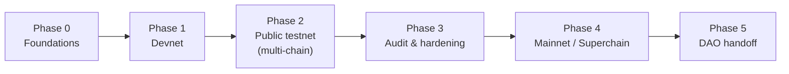
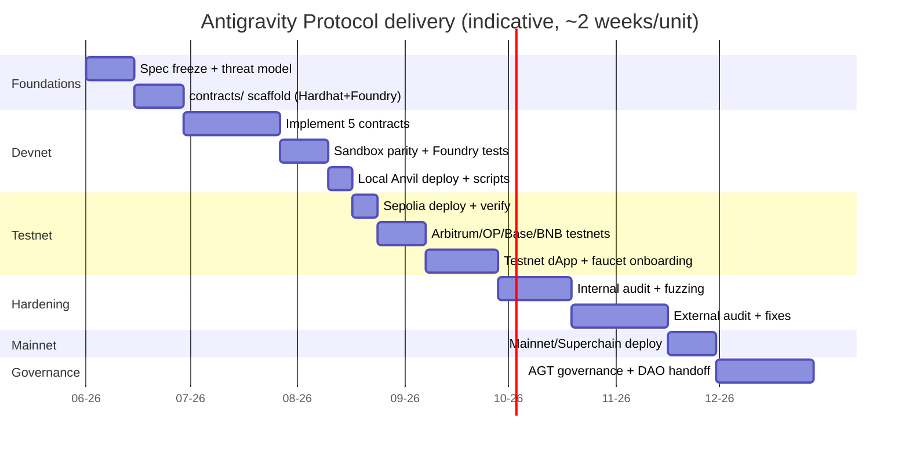

# Antigravity Protocol — Roadmap

From devnet to a DAO‑owned public good. Each **growth point** below is phrased as a task and
mirrored 1:1 in [EPIC‑01](./epics/EPIC-01-devnet-testnet-deployment.md).

> Companion docs: [Whitepaper](./whitepaper.md) · [Yellowpaper](./yellowpaper.md) ·
> [Grants](./grants.md)

---

## Phase flow

## Timeline (indicative)

## Phase detail

### Phase 0 — Foundations
- Freeze the [Yellowpaper](./yellowpaper.md) spec; write the threat model.
- Scaffold `contracts/` (Hardhat **and** Foundry) alongside the existing JS tooling.
- **Exit:** spec signed off, empty project compiles in CI.

### Phase 1 — Devnet
- Implement `AGT`, `SkillCredential`, `SkillRegistry`, `RewardDistributor`, `Attestor`.
- Achieve **sandbox parity** with `academy/courses/web3-genesis/assets/sandbox.js`.
- Deploy to local Anvil/Hardhat node with seed/fixture scripts.
- **Exit:** full Foundry suite green; local end‑to‑end mint + claim works.

### Phase 2 — Public testnet (multi‑chain)
- Deploy to **Sepolia**, **Arbitrum Sepolia**, **Optimism Sepolia**, **Base Sepolia**, **BNB
  testnet**; verify contracts on each explorer.
- Wire the testnet dApp (read registry, mint credential, claim AGT) via `viem`.
- Faucet + onboarding flow for testers.
- **Exit:** a public tester can earn an SBT and claim testnet AGT on ≥2 chains.

### Phase 3 — Audit & hardening
- Internal review + fuzz/invariant runs; then an external audit; fix and re‑test.
- **Exit:** audit report published, criticals resolved.

### Phase 4 — Mainnet / Superchain
- Mainnet deploy; prioritize an L2 / Superchain target chosen with the [Grants](./grants.md)
  matrix.
- **Exit:** verified mainnet contracts + monitoring/alerting live.

### Phase 5 — DAO handoff
- Move curriculum weights, emission `d`, and the attestor set under AGT governance; transfer
  treasury to the DAO.
- **Exit:** core multisig powers retired/timelocked; protocol is community‑owned.

## Growth points (tasks → EPIC‑01)

| # | Growth point | Why it matters |
| --- | --- | --- |
| G1 | **EAS attestations** | Trust‑minimize completion proofs; third‑party verifiable. |
| G2 | **Account abstraction onboarding** | New learners get a smart wallet without seed‑phrase friction. |
| G3 | **Gasless mint + claim (paymaster)** | Remove the "fund your wallet first" barrier on testnet/mainnet. |
| G4 | **zk proof of completion** | Eliminate the trusted Attestor; prove assessment passage in zero knowledge. |
| G5 | **Subgraph indexing** | Fast registry/profile queries for the dApp and integrators. |
| G6 | **Multi‑chain SBT sync** | Read credentials cross‑chain (Superchain interop / messaging). |
| G7 | **Mobile wallet flow** | Mirror the academy's mobile reach; in‑app credential wallet. |
| G8 | **DAO treasury & skill bounties** | Sponsors escrow AGT for targeted skill tracks. |

---

## Grant task — BNB Chain Builder Grant (Phase 2 milestone)

Apply to the **BNB Chain Builder Grant** (up to ~$200K) once Phase 2 puts verified
contracts on BNB testnets. Our angle fits cleanly: an **open‑source AI/agent‑economy
public good** that already builds on **BSC** (settlement) and **BNB Greenfield**
(storage). Full program row + links: [grants.md → BNB Chain](./grants.md).

### Eligibility vs. current state (✅ have / ⬜ not yet)

| BNB criterion | Status | Evidence / gap |
| --- | :--: | --- |
| Builder team / startup building **for** BNB Chain | ✅ | DRM course platform: BSC settlement contracts + BNB Greenfield storage; Proof‑of‑Skill (AI/agent‑economy) direction. |
| Category fit (DeFi/GameFi/**AI & DePIN**/DeSoc/**infra/dev tools**) | ✅ | AI/agent‑economy + education infra & dev tooling (Skills, SDET, e2e harness). |
| Benefits ecosystem — **open‑source public good** *or* dApp adding users/TVL/tx | ⬜ | Open‑source ✅, but **no public BNB deployment yet** → no on‑chain users/TVL/tx metrics. Unlocks at Phase 2. |
| Uses **BSC / opBNB / Greenfield** | ✅ BSC+GF / ⬜ opBNB | BSC contracts + Greenfield storage working locally; opBNB not targeted yet. |
| **Clear technical plan & milestones** (architecture, roadmap) | ✅ | This [roadmap](./roadmap.md) + [EPIC‑01](./epics/EPIC-01-devnet-testnet-deployment.md); architecture in [whitepaper](./whitepaper.md)/[yellowpaper](./yellowpaper.md)/[sc.md](./sc.md). |
| Working code / traction (feasibility for technical review) | ✅ | 6 Solidity contracts, **86 forge tests @ 100% coverage**, Lit + Greenfield **e2e green in CI**, soulbound NFTs (AuthorNft/ClientNft). |
| **Verified contracts on a public explorer** | ⬜ | Currently local/devnet only. Need BSC‑testnet (+ Greenfield‑testnet) deploy & verify — EPIC‑01 **T8**. |
| Milestone‑broken **budget** | ⬜ | Not written yet; produce alongside the pitch deck. |
| **Pitch deck / live plan presentation** (review round 2) | ⬜ | [EPIC‑02](./epics/EPIC-02-pitch-deck.md) — not produced yet. |
| Relevance + technical assessment (review round 1) | ✅ *ready* | Strong code + spec; mainly needs the public deploy + deck to present. |

### Application steps (action)

1. ⬜ Review the priority wishlist — [bnb-chain/community-contributions](https://github.com/bnb-chain/community-contributions) — and align our pitch to a listed topic.
2. ⬜ Ship Phase 2: deploy + **verify** contracts on **BSC testnet** (and Greenfield testnet) — EPIC‑01 **T8**; capture explorer links + first usage metrics.
3. ⬜ Prepare the data room: deck + one‑pager + milestone budget — [EPIC‑02](./epics/EPIC-02-pitch-deck.md).
4. ⬜ Submit the **"Apply Now"** Builder Grant form — [bnbchain.org/en/grants](https://www.bnbchain.org/en/grants).
5. ⬜ *(Optional, startup track)* apply to the **MVB accelerator** — [bnbchain.org/en/programs/mvb](https://www.bnbchain.org/en/programs/mvb) (requires contracts deployed on BNB Chain).
6. ⬜ Pass the two‑round review (relevance+technical → live presentation, milestones & amount Q&A).

**Blocking dependency:** the only hard blockers are a **verified public BNB‑testnet deployment**
(EPIC‑01 T8) and the **pitch deck + budget** (EPIC‑02). Everything else is already in place.

---

*Next:* [EPIC‑01 — Devnet/Testnet deployment](./epics/EPIC-01-devnet-testnet-deployment.md) ·
[Grants matrix](./grants.md) · [Pitch deck](./epics/EPIC-02-pitch-deck.md)
